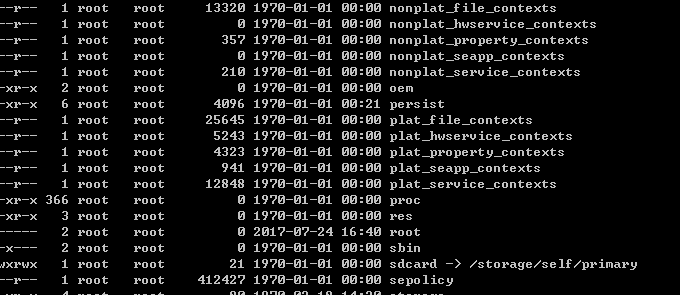

# 8.0系统SystemProperty权限问题 #

在8.0新功能开发过程中，碰到一个SystemProperty set的时候报错的问题。以下详细说明：

## 目录 ##

1. 问题现象
2. 问题解决方案
3. 问题分析过程

## 问题现象 ##

1. SystemProperty.set()报错
   在开发系统功能时，设置系统属性SystemProperty.set()时报错。

   native层报错 : `failed to set system property`  
   还有一行错误信息： `libc    : Unable to set property "lockscreen.newmode" to "1": error code: 0x18`

   问题可以确定是property设置的时候出问题了。然后尝试用其他方式设置property，首先是setprop命令行设置。

2. setprop指令报错

   命令行设置 `setprop lockscreen.newmode 1`  
   设置失败，报错：`failed to set system property`  
   查看logcat，同样有:`libc    : Unable to set property "lockscreen.newmode" to "1": error code: 0x18`
   但是Setting中拥有修改 build.prop 属性的功能，并依旧可以实现。于是去查找Setting中相关代码。

   特别说明的是：build.prop文件中，属性开头可能是有特殊含义的，如：ro是只读属性，presist是会被同步的属性，ctrl是控制开关属性，还有一些根据网络状态变化改变的属性等。
 
3. Setting未报错，且成功设置

   Setting中在DevelopmentSettings。java中多次调用set方法，于是找的一个开发者选项中设置log buffer的功能的方法 updateLogpersistValues()。
   方法中修改的是"logd.logpersistd"属性，于是手动设置之后，使用getprop查询属性，发现属性值确实被改动了。验证了set方法有效。

   检查Android.mk以及AndroidManifest.xml的权限相关属性，发现新增了 "android.permission.ACCESS_CHECKIN_PROPERTIES" 这个属性。
   在 frameworks/base/core/res/AndroidManifest.xml中查询发现：

```
   <!-- @SystemApi Allows read/write access to the "properties" table in the checkin
         database, to change values that get uploaded.
         <p>Not for use by third-party applications. -->
    <permission android:name="android.permission.ACCESS_CHECKIN_PROPERTIES"
        android:protectionLevel="signature|privileged" />
```
   对比7.0代码发现，是8.0新增的属性，那么基本可以确定，问题出在权限相关了。

   但是在自己的APK中设置了之后，发现问题并没有解决，依旧还是有一样的问题。那么我们需要去追踪源码，看看问题出现在哪里了。

## 问题解决方案 ##

在分析问题之前，把解决方案先抛出，是为了之后的大段分析过程干扰了解决问题的思路。

问题出现在没有权限上，此处的权限控制不是简单的系统级应用签名就可以的权限。

* android4.X版本就加入了SeLinux的安全控制功能，目的是防止获取root之后就可以随意的对文件进行操作，操作的时候还需要加入一些配置。
* android8.X版本将SeLinux的功能扩展到了SystemProperty上面，在SeLinux中未被配置的系统属性是不能被修改的。[差异可以参考博客](http://blog.csdn.net/huangyabin001/article/details/79290382)
* SeLinux中会以进程的Tag（ps -Z 的第一行tag）为组，来进行授权。授与的属性也需要再配置中进行添加，具体添加方式见章节 [SeLinux配置添加过程](#SeLinux配置添加过程) 。
* 配置成功后，在system_app(与priv_app不同)组中的应用是可以正常的进行设置SystemProperty的。最后说明一下，当设备root，remount之后，是可以使用setprop的，因为此时的组会由shell变成root。
* JACK编译后显示生成的文件是file_context.bin，但实际上在8.0系统中，为了分离/vendor和/system，对SeLinux的生成文件进行了改动，[具体内容也可以看博客](http://blog.csdn.net/huangyabin001/article/details/79290382)，由于根目录是read-only，所以我们只能用编译-打包的方式修改该功能。
* boot.img包含kernel和ramdisk(即 编译生成路径/root)生成得到，而我们需要更新根目录下的文件，所以只能去刷boot.img

## SystemProperty问题分析过程 ##

报错项为：`libc    : Unable to set property "lockscreen.newmode" to "1": error code: 0x18`

可以大致知道，报错的库是libc，是被捕获的异常流程（不是tombstone等崩溃报错），该流程拥有错误码，而我们主要的目的是找到0x18对应错误码的定义。

全局`cgrep "Unable to set property"`，定位到 /bionic/libc/bionic/system_properties.cpp：

```
system_properties.cpp

	int result = -1;
    if (!connection.RecvInt32(&result)) {
      errno = connection.GetLastError();
      __libc_format_log(ANDROID_LOG_WARN,
                        "libc",
                        "Unable to set property \"%s\" to \"%s\": recv failed; errno=%d (%s)",
                        key,
                        value,
                        errno,
                        strerror(errno));
      return -1;
    }

	if (result != PROP_SUCCESS) {
      __libc_format_log(ANDROID_LOG_WARN,
                        "libc",
                        "Unable to set property \"%s\" to \"%s\": error code: 0x%x",
                        key,
                        value,
                        result);
      return -1;
    }
```

result值是0x18，并被打印出来。在调用 `connection.RecvInt32(&result)` 时，得到返回值。

connection是类PropertyServiceConnection的一个实例，追踪到类代码中：

```
system_properties.cpp

class PropertyServiceConnection {
 public:
  PropertyServiceConnection() : last_error_(0) {
	// 原型为 int socket(int domain, int type, int protocol)。AF_LOCAL（亦AF_UNIX）协议簇，说明需要的是一个绝对路径；SOCK_STREAM是说明使用的TCP，与SOCK_DGRAM(UDP)相对应。
    socket_ = ::socket(AF_LOCAL, SOCK_STREAM | SOCK_CLOEXEC, 0);
    // socket判空
    if (socket_ == -1) {
      last_error_ = errno;
      return;
    }

    const size_t namelen = strlen(property_service_socket);
    sockaddr_un addr;
    memset(&addr, 0, sizeof(addr));
    strlcpy(addr.sun_path, property_service_socket, sizeof(addr.sun_path));
    addr.sun_family = AF_LOCAL;
    socklen_t alen = namelen + offsetof(sockaddr_un, sun_path) + 1;

    // TEMP_FAILURE_RETRY是Macro 宏定义，其中函数返回-1失败码的时候，重新执行
	// 原型为 int connect(int sockfd, struct sockaddr *serv_addr, int addrlen)。 需要注意的是 *serv_addr 是保存目的端口和ip等结构的数据结构。
	// addr的属性中sun_path是绝对路径 "/dev/socket/property_service"
    if (TEMP_FAILURE_RETRY(connect(socket_, reinterpret_cast<sockaddr*>(&addr), alen)) == -1) {
      close(socket_);
      socket_ = -1;
      last_error_ = errno;
    }
  }


  bool RecvInt32(int32_t* value) {
	//recv函数接受socket通信结果 转化成result
    int result = TEMP_FAILURE_RETRY(recv(socket_, value, sizeof(*value), MSG_WAITALL));
    return CheckSendRecvResult(result, sizeof(*value));
  }

```

以上注释中有很多关于socket编程的解释，想了解更多可以参考：
[c++中Socket编程（入门）](https://www.cnblogs.com/kefeiGame/p/7246942.html)
[Socket通信原理探讨(C++为例)](https://www.cnblogs.com/fuchongjundream/p/3914696.html)

通过分析socket通信中的几个函数，可以发现，我们当前使用的是AF_UNIX协议，写的地址不是ip而是具体的路径，路径是"/dev/socket/property_service"  
那么接下来应该追踪socket所对应的服务端的代码。

```
property_service.cpp

void start_property_service() {
    property_set("ro.property_service.version", "2");
	
	//此处是调用的 /system/core/init/util.cpp 的create_socket
	//PROP_SERVICE_NAME 调用的是_system_properties.h中的定义，与system_property.cpp是一致的
    property_set_fd = create_socket(PROP_SERVICE_NAME, SOCK_STREAM | SOCK_CLOEXEC | SOCK_NONBLOCK,
                                    0666, 0, 0, NULL);
    if (property_set_fd == -1) {
        PLOG(ERROR) << "start_property_service socket creation failed";
        exit(1);
    }

	//开始等待socket访问
    listen(property_set_fd, 8);

	//注册一个handler，实际上是一个函数接口，后续还要分析
    register_epoll_handler(property_set_fd, handle_property_set_fd);
}

```

接下来我们还要继续去看util类中定义的create_socket方法干了什么事情，是不是创建的与property_service相对应的接口。


```
util.cpp

int create_socket(const char *name, int type, mode_t perm, uid_t uid,
                  gid_t gid, const char *socketcon)
{
	..............................
    android::base::unique_fd fd(socket(PF_UNIX, type, 0));

    struct sockaddr_un addr;
    memset(&addr, 0 , sizeof(addr));
    addr.sun_family = AF_UNIX;

	//与selinux相关的部分
	..............................
    int ret = bind(fd, (struct sockaddr *) &addr, sizeof (addr));
    int savederrno = errno;
	
	//异常处理
    ..............................
}

```

可以知道确实是由property_service提供的服务，那么property_service又是怎么传出0x18错误的呢？

在这个地方特别注意头文件:
```
_system_properties.h

#define PROP_SERVICE_NAME "property_service"
#define PROP_FILENAME "/dev/__properties__"

#define PROP_MSG_SETPROP 1
#define PROP_MSG_SETPROP2 0x00020001

#define PROP_SUCCESS 0
#define PROP_ERROR_READ_CMD 0x0004
#define PROP_ERROR_READ_DATA 0x0008
#define PROP_ERROR_READ_ONLY_PROPERTY 0x000B
#define PROP_ERROR_INVALID_NAME 0x0010
#define PROP_ERROR_INVALID_VALUE 0x0014
#define PROP_ERROR_PERMISSION_DENIED 0x0018
#define PROP_ERROR_INVALID_CMD 0x001B
#define PROP_ERROR_HANDLE_CONTROL_MESSAGE 0x0020
#define PROP_ERROR_SET_FAILED 0x0024
```

可以注意到的是 0x0018 所对应的错误码是 权限拒绝。问题到这就变的很奇怪了，因为我们的应用是系统级签名、shareUID的，现在权限等级和系统设置是一致的。到底还会有什么权限影响到这里，报错说没有权限。

那么我们需要了解其中权限是如何被拒绝的。

```
property_service.cpp

void start_property_service() {
	......................................
	//这里去跟踪 handle_property_set_fd 这个函数
    register_epoll_handler(property_set_fd, handle_property_set_fd);
}

static void handle_property_set_fd() {
	......................................
    switch (cmd) {
    case PROP_MSG_SETPROP: {
        char prop_name[PROP_NAME_MAX];
        char prop_value[PROP_VALUE_MAX];

        if (!socket.RecvChars(prop_name, PROP_NAME_MAX, &timeout_ms) ||
            !socket.RecvChars(prop_value, PROP_VALUE_MAX, &timeout_ms)) {
          PLOG(ERROR) << "sys_prop(PROP_MSG_SETPROP): error while reading name/value from the socket";
          return;
        }

        prop_name[PROP_NAME_MAX-1] = 0;
        prop_value[PROP_VALUE_MAX-1] = 0;
		//主要流程是调用handle_property_set
        handle_property_set(socket, prop_value, prop_value, true);
        break;
      }
}


static void handle_property_set(SocketConnection& socket,
                                const std::string& name,
                                const std::string& value,
                                bool legacy_protocol) {

  ......................................
  if (android::base::StartsWith(name, "ctl.")) {
	//需要注意这个函数，检查权限check_control_mac_perms
    if (check_control_mac_perms(value.c_str(), source_ctx, &cr)) {
      handle_control_message(name.c_str() + 4, value.c_str());
      if (!legacy_protocol) {
        socket.SendUint32(PROP_SUCCESS);
      }
  ......................................
  } else {
	//注意这个函数，检查权限check_mac_perms
    if (check_mac_perms(name, source_ctx, &cr)) {
      uint32_t result = property_set(name, value);
      if (!legacy_protocol) {
        socket.SendUint32(result);
      }
    } 
  ......................................
  }

  freecon(source_ctx);
}
```

因为check_control_mac_perms 还是会调用到 check_mac_perms 中：

```
property_service.cpp

static bool check_mac_perms(const std::string& name, char* sctx, struct ucred* cr) {

	......................................
	
	//这里就调用到selinux.h中的方法了，即selinux中管控property_service相关
    bool has_access = (selinux_check_access(sctx, tctx, "property_service", "set", &audit_data) == 0);

    freecon(tctx);
    return has_access;
}
```

其实分析到这里，基本就知道了问题所在了，是因为SeLinux在8.0系统增加了对property的管控。

每个property需要在SeLinux中注册到相应的用户组中，具体的配置方式可以参考后文。


## SeLinux配置添加过程 ##

SeLinux的策略主要代码在源码的 /system/sepolicy/ 下 ：

```
-rwxrwxrwx  1 root1 root1    20 Jan 11 11:20 Android.bp
-rwxrwxrwx  1 root1 root1 45973 Jan 11 11:20 Android.mk
-rwxrwxrwx  1 root1 root1  3670 Jan 11 11:20 CleanSpec.mk
drwxrwxrwx  9 root1 root1  4096 Jan 15 18:01 .git
-rwxrwxrwx  1 root1 root1     0 Jan 11 11:20 MODULE_LICENSE_PUBLIC_DOMAIN
-rwxrwxrwx  1 root1 root1  1029 Jan 11 11:20 NOTICE
-rwxrwxrwx  1 root1 root1    67 Jan 11 11:20 PREUPLOAD.cfg
drwxrwxrwx  2 root1 root1  4096 Mar  2 15:07 private
drwxrwxrwx  2 root1 root1  4096 Mar  2 15:09 public
-rwxrwxrwx  1 root1 root1  5428 Jan 11 11:20 README
drwxrwxrwx  2 root1 root1  4096 Jan 11 11:20 reqd_mask
drwxrwxrwx  3 root1 root1  4096 Jan 11 11:20 tests
drwxrwxrwx  4 root1 root1  4096 Jan 11 11:20 tools
drwxrwxrwx  2 root1 root1  4096 Jan 11 11:20 vendor

```
sepolicy的编译结果是file_context.bin，但是在8.0中在root目录下的是：



可以看到，是分作nonplat以及plat两大类:

* Nonplat_file_contexts：设备制造商的file_context，在 vendor 下加载，与设备制造商vendor相关。
* Plat_file_contexts：平台的file_context，在 system 分区加载，与aosp平台相关。

而sepolicy最主要的几个目录是：

*　public:平台公有策略，type和attribute可以被non-platform中引用，这里的策略相当于是开放的。
*　private:平台私有策略，type和attribute对non-platform的策略作者是不可见的，在某个平台的产品中是没有办法 "allow XXX"这种形式添加的，因为找不到private的type。
*　vendor:平台对vendor相关的定义。

那么接下来主要写一下新增一个SeLinux的Policy的方法：(当前路径是/system/sepolicy)

1. 找到./public/property.te，添加type：`type aamode_prop, property_type;` 第一个是属性名，后面可以加多个参数。property_type描述的是一般property，还有core_property_type是不可以被没有相应权限写的property。有具体属性定义。
2. 添加type以后，在./private/property_contexts 中添加 `lezh.aamode     u:object_r:aamode_prop:s0` ，将lezh.aamode的标签与aamode_prop属性挂钩起来。
3. 标签与属性挂钩之后，设置aamode的属性到权限组system_app： `set_prop(system_app, aamode_prop)`
4. 编译sepolicy，显示生成文件是file_context.bin。在out目录下的 /root 目录下，也会更新相应的nonplat_XXX_contexts以及plat_XXX_contexts。可以查看plat_property_context是否新增了 lezh.aamode 这个属性。
5. 将boot.img刷到系统中去。请注意，这里刷系统发现了一个[fastboot工具无法正常刷新boot.img的问题](./烧录镜像以及内核模型.md)。查看系统的根目录下的相应文件，是不是同样更新了值。
6. 更新后，使用`ps -A -Z`查看进程的进程组，确认当前应用有 system_app 的TAG。然后可以测试在应用中setprop的功能了。