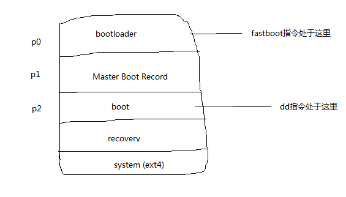

#　烧录镜像以及内核模型　#

烧录镜像过程中碰到一个问题：

/out/target/product/bullhead 是原生产品生成目录，编译得到的文件：

bullhead/root/plat_property_contexts添加了一行属性。

而在使用刷机脚本flash-all.bat之后，plat_property_contexts属性并没有被添加上去。

## 问题解决方案 ##

1. 问题出现在flash-all.bat并没有成功刷新 boot.img。源码的/root目录会打包到ramdisk.img中，而ramdisk.img和kenel打包成boot.img。
2. 选择使用 dd 刷新flash，替换掉boot.img所对应分区。重新启动系统即可。

即执行以下指令：

```
源码执行：make bootimage -j12

命令行执行：
adb push boot.img /data/
adb shell

$ dd if=/data/boot.img  of=/dev/block/platform/soc.0/f9824900.sdhci/by-name/boot
```

## 问题相关知识记录 ## 

[linux启动过程博客](http://blog.csdn.net/xiaofengwu123/article/details/50536139)

以下是简图：



* 启动时，首先会加载bootloader
* 然后会读取分区表(Master Boot Record)
* 读取分区表后，确定是要走boot流程还是recovery流程，两者都有它们自己的kenel
* boot成功后会进入system.img所在的ext4文件系统，从而进入真正的android环境。

而我们打包的boot.img和recovery.img都是二进制文件。这两者都是可以用dd指令直接写到系统分区中，而分区有哪些可以`df -a(显示所有) -h(以kb显示)`来查询。

需要注意的是system.img并不能使用同样的方式刷分区，因为system.img是使用ext4文件系统格式的文件，而不是直接的二进制文件。在system.img被加上之前，需要先对分区进行格式化再进行解压。

linux系统在后面还需要进行深入的研究与了解。


