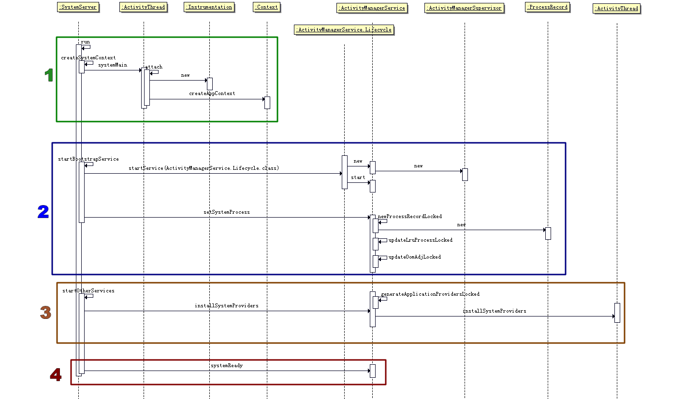

# AMS启动流程 #

## 主要内容 ##

AMS与WMS(WindowManagerService)类似。由系统SystemServer负责开机过程中启动，在系统中常驻并向其他应用(进程)提供服务。

以下是对AMS的提供服务方式、以及启动AMS几个流程的详细说明：  

- [AMS对外提供服务方式简介](#AMS对外提供服务方式简介)
- [系统创建AMS流程](#系统创建AMS流程)
- [AMS初始化流程](#AMS初始化流程)
- [SystemReady后AMS的工作流程](#AMS初始化流程)

## AMS对外提供服务方式简介 ##


AMS本身是在system_server中启动的，而有很多情况需要AMS对外提供服务。  
如图中的`getFrontActivityScreenCompatMode()`则是外界（非system_server进程）也可以直接访问的方法。  
为了达到跨进程调用的效果，AMS使用的是Binder机制来进行跨进程通信。  
ActivityManagerNative与ActivityManagerProxy分别是Bn端与Bp端。WMS等系统服务也是采用的Binder机制对外界提供服务，故不再赘述Binder机制。

但与WMS不一样的是，AMS还使用了Socket通信，调用ActivityThread（江湖人称UI线程、主线程等）的main方法，为新的Activity开启新进程（是否开启新进程实际上取决于启动模式与各种标签，[详情请参考](http://blog.csdn.net/zhangjg_blog/article/details/10923643?reload)，此处是初次启动某个应用的流程），这一部分的具体代码流程在[AMS管理Acitivity启动流程]()中有详细说明。

## 系统创建AMS流程 ##

如图中1区域所示：

```
SystemServer.java

private void run() {
        
        Looper.prepareMainLooper();

		...............

        // Initialize the system context.
        createSystemContext();

        // Create the system service manager.
        mSystemServiceManager = new SystemServiceManager(mSystemContext);
        LocalServices.addService(SystemServiceManager.class, mSystemServiceManager);
    
        startBootstrapServices();
        startCoreServices();
        startOtherServices();

    	...............

    // Loop forever.
    Looper.loop();
    throw new RuntimeException("Main thread loop unexpectedly exited");
}

```

接下来调用createSystemContext()用于创建SystemServer持有的Context。


```
SystemServer.java

private void createSystemContext() {
        ActivityThread activityThread = ActivityThread.systemMain();
        mSystemContext = activityThread.getSystemContext();
        mSystemContext.setTheme(DEFAULT_SYSTEM_THEME);
    }


```

首先调用ActivityThread的静态方法systemMain创建ActivityThread实例，并调用attach。
ActivityThread构造函数只是简单的获取了一下ResouceManager的单例。

当新应用被启动时，是调用的ActivityThread的main函数，大致流程与systemMain一样。

```
ActivityThread.java

public static ActivityThread systemMain() {

		...............

        ActivityThread thread = new ActivityThread();
        thread.attach(true);
        return thread;
    }

```

attach函数调用

```
ActivityThread.java

    private void attach(boolean system) {
        sCurrentActivityThread = this;
        mSystemThread = system;
        if (!system) {
            ViewRootImpl.addFirstDrawHandler(new Runnable() {
                @Override
                public void run() {
                    ensureJitEnabled();
                }
            });
            android.ddm.DdmHandleAppName.setAppName("<pre-initialized>",
                                                    UserHandle.myUserId());
            RuntimeInit.setApplicationObject(mAppThread.asBinder());
            final IActivityManager mgr = ActivityManagerNative.getDefault();
            try {
                mgr.attachApplication(mAppThread);
            } catch (RemoteException ex) {
                throw ex.rethrowFromSystemServer();
            }
            // Watch for getting close to heap limit.
            BinderInternal.addGcWatcher(new Runnable() {
                @Override public void run() {
                    if (!mSomeActivitiesChanged) {
                        return;
                    }
                    Runtime runtime = Runtime.getRuntime();
                    long dalvikMax = runtime.maxMemory();
                    long dalvikUsed = runtime.totalMemory() - runtime.freeMemory();
                    if (dalvikUsed > ((3*dalvikMax)/4)) {
                        if (DEBUG_MEMORY_TRIM) Slog.d(TAG, "Dalvik max=" + (dalvikMax/1024)
                                + " total=" + (runtime.totalMemory()/1024)
                                + " used=" + (dalvikUsed/1024));
                        mSomeActivitiesChanged = false;
                        try {
                            mgr.releaseSomeActivities(mAppThread);
                        } catch (RemoteException e) {
                            throw e.rethrowFromSystemServer();
                        }
                    }
                }
            });
        } else {
            // Don't set application object here -- if the system crashes,
            // we can't display an alert, we just want to die die die.
            android.ddm.DdmHandleAppName.setAppName("system_process",
                    UserHandle.myUserId());
            try {
                mInstrumentation = new Instrumentation();
                ContextImpl context = ContextImpl.createAppContext(
                        this, getSystemContext().mPackageInfo);
                mInitialApplication = context.mPackageInfo.makeApplication(true, null);
                mInitialApplication.onCreate();
            } catch (Exception e) {
                throw new RuntimeException(
                        "Unable to instantiate Application():" + e.toString(), e);
            }
        }

        // add dropbox logging to libcore
        DropBox.setReporter(new DropBoxReporter());

        ViewRootImpl.addConfigCallback(new ComponentCallbacks2() {
            @Override
            public void onConfigurationChanged(Configuration newConfig) {
                synchronized (mResourcesManager) {
                    // We need to apply this change to the resources
                    // immediately, because upon returning the view
                    // hierarchy will be informed about it.
                    if (mResourcesManager.applyConfigurationToResourcesLocked(newConfig, null)) {
                        updateLocaleListFromAppContext(mInitialApplication.getApplicationContext(),
                                mResourcesManager.getConfiguration().getLocales());

                        // This actually changed the resources!  Tell
                        // everyone about it.
                        if (mPendingConfiguration == null ||
                                mPendingConfiguration.isOtherSeqNewer(newConfig)) {
                            mPendingConfiguration = newConfig;

                            sendMessage(H.CONFIGURATION_CHANGED, newConfig);
                        }
                    }
                }
            }
            @Override
            public void onLowMemory() {
            }
            @Override
            public void onTrimMemory(int level) {
            }
        });
    }


```


## AMS初始化流程 ##


## SystemReady后AMS的工作流程 ##


