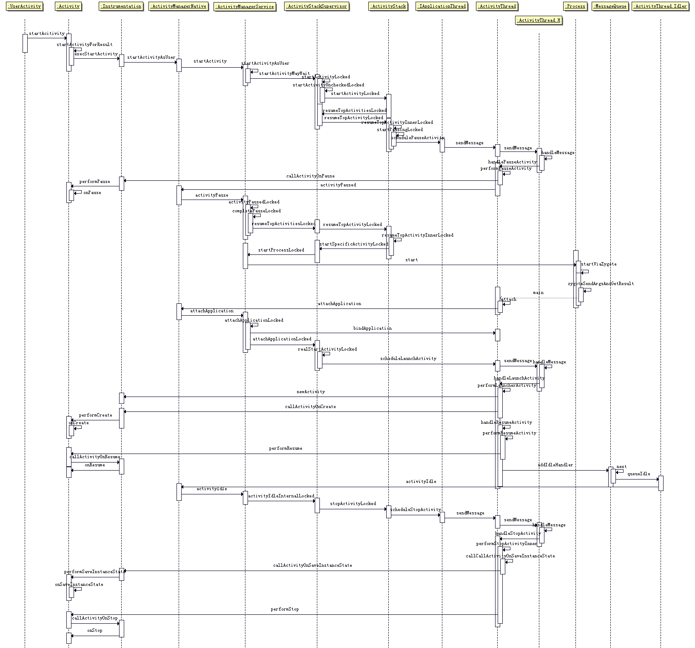
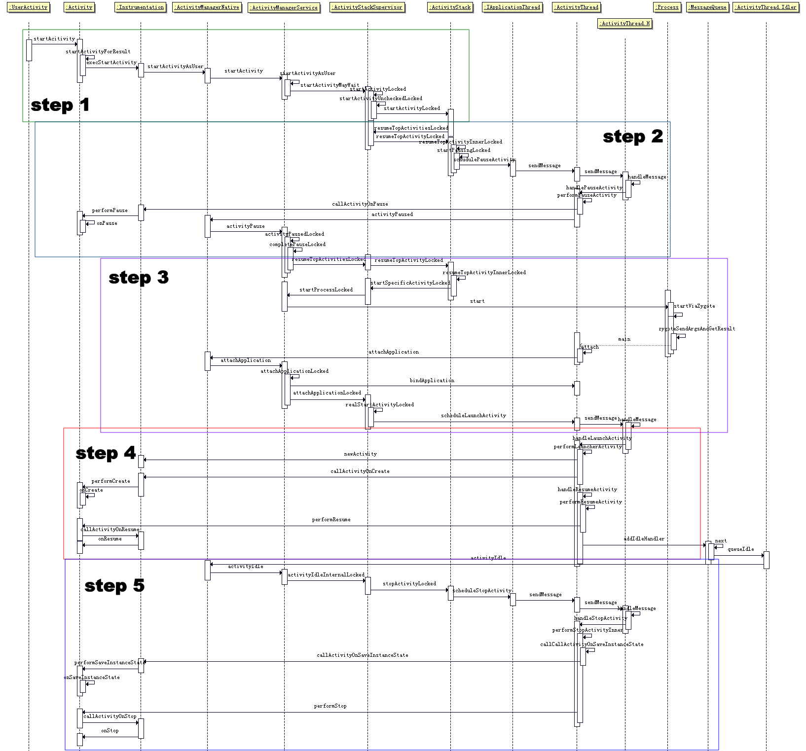

# AMS管理Activity启动流程 #

## 主要内容 ##

Launcher也是一个App，从Launcher上启动一个应用的过程是AMS管理Activity启动很经典的过程。

整体的时序图如下：  


Launcher启动App需要经历以下过程：  
1. Launcher发出启动app的请求  
2. Launcher进行onPause  
3. app进入onStart  
4. app进入onResume  
5. Launcher进行onStop  

这也是两个应用之间相互调用比较常见的生命周期。


接下来对以上代码细化并分作章节介绍：

- [app发起请求启动新app](#app发起请求启动新app)
- [AMS使原app进入onPause](#ams使原app进入onpause)
- [新app各数据结构创建初始化](#新app各数据结构创建初始化)
- [AMS使新app进入onCreate以及onResume](#ams使新app进入oncreate以及onresume)
- [AMS使原app进入onStop](#ams使原app进入onstop)

(可以把原图下载下来对照看)

[可以参考大佬的博客](http://blog.csdn.net/qq_23547831/article/details/51224992)

## app发起请求启动新app ##

```
UserActivity.startActivity() 
Activity.startActivity() 
Activity.startActivityForResult() 
Instrumentation.execStartActivty() 
ActivityManagerNative.getDefault().startActivityAsUser() 
ActivityManagerService.startActivity() 
ActvityiManagerService.startActivityAsUser() 
ActivityStackSupervisor.startActivityMayWait() 
ActivityStackSupervisor.startActivityLocked() 
ActivityStackSupervisor.startActivityUncheckedLocked() 
ActivityStackSupervisor.startActivityLocked() 
ActivityStackSupervisor.resumeTopActivitiesLocked() 
ActivityStackSupervisor.resumeTopActivityInnerLocked() 
```

step 1是启动一个新的activity的必经之路。

```
Activity.java

	@Override
    public void startActivities(Intent[] intents, @Nullable Bundle options) {
        mInstrumentation.execStartActivities(this, mMainThread.getApplicationThread(),
                mToken, this, intents, options);
    }
```


```
Instrumentation.java

	public void execStartActivities(Context who, IBinder contextThread,
            IBinder token, Activity target, Intent[] intents, Bundle options) {
        execStartActivitiesAsUser(who, contextThread, token, target, intents, options,
                UserHandle.myUserId());
    }

   
    public void execStartActivitiesAsUser(Context who, IBinder contextThread,
            IBinder token, Activity target, Intent[] intents, Bundle options,
            int userId) {
				...........................................
            int result = ActivityManagerNative.getDefault()
                .startActivities(whoThread, who.getBasePackageName(), intents, resolvedTypes,
                        token, options, userId);
            checkStartActivityResult(result, intents[0]);
				...........................................
    }
```

execStartActivitiesAsUser()中调用了ActivityManagerNative.getDefault()。getDefault获取的是gDefault的单例。gDefault是静态变量，初始化时调用asInterface函数。所以最终getDefault()获取的是ActivityManagerProxy的实例。

ActivityManagerNative与ActivityManagerProxy都继承IActivityManager，使用binder机制来通信。ActivityManagerNative作为BN端，且ActivityManagerService基础它，进行实际的业务代码逻辑。

所以调用的startActivities()虽然第一步会调用到ActivityManagerProxy中的同名函数，但是最终还是会调用ActivityManagerService中的业务逻辑。


```
ActivityManagerNative.java

public abstract class ActivityManagerNative extends Binder implements IActivityManager
{

	static public IActivityManager asInterface(IBinder obj) {
        if (obj == null) {
            return null;
        }
        IActivityManager in =
            (IActivityManager)obj.queryLocalInterface(descriptor);
        if (in != null) {
            return in;
        }
		//实际的asInterface返回的就是proxy端
        return new ActivityManagerProxy(obj);
    }

	static public IActivityManager getDefault() {
		//客户端应用可以直接使用get函数获取默认的实例，该实例是proxy端
        return gDefault.get();
    }

	private static final Singleton<IActivityManager> gDefault = new Singleton<IActivityManager>() {
        protected IActivityManager create() {
            IBinder b = ServiceManager.getService("activity");
            if (false) {
                Log.v("ActivityManager", "default service binder = " + b);
            }
            IActivityManager am = asInterface(b);
            if (false) {
                Log.v("ActivityManager", "default service = " + am);
            }
            return am;
        }
    };

	
}


class ActivityManagerProxy implements IActivityManager
		...........................................
	public int startActivityAsUser(IApplicationThread caller, String callingPackage, Intent intent,
            String resolvedType, IBinder resultTo, String resultWho, int requestCode,
            int startFlags, ProfilerInfo profilerInfo, Bundle options,
            int userId) throws RemoteException {
        Parcel data = Parcel.obtain();
        Parcel reply = Parcel.obtain();
	        ...........................................
		//将proxy收到的消息通过Binder机制发给native端
        mRemote.transact(START_ACTIVITY_AS_USER_TRANSACTION, data, reply, 0);
        reply.readException();
        int result = reply.readInt();
        reply.recycle();
        data.recycle();
        return result;
    }
}
```

```
ActivityManagerService.java

	@Override
    public final int startActivityAsUser(IApplicationThread caller, String callingPackage,
            Intent intent, String resolvedType, IBinder resultTo, String resultWho, int requestCode,
            int startFlags, ProfilerInfo profilerInfo, Bundle options, int userId) {
		//检查是否是没有来源intent的启动
        enforceNotIsolatedCaller("startActivity");
		//检查权限问题
        userId = handleIncomingUser(Binder.getCallingPid(), Binder.getCallingUid(), userId,
                false, ALLOW_FULL_ONLY, "startActivity", null);
        //在ActivityStack管理类中来调度ActivityStack的生命周期
        return mStackSupervisor.startActivityMayWait(caller, -1, callingPackage, intent,
                resolvedType, null, null, resultTo, resultWho, requestCode, startFlags,
                profilerInfo, null, null, options, userId, null, null);
    }
```

```
ActivityStackSupervisor.java

	final int startActivityMayWait(IApplicationThread caller, int callingUid,
            String callingPackage, Intent intent, String resolvedType,
            IVoiceInteractionSession voiceSession, IVoiceInteractor voiceInteractor,
            IBinder resultTo, String resultWho, int requestCode, int startFlags,
            ProfilerInfo profilerInfo, WaitResult outResult, Configuration config,
            Bundle options, int userId, IActivityContainer iContainer, TaskRecord inTask) {
			...........................................
			//在这里由intent中的信息，获取ActivityInfo。
	        ActivityInfo aInfo = resolveActivity(intent, resolvedType, startFlags,
                profilerInfo, userId);

			//清除proxy端的pid和uid 使用native端的pid和uid  
			final long origId = Binder.clearCallingIdentity();
        	...........................................
            int res = startActivityLocked(caller, intent, resolvedType, aInfo,
                    voiceSession, voiceInteractor, resultTo, resultWho,
                    requestCode, callingPid, callingUid, callingPackage,
                    realCallingPid, realCallingUid, startFlags, options,
                    componentSpecified, null, container, inTask);
			//还原proxy端的pid和uid 一般与 clearCallingIdentity 成套使用
            Binder.restoreCallingIdentity(origId);

			//对返回值的res的逻辑处理
            ...........................................
            return res;
        }
    }

	final int startActivityLocked(IApplicationThread caller,
            Intent intent, String resolvedType, ActivityInfo aInfo,
            IVoiceInteractionSession voiceSession, IVoiceInteractor voiceInteractor,
            IBinder resultTo, String resultWho, int requestCode,
            int callingPid, int callingUid, String callingPackage,
            int realCallingPid, int realCallingUid, int startFlags, Bundle options,
            boolean componentSpecified, ActivityRecord[] outActivity, ActivityContainer container,
            TaskRecord inTask) {
		//记录当前执行状态值，返回错误码
        int err = ActivityManager.START_SUCCESS;
		...........................................
		//获取intent的标记，判断相关信息
        final int launchFlags = intent.getFlags();
		...........................................
		//如果不是正常启动，则调用ActivityStack的sendActivityResultLocked，给出的标记是Activity.RESULT_CANCELED。
        if (err != ActivityManager.START_SUCCESS) {
            if (resultRecord != null) {
                resultStack.sendActivityResultLocked(-1,
                    resultRecord, resultWho, requestCode,
                    Activity.RESULT_CANCELED, null);
            }
            ActivityOptions.abort(options);
            return err;
        }
     	...........................................
		//判断结束，调用正常启动的业务逻辑代码
        err = startActivityUncheckedLocked(r, sourceRecord, voiceSession, voiceInteractor,
                startFlags, true, options, inTask);
		...........................................
    }
	
	final int startActivityUncheckedLocked(ActivityRecord r, ActivityRecord sourceRecord,
            IVoiceInteractionSession voiceSession, IVoiceInteractor voiceInteractor, int startFlags,
            boolean doResume, Bundle options, TaskRecord inTask) {
		//在正常情况下 doResume 传入值为true 
        final Intent intent = r.intent;
        final int callingUid = r.launchedFromUid;
		//根据启动模式以及startActivityLocked的标签进行逻辑判断
		...........................................
		//通知目标ActivityStack开始启动相关Activity
        targetStack.startActivityLocked(r, newTask, doResume, keepCurTransition, options);
        ...........................................
        return ActivityManager.START_SUCCESS;
    }
```

```
ActivityStack.java

	final void startActivityLocked(ActivityRecord r, boolean newTask,
            boolean doResume, boolean keepCurTransition, Bundle options) {
		...........................................
		//判断不同启动模式时，根据Stack状态处理ActivityRecord
		task.addActivityToTop(r);
        task.setFrontOfTask();
		//调整WindowManagerService的状态，准备Transaction
		...........................................
		//传入的doResume是true
		if (doResume) {
            mStackSupervisor.resumeTopActivitiesLocked(this, r, options);
        }
    }
```

```
ActivityStackSupervisor.java

	//基本上各种情况的启动resume流程都会调用到这个函数
 	boolean resumeTopActivitiesLocked(ActivityStack targetStack, ActivityRecord target,
            Bundle targetOptions) {
        if (targetStack == null) {
            targetStack = getFocusedStack();
        }
        // Do targetStack first.
        boolean result = false;
		//最终将所有isFrontStack()返回值是true的函数都会调用resumeTopActivityLocked
        if (isFrontStack(targetStack)) {
            result = targetStack.resumeTopActivityLocked(target, targetOptions);
        }
        for (int displayNdx = mActivityDisplays.size() - 1; displayNdx >= 0; --displayNdx) {
            final ArrayList<ActivityStack> stacks = mActivityDisplays.valueAt(displayNdx).mStacks;
            for (int stackNdx = stacks.size() - 1; stackNdx >= 0; --stackNdx) {
                final ActivityStack stack = stacks.get(stackNdx);
                if (stack == targetStack) {
                    // Already started above.
                    continue;
                }
                if (isFrontStack(stack)) {
                    stack.resumeTopActivityLocked(null);
                }
            }
        }
        return result;
    }

```

```
ActivityStack.java
 
	//传入的prev是前一个处于resume状态的ActivityRecord，也是即将进行pause的。返回值是当前Top是否有需要进行resume-pause操作的。
    final boolean resumeTopActivityLocked(ActivityRecord prev) {
        return resumeTopActivityLocked(prev, null);
    }

    final boolean resumeTopActivityLocked(ActivityRecord prev, Bundle options) {
        if (mStackSupervisor.inResumeTopActivity) {
            // 没有执行任何resume操作
            return false;
        }

        boolean result = false;
        try {
            // 防止递归
            mStackSupervisor.inResumeTopActivity = true;
            if (mService.mLockScreenShown == ActivityManagerService.LOCK_SCREEN_LEAVING) {
                mService.mLockScreenShown = ActivityManagerService.LOCK_SCREEN_HIDDEN;
                mService.updateSleepIfNeededLocked();
            }
            result = resumeTopActivityInnerLocked(prev, options);
        } finally {
            mStackSupervisor.inResumeTopActivity = false;
        }
        return result;
    }

	final boolean resumeTopActivityInnerLocked(ActivityRecord prev, Bundle options) {

		//实际的ActivityStack业务逻辑，具体的每一步操作基本都有注释说明  以下是几个例子
        // Find the first activity that is not finishing.
        
        // Remember how we'll process this pause/resume situation, and ensure
        // that the state is reset however we wind up proceeding.

        // If the top activity is the resumed one, nothing to do.
        
        // If we are sleeping, and there is no resumed activity, and the top
        // activity is paused, well that is the state we want.

        // The activity may be waiting for stop, but that is no longer
        // appropriate for it.

        // If we are currently pausing an activity, then don't do anything
        // until that is done.

        // Okay we are now going to start a switch, to 'next'.  We may first
        // have to pause the current activity, but this is an important point
        // where we have decided to go to 'next' so keep track of that.
        // XXX "App Redirected" dialog is getting too many false positives
        // at this point, so turn off for now.
        
		//-----着重介绍一下这里-----
        // We need to start pausing the current activity so the top one
        // can be resumed...
		
        boolean dontWaitForPause = (next.info.flags&ActivityInfo.FLAG_RESUME_WHILE_PAUSING) != 0;
        boolean pausing = mStackSupervisor.pauseBackStacks(userLeaving, true, dontWaitForPause);

		//multiconfig 和 dualconfig 分别是Configuration中保留的多窗口模式以及双屏模式，具体作用可以再查  
		//condition_XXX 是根据当前ActivityStack信息确认是否需要多窗口及双屏是否起作用的变量
        boolean multiconfig = mService.mConfiguration.enableMultiWindow();
		boolean condition_multiWin = false;
		boolean samePackInDifTask;
		boolean dualconfig = mService.mConfiguration.enableDualScreen();
		boolean condition_dualScreen  = false;
		if(multiconfig){
	    	samePackInDifTask = mResumedActivity != null && mResumedActivity.task.taskId != next.task.taskId && mResumedActivity.packageName.equals(next.packageName);
	    	if (samePackInDifTask) {
			mResumedActivity.difPkgTask = true;		
	    }
	    condition_multiWin = mResumedActivity != null &&mResumedActivity!=next && (mResumedActivity.task.taskId==next.task.taskId ||samePackInDifTask);
		} else if (dualconfig) {
		condition_dualScreen = mResumedActivity != null && mResumedActivity!=next && mResumedActivity.task.taskId==next.task.taskId && (!mService.isTaskShowInExtendDisplay(mResumedActivity));
		} else {
			//系统不设置多窗口及双屏模式，则查找有没有需要从resume-pause的activity
			condition_multiWin = mResumedActivity != null;
			condition_dualScreen = mResumedActivity != null;
		}
        if (condition_multiWin || condition_dualScreen) {
			//什么模式都不设置的情况会走到这里  执行Pausing操作。若返回true，则当前Activity是pausing的
            pausing |= startPausingLocked(userLeaving, false, true, dontWaitForPause);
        }
        if (pausing) {
			//把即将出现的Activity进程放在LRU list的最顶端，最近很可能会再次使用它，所以杀死进程会有很大开销
            if (next.app != null && next.app.thread != null) {
                mService.updateLruProcessLocked(next.app, true, null);
            }
            return true;
        }

        //接下来是对window相关显示的逻辑，隐藏pause的window等

		//再接下来是异常处理及一些逻辑代码处理
	}
```


## AMS使原app进入onPause ##

```
ActivityStack.startPausingLocked() 
IApplicationThread.schudulePauseActivity() 
ActivityThread.sendMessage() 
ActivityThread.H.sendMessage(); 
ActivityThread.H.handleMessage() 
ActivityThread.handlePauseActivity() 
ActivityThread.performPauseActivity() 
Activity.performPause() 
Activity.onPause() 
ActivityManagerNative.getDefault().activityPaused(token) 
ActivityManagerService.activityPaused() 
ActivityStack.activityPausedLocked() 
ActivityStack.completePauseLocked() 
```
到这里，已经经过了启动的基本流程，可以总结如下：  
* Activity的部分请求需要使用工具类Instrumentation来实现
* Instrumentation有关Activity调度相关的问题，需要获取ActivityManagerNative的defualt对象，即AMS的proxy对象。
* 请求最终会发送到AMS中进行调度处理。
* ActivityStackSupervisor是总管ActivityStack调度的类，一个系统中只有一个ActivityStackSupervisor。
* ActivityStack是以Stack为单位管理的单位，7.0版本多窗口模式就是基于不同的Stack来实现的。[可以参考dump日志](../chap2/chap2.md)。

接下来我们继续去追踪，看看Activity到底是怎么被停下来的。

```
ActivityStack.java

	//pausing当前resumed的Activity。如果有一个Activity已经被pause或没有resumed的Activity都是需要报错的
	//只有当Activity已经处于pause状态的时候，才会返回true
    final boolean startPausingLocked(boolean userLeaving, boolean uiSleeping, boolean resuming,
            boolean dontWait) {
		//处理逻辑 记录变量信息
        ...........................................
        if (prev.app != null && prev.app.thread != null) {
            try {
                mService.updateUsageStats(prev, false);
				//取ActivityThread，对具体的Activity进行pause操作
                prev.app.thread.schedulePauseActivity(prev.appToken, prev.finishing,
                        userLeaving, prev.configChangeFlags, dontWait);
            } 
		//处理非正常逻辑，处理异常状态
		...........................................
        } 

    }
```
prev.app.thread 是 IApplicationThread的对象。继续往下追。

```
IApplicationThread.java

public interface IApplicationThread extends IInterface {
	//发起activity pause请求
    void schedulePauseActivity(IBinder token, boolean finished, boolean userLeaving,
            int configChanges, boolean dontReport) throws RemoteException;
	...........................................
}
```
ActivityThread中有内部类H，继承Handler，用于处理各种请求的事件。外部来的事件通过sendMessage的方式传到H中，由handlerMessage来处理。

```
ActivityThread.java

//H是ActivityThread中很关键的一个类，用于总的管理处理消息。继承handler。
final H mH = new H();

//内部类ApplicationThread才会继承ApplicationThreadNative，后者继承的是IApplicationThread
private class ApplicationThread extends ApplicationThreadNative {
	...........................................
	public final void schedulePauseActivity(IBinder token, boolean finished,
                boolean userLeaving, int configChanges, boolean dontReport) {
            sendMessage(
                    finished ? H.PAUSE_ACTIVITY_FINISHING : H.PAUSE_ACTIVITY,
                    token,
                    (userLeaving ? 1 : 0) | (dontReport ? 2 : 0),
                    configChanges);
        }

	private void sendMessage(int what, Object obj, int arg1, int arg2) {
        sendMessage(what, obj, arg1, arg2, false);
    }

    private void sendMessage(int what, Object obj, int arg1, int arg2, boolean async) {
        Message msg = Message.obtain();
        msg.what = what;
        msg.obj = obj;
        msg.arg1 = arg1;
        msg.arg2 = arg2;
        if (async) {
            msg.setAsynchronous(true);
        }
        mH.sendMessage(msg);
    }

```

接下来是处理函数的逻辑，这个地方我们在Activity的调用流程中还会经常见到。这种形式之后的代码中就不再赘述了。

```
ActivityThread.java
	
	private class H extends Handler {
        case PAUSE_ACTIVITY_FINISHING: return "PAUSE_ACTIVITY_FINISHING";
		...........................................
		public void handleMessage(Message msg) {
            if (DEBUG_MESSAGES) Slog.v(TAG, ">>> handling: " + codeToString(msg.what));
            switch (msg.what) {
				...........................................
				case PAUSE_ACTIVITY_FINISHING:
                    Trace.traceBegin(Trace.TRACE_TAG_ACTIVITY_MANAGER, "activityPause");
                    handlePauseActivity((IBinder)msg.obj, true, (msg.arg1&1) != 0, msg.arg2,
                            (msg.arg1&1) != 0);
                    Trace.traceEnd(Trace.TRACE_TAG_ACTIVITY_MANAGER);
                    break;

	//执行暂停Activity函数
	private void handlePauseActivity(IBinder token, boolean finished,
            boolean userLeaving, int configChanges, boolean dontReport) {
        ActivityClientRecord r = mActivities.get(token);
        if (r != null) {
            if (userLeaving) {
                performUserLeavingActivity(r);
            }
			
			//Record不为空 直接执行 performPauseActivity
            r.activity.mConfigChangeFlags |= configChanges;
            performPauseActivity(token, finished, r.isPreHoneycomb());

            // 确保所有需要写的东西都提交过了
            if (r.isPreHoneycomb()) {
                QueuedWork.waitToFinish();
            }

            // 通知AMS，当前activity进入pause成功
            if (!dontReport) {
                try {
                    ActivityManagerNative.getDefault().activityPaused(token);
                } catch (RemoteException ex) {
                }
            }
            mSomeActivitiesChanged = true;
        }
    }
```

接下来是performPauseActivity的业务逻辑。

```
ActivityThread.java

	final Bundle performPauseActivity(IBinder token, boolean finished,
            boolean saveState) {
        ActivityClientRecord r = mActivities.get(token);
		//判空
        return r != null ? performPauseActivity(r, finished, saveState) : null;
    }

    final Bundle performPauseActivity(ActivityClientRecord r, boolean finished,
            boolean saveState) {
        if (r.paused) {
            if (r.activity.mFinished) {
				//我们在某些特定的情况下，不会在finish的时候调用onResume
				//所以在这里在activity没有resume的情况下不会调用onPause
                return null;
            }
        }
        if (finished) {
            r.activity.mFinished = true;
        }
        try {
            // 接下来保存activity的状态以及管理对话框的状态
            if (!r.activity.mFinished && saveState) {
                callCallActivityOnSaveInstanceState(r);
            }
            // 这个时候activity已经是空闲的了
            r.activity.mCalled = false;
			
			//用instrumentation来通知onPause事件
            mInstrumentation.callActivityOnPause(r.activity);

       	...........................................
		//返回值是ActivityClientRecord的状态
        return !r.activity.mFinished && saveState ? r.state : null;
    }
```
调用工具类instrumentation，作为ActivityThread和Activity的中介。

```
Instrumentation.java

	public void callActivityOnPause(Activity activity) {
        activity.performPause();
    }
```
Activity的调用逻辑，设置一些状态值。主要是调用回调函数onPause()。

```
Activity.java

	final void performPause() {
        mDoReportFullyDrawn = false;
        mFragments.dispatchPause();
        mCalled = false;
        onPause();
        mResumed = false;
    }
```

调用了回调，这条路到这里就走到头了。那么接下来肯定是还要通知系统，该应用已经pause，需要进行下一步操作。

所以我们回到代码：

```
ActivityThread.java

	private void handlePauseActivity(IBinder token, boolean finished,
            boolean userLeaving, int configChanges, boolean dontReport) {
			...........................................
			if (!dontReport) {
                try {
					//向AMS端通知activity进入pause状态
                    ActivityManagerNative.getDefault().activityPaused(token);
                } catch (RemoteException ex) {
                }
            }
            mSomeActivitiesChanged = true;

```

接下来会在服务中，向ActivityStack调用pause的请求。

```
ActivityManagerService.java

	@Override
    public final void activityPaused(IBinder token) {
        final long origId = Binder.clearCallingIdentity();
        synchronized(this) {
			//获取token所对应的ActivityStack
            ActivityStack stack = ActivityRecord.getStackLocked(token);
            if (stack != null) {
				//向ActivityStack中通知pause的信息
                stack.activityPausedLocked(token, false);
            }
        }
        Binder.restoreCallingIdentity(origId);
    }
```

执行pause操作，会有非常复杂的逻辑判断在completePauseLocked中。然后通知Supervisor，下一个activity应该进入resume状态了。

```
ActivityStack.java

	final void activityPausedLocked(IBinder token, boolean timeout) {
		//还是根据token取出ActivityRecord
        final ActivityRecord r = isInStackLocked(token);
        if (r != null) {
            mHandler.removeMessages(PAUSE_TIMEOUT_MSG, r);
		boolean cond = false;
		
		//一些关于多窗口的判断
		if(mService.mConfiguration.enableMultiWindow()){
			cond = r != null;
		}else if (mService.mConfiguration.enableDualScreen()) {
				cond = r != null;
		}else{
			cond = mPausingActivity == r;
		}
		//到这里ActivityRecord已经是PAUSED了，接下来会调用completePauseLocked做实际的操作
        r.state = ActivityState.PAUSED;
        completePauseLocked(r,true);
        }
    }

	
	private void completePauseLocked(ActivityRecord r,boolean resumeNext) {
        //需要注意的是，在这里r是前面一个需要被停止的activity的record
        ActivityRecord prev = null;
		//窗口相关 来设置prev，即需要被停止的activity的Record到prev
		if(mService.mConfiguration.enableMultiWindow() && r != null) {
			prev = r;
		} else if (mService.mConfiguration.enableDualScreen() && r != null) {
			prev = r;
		}else{
			prev = mPausingActivity;
		}
		
        if (prev != null) {
            prev.state = ActivityState.PAUSED;
            if (prev.finishing) {
                if (DEBUG_PAUSE) Slog.v(TAG, "Executing finish of activity: " + prev);
                prev = finishCurrentActivityLocked(prev, FINISH_AFTER_VISIBLE, false);
            } else if (prev.app != null) {
                if (DEBUG_PAUSE) Slog.v(TAG, "Enqueueing pending stop: " + prev)；
                if (prev.waitingVisible) {
                    prev.waitingVisible = false;
                    mStackSupervisor.mWaitingVisibleActivities.remove(prev);
                    if (DEBUG_SWITCH || DEBUG_PAUSE) Slog.v(
                            TAG, "Complete pause, no longer waiting: " + prev);
                }
                if (prev.configDestroy) {
                    // The previous is being paused because the configuration
                    // is changing, which means it is actually stopping...
                    // To juggle the fact that we are also starting a new
                    // instance right now, we need to first completely stop
                    // the current instance before starting the new one.
                    if (DEBUG_PAUSE) Slog.v(TAG, "Destroying after pause: " + prev);
                    destroyActivityLocked(prev, true, "pause-config");
                } else if (!hasVisibleBehindActivity()) {
                    // If we were visible then resumeTopActivities will release resources before
                    // stopping.
                    mStackSupervisor.mStoppingActivities.add(prev);
                    if (mStackSupervisor.mStoppingActivities.size() > 3 ||
                            prev.frontOfTask && mTaskHistory.size() <= 1) {
                        // If we already have a few activities waiting to stop,
                        // then give up on things going idle and start clearing
                        // them out. Or if r is the last of activity of the last task the stack
                        // will be empty and must be cleared immediately.
                        if (DEBUG_PAUSE) Slog.v(TAG, "To many pending stops, forcing idle");
                        mStackSupervisor.scheduleIdleLocked();
                    } else {
                        mStackSupervisor.checkReadyForSleepLocked();
                    }
                }
            } else {
                if (DEBUG_PAUSE) Slog.v(TAG, "App died during pause, not stopping: " + prev);
                prev = null;
            }
	    if("true".equals(SystemProperties.get("ro.config.low_ram", "false")) && (!"true".equals(SystemProperties.get("sys.cts_gts.status", "false"))))
	    {
	    	if(prev!= null && mResumingActivity!= null && mResumingActivity.toString().contains("recents.RecentsActivity"))
	    	{
			String prevstring = prev.toString();
			if(!shouldExcludePrevApp(prevstring)) {
                		if(DEBUG_LOWMEM)Slog.d("xzj","------pause packages because recent "+prevstring);
		        	mService.killAppAtUsersRequest(prev.app, null);		
			}
	    	}
 	    }
            mPausingActivity = null;
        }

        if (resumeNext) {
            final ActivityStack topStack = mStackSupervisor.getFocusedStack();
            if (!mService.isSleepingOrShuttingDown()) {
				//------------------------------------------------------------------------
				//根据上述的一系列判断，最终会使用StackSupervisor的管理流程来管理resume下一个activity的要求
				//------------------------------------------------------------------------
                mStackSupervisor.resumeTopActivitiesLocked(topStack, prev, null);
            } else {
                mStackSupervisor.checkReadyForSleepLocked();
                ActivityRecord top = topStack.topRunningActivityLocked(null);
                if (top == null || (prev != null && top != prev)) {
                    // If there are no more activities available to run,
                    // do resume anyway to start something.  Also if the top
                    // activity on the stack is not the just paused activity,
                    // we need to go ahead and resume it to ensure we complete
                    // an in-flight app switch.
					//------------------------------------------------------------------------
					//根据上述的一系列判断，最终会使用StackSupervisor的管理流程来管理resume下一个activity的要求
					//------------------------------------------------------------------------
                    mStackSupervisor.resumeTopActivitiesLocked(topStack, null, null);
                }
            }
        }

        if (prev != null) {
            prev.resumeKeyDispatchingLocked();

            if (prev.app != null && prev.cpuTimeAtResume > 0
                    && mService.mBatteryStatsService.isOnBattery()) {
                long diff = mService.mProcessCpuTracker.getCpuTimeForPid(prev.app.pid)
                        - prev.cpuTimeAtResume;
                if (diff > 0) {
                    BatteryStatsImpl bsi = mService.mBatteryStatsService.getActiveStatistics();
                    synchronized (bsi) {
                        BatteryStatsImpl.Uid.Proc ps =
                                bsi.getProcessStatsLocked(prev.info.applicationInfo.uid,
                                        prev.info.packageName);
                        if (ps != null) {
                            ps.addForegroundTimeLocked(diff);
                        }
                    }
                }
            }
            prev.cpuTimeAtResume = 0; // reset it
        }

        // Notfiy when the task stack has changed
        mService.notifyTaskStackChangedLocked();
    }

```


## 新app各数据结构创建初始化 ##
```
ActivityStackSupervisor.resumeTopActivitiesLocked()
ActivityStack.resumeTopActivitiesLocked() 
ActivityStack.resumeTopActivityLocked() 
ActivityStack.resumeTopActivityInnerLocked() 
ActivityStackSupervisor.startSpecificActivityLocked 
ActivityManagerService.startProcessLocked() 
Process.start() 
ActivityThread.main() 
ActivityThread.attach() 
ActivityManagerNative.getDefault().attachApplication() 
ActivityManagerService.attachApplication() 
ActivityStackSupervisor.attachApplicationLocked() 
ActivityStackSupervisor.realStartActivityLocked() 
IApplicationThread.scheduleLauncherActivity() 
ActivityThread.sendMessage() 
ActivityThread.H.sendMessage() 
ActivityThread.H.handleMessage() 
ActivityThread.handleLauncherActivity() 
ActivityThread.performLauncherActivity() 
```

按照惯例，我们总结一下上一个步骤做了些什么。
* 在ActivityStack中的pause请求被执行。
* 会将请求通过IApplicationThread发送到ActivityThread（主线程），由H这个内部类来处理各种请求。
* H在handlerMessage的时候处理了请求，调用handlePauseActivity。
* handlePauseActivity的时候执行了两个操作，先一路调用到Activity的onPause回调，再通知到AMS该应用调用完成。
* 在ActivityStack的completePauseLocked中通知ActivitySupervisor去resume下一个activity。

那么接下来，我们就将跟踪如何resume一个activity。

```
ActivityStackSupervisor.java

	boolean resumeTopActivitiesLocked(ActivityStack targetStack, ActivityRecord target,
            Bundle targetOptions) {
        if (targetStack == null) {
			//获取目标stack
            targetStack = getFocusedStack();
        }
		
        boolean result = false;
        if (isFrontStack(targetStack)) {
			//如果前台stack就是targetStack，则直接启动
            result = targetStack.resumeTopActivityLocked(target, targetOptions);
        }
        for (int displayNdx = mActivityDisplays.size() - 1; displayNdx >= 0; --displayNdx) {
            final ArrayList<ActivityStack> stacks = mActivityDisplays.valueAt(displayNdx).mStacks;
            for (int stackNdx = stacks.size() - 1; stackNdx >= 0; --stackNdx) {
                final ActivityStack stack = stacks.get(stackNdx);
                if (stack == targetStack) {
                    // 如果stack就是targetStack，在前面启动过了，可以跳过
                    continue;
                }
                if (isFrontStack(stack)) {
					// 如果stack是前台栈，则resume它
                    stack.resumeTopActivityLocked(null);
                }
            }
        }
        return result;
    }
```

接下来的流程会调用到ActivityStack中。

在ActivityStack中首先是防止递归resume，否则有可能引起不断的替换最前端的activity。

在resumeTopActivityInnerLocked处理实际的启动activity逻辑。这里会处理多种情况，所以显得非常复杂。代码只贴出其中创建新activity相关的代码。

```
ActivityStack.java

	final boolean resumeTopActivityLocked(ActivityRecord prev) {
        return resumeTopActivityLocked(prev, null);
    }

    final boolean resumeTopActivityLocked(ActivityRecord prev, Bundle options) {
        if (mStackSupervisor.inResumeTopActivity) {
            // 一定不要递归调用
            return false;
        }

        boolean result = false;
        try {
            // 防止递归
            mStackSupervisor.inResumeTopActivity = true;
            if (mService.mLockScreenShown == ActivityManagerService.LOCK_SCREEN_LEAVING) {
                mService.mLockScreenShown = ActivityManagerService.LOCK_SCREEN_HIDDEN;
                mService.updateSleepIfNeededLocked();
            }
			// 保证不会递归的情况下，调用resumeTopActivityInnerLocked
            result = resumeTopActivityInnerLocked(prev, options);
        } finally {
            mStackSupervisor.inResumeTopActivity = false;
        }
        return result;
    }


	final boolean resumeTopActivityInnerLocked(ActivityRecord prev, Bundle options) {
		...........................................

        // 找到最顶端正在运行的activity的记录
        final ActivityRecord next = topRunningActivityLocked(null);

        // 如果没有多的activity，则显示launcher
		...........................................

        // 如果顶端activity进入resume，则什么都不做
        ...........................................
		//诸如此类的分支判断极其多，根据分支来设置next的值或直接做一些操作。追踪到最后的代码中，关注需要启动一个新的activity的情况。
            // Whoops, need to restart this activity!
			//到这里，我们需要启动新的activity
			...........................................
            mStackSupervisor.startSpecificActivityLocked(next, true, true);
        }
        return true;
    }

```

通过上述非常复杂的过程之后，会进入mStackSupervisor的startSpecificActivityLocked来启动新的Activity。

启动新的应用会首先查看进程是否还存在，如果不存在就创建，如果存在就直接进入realStartActivityLock。当前我们是不存在的。

```
ActivityStackSupervisor.java

	void startSpecificActivityLocked(ActivityRecord r,
            boolean andResume, boolean checkConfig) {
        // 这个activity是否准备就绪
        ProcessRecord app = mService.getProcessRecordLocked(r.processName,
                r.info.applicationInfo.uid, true);

        r.task.stack.setLaunchTime(r);

        if (app != null && app.thread != null) {
            try {
                if ((r.info.flags&ActivityInfo.FLAG_MULTIPROCESS) == 0
                        || !"android".equals(r.info.packageName)) {
					//不要添加运行在多进程中的平台组件，因为这里实际上是framework的一部分，所以作为不同进程中的apk，跟踪起来是没有意义的
                    app.addPackage(r.info.packageName, r.info.applicationInfo.versionCode,
                            mService.mProcessStats);
                }
				//如果当前是有app信息的，直接调用realStartActivityLocked，暂时是没有的，所以不走这里
                realStartActivityLocked(r, app, andResume, checkConfig);
                return;
            } catch (RemoteException e) {
                Slog.w(TAG, "Exception when starting activity "
                        + r.intent.getComponent().flattenToShortString(), e);
            }

            // If a dead object exception was thrown -- fall through to
            // restart the application.
        }
		//没有app信息，则调用startProcessLocked创建各需要的数据结构
        mService.startProcessLocked(r.processName, r.info.applicationInfo, true, 0,
                "activity", r.intent.getComponent(), false, false, true);
    }
```

因为我们还没有相关的进程被创建，所以会需要进入AMS的startProcessLocked过程。

```
ActivityManagerService.java
	private final void startProcessLocked(ProcessRecord app, String hostingType,
            String hostingNameStr, String abiOverride, String entryPoint, String[] entryPointArgs) {
			
			//前面是一些关于gid uid的设置
			...........................................
			//启动进程。会返回一个包含新进程PID的值，如果不是的话，会抛出异常
            boolean isActivityProcess = (entryPoint == null);
			//注意 entryPoint 是 ActivityThread
            if (entryPoint == null) entryPoint = "android.app.ActivityThread";
            checkTime(startTime, "startProcess: asking zygote to start proc");
            Process.ProcessStartResult startResult = Process.start(entryPoint,
                    app.processName, uid, uid, gids, debugFlags, mountExternal,
                    app.info.targetSdkVersion, app.info.seinfo, requiredAbi, instructionSet,
                    app.info.dataDir, entryPointArgs);
            checkTime(startTime, "startProcess: returned from zygote!");
			...........................................
			//后面是一些后续的处理，如日志输入，设置变量等
            
    }
```

在AMS里请求Process.start()。用于创建符合当前要求的进程，接下来追踪一下start到底是怎么创建进程的。

```
Process.java

	public static final ProcessStartResult start(final String processClass,
                                  final String niceName,
                                  int uid, int gid, int[] gids,
                                  int debugFlags, int mountExternal,
                                  int targetSdkVersion,
                                  String seInfo,
                                  String abi,
                                  String instructionSet,
                                  String appDataDir,
                                  String[] zygoteArgs) {
        try {
            return startViaZygote(processClass, niceName, uid, gid, gids,
                    debugFlags, mountExternal, targetSdkVersion, seInfo,
                    abi, instructionSet, appDataDir, zygoteArgs);
        } catch (ZygoteStartFailedEx ex) {
        }
    }

	 private static ProcessStartResult startViaZygote(final String processClass,
                                  final String niceName,
                                  final int uid, final int gid,
                                  final int[] gids,
                                  int debugFlags, int mountExternal,
                                  int targetSdkVersion,
                                  String seInfo,
                                  String abi,
                                  String instructionSet,
                                  String appDataDir,
                                  String[] extraArgs)
                                  throws ZygoteStartFailedEx {
        synchronized(Process.class) {
            ArrayList<String> argsForZygote = new ArrayList<String>();
			// 设置Zygote进程相关参数
            // --runtime-init, --setuid=, --setgid=,
            // and --setgroups= must go first
            argsForZygote.add("--runtime-init");
            argsForZygote.add("--setuid=" + uid);
            argsForZygote.add("--setgid=" + gid);
			...........................................
			// 分支判断添加一些Zygote相关参数
			...........................................
			//输入zygote需要的参数，获得返回值
            return zygoteSendArgsAndGetResult(openZygoteSocketIfNeeded(abi), argsForZygote);
        }
    }

	private static ProcessStartResult zygoteSendArgsAndGetResult(
            ZygoteState zygoteState, ArrayList<String> args)
            throws ZygoteStartFailedEx {
        try {
            /**
             * 参考 com.android.internal.os.ZygoteInit.readArgumentList()
             * 现在zygote输入格式是：
             * a) 输入参数数量
             * b) 输入参数
             */
			//此处打开zygote输入、输入口，用于利用zygote启动进程。详细的过程以后的文章再分析。
            final BufferedWriter writer = zygoteState.writer;
            final DataInputStream inputStream = zygoteState.inputStream;

            writer.write(Integer.toString(args.size()));
            writer.newLine();

            int sz = args.size();
            for (int i = 0; i < sz; i++) {
                String arg = args.get(i);
                if (arg.indexOf('\n') >= 0) {
                    throw new ZygoteStartFailedEx(
                            "embedded newlines not allowed");
                }
                writer.write(arg);
                writer.newLine();
            }

            writer.flush();

            //此处获取zygote输入流，得到的是返回值
            ProcessStartResult result = new ProcessStartResult();
            result.pid = inputStream.readInt();
            if (result.pid < 0) {
                throw new ZygoteStartFailedEx("fork() failed");
            }
            result.usingWrapper = inputStream.readBoolean();
            return result;
        } catch (IOException ex) {
            zygoteState.close();
            throw new ZygoteStartFailedEx(ex);
        }
    }

	
```
上述过程会执行到从zygoteState中获取输入流，写入我们需要的格式，用于创建新的进程。

注意前面的代码:  
`if (entryPoint == null) entryPoint = "android.app.ActivityThread";`

说明会启动ActivityThread的main函数。所以我们接下来继续追踪。

```
ActivityThread.java

	public static void main(String[] args) {
        SamplingProfilerIntegration.start();

        ...........................................
		//准备looper
        Looper.prepareMainLooper();
		//初始化ActivityThread
        ActivityThread thread = new ActivityThread();
		//执行attach
        thread.attach(false);
		//开始loop
        Looper.loop();
    }


	private void attach(boolean system) {
        sCurrentActivityThread = this;
        mSystemThread = system;
		//system只在启动系统的AcitivityThread时才是true  一般情况都是false
        if (!system) {
            ViewRootImpl.addFirstDrawHandler(new Runnable() {
                @Override
                public void run() {
                    ensureJitEnabled();
                }
            });
            android.ddm.DdmHandleAppName.setAppName("<pre-initialized>",
                                                    UserHandle.myUserId());
            RuntimeInit.setApplicationObject(mAppThread.asBinder());
            final IActivityManager mgr = ActivityManagerNative.getDefault();
            try {
				//正常启动mgr需要走的流程
                mgr.attachApplication(mAppThread);
            } catch (RemoteException ex) {
                // Ignore
            }
            // 检测是否接近GC的限制，并使用mgr来释放资源  回调函数中是内存溢出需要执行的代码
            BinderInternal.addGcWatcher(new Runnable() {
                @Override public void run() {
                    if (!mSomeActivitiesChanged) {
                        return;
                    }
                    Runtime runtime = Runtime.getRuntime();
                    long dalvikMax = runtime.maxMemory();
                    long dalvikUsed = runtime.totalMemory() - runtime.freeMemory();
                    if (dalvikUsed > ((3*dalvikMax)/4)) {
                        if (DEBUG_MEMORY_TRIM) Slog.d(TAG, "Dalvik max=" + (dalvikMax/1024)
                                + " total=" + (runtime.totalMemory()/1024)
                                + " used=" + (dalvikUsed/1024));
                        mSomeActivitiesChanged = false;
                        try {
                            mgr.releaseSomeActivities(mAppThread);
                        } catch (RemoteException e) {
                        }
                    }
                }
            });
        } else {
			//系统启动ActivityThread的流程  可以参考前一篇文章
            ...........................................
        }

    }
```

接下来，我们从与进程相关的类调用AMS的BP端，开始使用AMS的功能来构建新的Activity。

```
ActivityManagerService.java

@Override
    public final void attachApplication(IApplicationThread thread) {
        synchronized (this) {
			//获取调用者pid
            int callingPid = Binder.getCallingPid();
			//将调用者IPC应用起来  使用调用者的pid uid
            final long origId = Binder.clearCallingIdentity();
            attachApplicationLocked(thread, callingPid);
			//还原本地IPC信息
            Binder.restoreCallingIdentity(origId);
        }
    }


	private final boolean attachApplicationLocked(IApplicationThread thread,
            int pid) {
		//找到被attach的应用信息 要么是通过在多个进程中寻找正在运行的pid号  要么是当我们通过匿名线程模  
		//拟进程时，直接拉下一个app的记录
        ProcessRecord app;
		//进行异常处理，比如在一些catch处理块里需要重新调用startProcessLocked()来准备启动信息
        ...........................................
		//一切正常的情况下 在这个进程中，顶端可见的activity准备运行
        if (normalMode) {
            try {
                if (mStackSupervisor.attachApplicationLocked(app)) {
                    didSomething = true;
                }
            } catch (Exception e) {
                Slog.wtf(TAG, "Exception thrown launching activities in " + app, e);
                badApp = true;
            }
        }
        //对badApp进程处理
		...........................................
        return true;
    }
```

```
ActivityStackSupervisor.java

boolean attachApplicationLocked(ProcessRecord app) throws RemoteException {
        final String processName = app.processName;
        boolean didSomething = false;
        for (int displayNdx = mActivityDisplays.size() - 1; displayNdx >= 0; --displayNdx) {
            ArrayList<ActivityStack> stacks = mActivityDisplays.valueAt(displayNdx).mStacks;
            for (int stackNdx = stacks.size() - 1; stackNdx >= 0; --stackNdx) {
                final ActivityStack stack = stacks.get(stackNdx);
                if (!isFrontStack(stack)) {
                    continue;
                }
                ActivityRecord hr = stack.topRunningActivityLocked(null);
                if (hr != null) {
                    if (hr.app == null && app.uid == hr.info.applicationInfo.uid
                            && processName.equals(hr.processName)) {
                        try {
							//调用到这里来
                            if (realStartActivityLocked(hr, app, true, true)) {
                                didSomething = true;
                            }
                        } catch (RemoteException e) {
                            Slog.w(TAG, "Exception in new application when starting activity "
                                  + hr.intent.getComponent().flattenToShortString(), e);
                            throw e;
                        }
                    }
                }
            }
        }
        if (!didSomething) {
            ensureActivitiesVisibleLocked(null, 0);
        }
        return didSomething;
    }

	final boolean realStartActivityLocked(ActivityRecord r,
            ProcessRecord app, boolean andResume, boolean checkConfig)
            throws RemoteException {
			//设置一些与窗口初始化相关的值
			...........................................
            ProfilerInfo profilerInfo = profileFile != null
                    ? new ProfilerInfo(profileFile, profileFd, mService.mSamplingInterval,
                    mService.mAutoStopProfiler) : null;
            app.forceProcessStateUpTo(ActivityManager.PROCESS_STATE_TOP);
			int align = mWindowManager.getHalfScreenWindowAlignFromSameTask(r.appToken,r.task.taskId);
			//这个时候其实又会调用到IApplicationThread接口的函数
            app.thread.scheduleLaunchActivity(new Intent(r.intent), r.appToken,
 					r.task.taskId,r.isHomeActivity,
                    System.identityHashCode(r), r.info, new Configuration(mService.mConfiguration),
                    r.compat, r.launchedFromPackage, r.task.voiceInteractor, app.repProcState,
                    r.icicle, r.persistentState, results, newIntents, !andResume,
                    mService.isNextTransitionForward(), profilerInfo,align);

            //后续的异常处理以及值处理
			...........................................
        return true;
    }

```

最终会由ActivtyThread来处理事件。

```
ActivtyThread.java

	public final void scheduleLaunchActivity(Intent intent, IBinder token,int taskId,
        		boolean isHomeActivity,  int ident,
                ActivityInfo info, Configuration curConfig, CompatibilityInfo compatInfo,
                String referrer, IVoiceInteractor voiceInteractor, int procState, Bundle state,
                PersistableBundle persistentState, List<ResultInfo> pendingResults,
                List<ReferrerIntent> pendingNewIntents, boolean notResumed, boolean isForward,
                ProfilerInfo profilerInfo,int align) {

            updateProcessState(procState, false);

			//赋值ActivityClientRecord的记录
            ActivityClientRecord r = new ActivityClientRecord();
            r.token = token;
			r.taskId = taskId;
			r.isHomeActivity = isHomeActivity;
            r.ident = ident;
            r.intent = intent;
            r.referrer = referrer;
            r.voiceInteractor = voiceInteractor;
            r.activityInfo = info;
            r.compatInfo = compatInfo;
            r.state = state;
            r.persistentState = persistentState;
            r.pendingResults = pendingResults;
            r.pendingIntents = pendingNewIntents;
            r.startsNotResumed = notResumed;
            r.isForward = isForward;
            r.profilerInfo = profilerInfo;
			r.align = align;

            updatePendingConfiguration(curConfig);
			//赋值完毕后发送值到H中
            sendMessage(H.LAUNCH_ACTIVITY, r);
        }
```

实际处理H.LAUNCH_ACTIVITY的地方如下：

```
ActivtyThread.java

	private void handleLaunchActivity(ActivityClientRecord r, Intent customIntent) {
        //GC处理以及处理配置文件
		...........................................
		//准备开始启动Activity
        Activity a = performLaunchActivity(r, customIntent);

        if (a != null) {
            r.createdConfig = new Configuration(mConfiguration);
            Bundle oldState = r.state;
			//如果activity launch成功 则进入resume周期
            handleResumeActivity(r.token, false, r.isForward,false,
                    !r.activity.mFinished && !r.startsNotResumed);
			//状态处理
            ...........................................
    }
```

到了handleLaunchActivity之后，基本的进程以及ActivityThread都创建完毕，接下来是需要准备Activity的创建以及初始化变量。

## AMS使新app进入onCreate以及onResume ##
```
ActivityThread.performLaunchActivity()
Instrumentation.callActivityOnCreate() 
Activity.onCreate() 
ActivityThread.handleResumeActivity() 
ActivityThread.performResumeActivity() 
Activity.performResume() 
Instrumentation.callActivityOnResume() 
Activity.onResume() 
```

按照惯例，我们总结一下上一个步骤做了些什么。
* 先经过resume新的Activity的流程，根据逻辑判断，最终发现需要startSpecificActivityLocked。
* start一个activity时，需要经过的是通过zygote创建进程，给进程赋值，如命名等。然后再初始化ActivityThread。
* ActivityThread在创建时，系统的与非系统的流程是完全不同的。
* 当ActivityThread创建结束后，会加入GCWatcher之类的东西，接下来会调用AMS的BP端，与AMS进行通信。
* AMS会先行创建相关信息，用于描述新的Activity。然后有ActivityStackSupervisor来进行管理周期。
* 最终请求是由ActivityThread来处理的，需要做的是使新的应用进行到onCreate和onResume。

那么接下来，我们就将跟踪如何使新的应用进行到onCreate和onResume。


首先需要分析的就是performLaunchActivity，这个函数里面是做了很多activty环境的构建工作。

```
ActivityThread.java

	private Activity performLaunchActivity(ActivityClientRecord r, Intent customIntent) {
		//从ActivityClientRecord中取出各类属性值，并做一些判空工作
        ActivityInfo aInfo = r.activityInfo;
		...........................................
        ComponentName component = r.intent.getComponent();
		...........................................
		//需要返回的activity的信息
        Activity activity = null;
			//获取ClassLoader
            java.lang.ClassLoader cl = r.packageInfo.getClassLoader();
			//使用工具类来创建activty
            activity = mInstrumentation.newActivity(
                    cl, component.getClassName(), r.intent);
            StrictMode.incrementExpectedActivityCount(activity.getClass());
			//设置ActivityClientRecord的相关值
            r.intent.setExtrasClassLoader(cl);
            r.intent.prepareToEnterProcess();
			...........................................
			//创建Application的结点  可以验证Application是晚于activity创建的
            Application app = r.packageInfo.makeApplication(false, mInstrumentation);


            if (activity != null) {
				//生成context title config等等activity中可以获取到的值
                Context appContext = createBaseContextForActivity(r, activity);
                CharSequence title = r.activityInfo.loadLabel(appContext.getPackageManager());
                Configuration config = new Configuration(mCompatConfiguration);
                //activity调用attach  把之前创建的类传进去，用于关联window相关的属性
                activity.attach(appContext, this, getInstrumentation(), r.token,
                        r.ident, app, r.intent, r.activityInfo, title, r.parent,
                        r.embeddedID, r.lastNonConfigurationInstances, config,
                        r.referrer, r.voiceInteractor,r.align);
                ...........................................

				//应用主题在这里获取
                int theme = r.activityInfo.getThemeResource();
                if (theme != 0) {
                    activity.setTheme(theme);
                }
                activity.mCalled = false;
				activity.getWindow().setHomeWindow(r.isHomeActivity);
				
				//根据是否常驻应用，来调用callActivityOnCreate
                if (r.isPersistable()) {
                    mInstrumentation.callActivityOnCreate(activity, r.state, r.persistentState);
                } else {
                    mInstrumentation.callActivityOnCreate(activity, r.state);
                }

                r.activity = activity;
				activity.getWindow().getAttributes().taskId = r.taskId;
				//此处会设置r.stopped是true，可以防止走到onStop
                r.stopped = true;

				//以下都是根据r不同的状态值，来选择性调用生命周期的代码
                if (!r.activity.mFinished) {
                    activity.performStart();
                    r.stopped = false;
                }
                if (!r.activity.mFinished) {
                    if (r.isPersistable()) {
                        if (r.state != null || r.persistentState != null) {
                            mInstrumentation.callActivityOnRestoreInstanceState(activity, r.state,
                                    r.persistentState);
                        }
                    } else if (r.state != null) {
                        mInstrumentation.callActivityOnRestoreInstanceState(activity, r.state);
                    }
                }
                if (!r.activity.mFinished) {
                    activity.mCalled = false;

                    if (r.isPersistable()) {
                        mInstrumentation.callActivityOnPostCreate(activity, r.state,
                                r.persistentState);
                    } else {
                        mInstrumentation.callActivityOnPostCreate(activity, r.state);
                    }
                }
            }
            r.paused = true;
			//记录token与ActivityClientRecord的一个map结构
            mActivities.put(r.token, r);

        return activity;
    }

```

接着调用工具类Instrumentation的callActivityOnCreate方法。

```
Instrumentation.java

	public void callActivityOnCreate(Activity activity, Bundle icicle) {
        prePerformCreate(activity);
		//Bundle就是r.state的信息
        activity.performCreate(icicle);
        postPerformCreate(activity);
    }
```

```
Activity.java

	final void performCreate(Bundle icicle) {
		//调用系统回调 onCreate
        onCreate(icicle);
        mActivityTransitionState.readState(icicle);
        performCreateCommon();
    }
```

到这里，新的Activity的onCreate函数已经被调用到了。其实还有许多的状态值还没有分析到，但是限于我们只是把这个流程走一遍，具体的问题可能还需要按照出现问题的地方自行分析。

接下来我们需要回到handleResumeActivity，继续走到onResume的流程。

```
ActivityThread.java

	private void handleLaunchActivity(ActivityClientRecord r, Intent customIntent) {
		...........................................
		//上文已经分析过的流程
		Activity a = performLaunchActivity(r, customIntent);
		//成功创建之后
		if (a != null) {
			//把前面的mConfiguration重新包装，赋值给r
            r.createdConfig = new Configuration(mConfiguration);
            Bundle oldState = r.state;
			//使activity进入onResume
            handleResumeActivity(r.token, false, r.isForward,false,
                    !r.activity.mFinished && !r.startsNotResumed);
		...........................................
	}

```

接下来就是走到handleResumeActivity的处理流程了，使onCreate的应用进入onResume。

```
ActivityThread.java

	final void handleResumeActivity(IBinder token,
            boolean clearHide, boolean isForward,boolean ignoreCallback, boolean reallyResume) {
		//标记状态值
        mSomeActivitiesChanged = true;

		//开始resume此activity并返回改变过的ActivityClientRecord
        ActivityClientRecord r = performResumeActivity(token, clearHide,ignoreCallback);

        if (r != null) {
            final Activity a = r.activity;
			...........................................
			//后面都是对window的一些情况处理

			//如果window还没用被添加到WindowManger中，且这货没有finish自己，或者启动另一个window，那么继续，且添加这个window
            boolean willBeVisible = !a.mStartedActivity;
            if (!willBeVisible) {
                try {
                    willBeVisible = ActivityManagerNative.getDefault().willActivityBeVisible(
                            a.getActivityToken());
                } catch (RemoteException e) {
                }
            }
            if (r.window == null && !a.mFinished && willBeVisible) {
                r.window = r.activity.getWindow();
                View decor = r.window.getDecorView();
                decor.setVisibility(View.INVISIBLE);
                ViewManager wm = a.getWindowManager();
                WindowManager.LayoutParams l = r.window.getAttributes();
                a.mDecor = decor;
                l.type = WindowManager.LayoutParams.TYPE_BASE_APPLICATION;
                l.softInputMode |= forwardBit;
                if (a.mVisibleFromClient) {
                    a.mWindowAdded = true;
                    wm.addView(decor, l);
                }
			
			//如果窗口已经被添加了，但是在resume期间启动了另一个activity,那么要使这个window不可见
            } else if (!willBeVisible) {
                if (localLOGV) Slog.v(
                    TAG, "Launch " + r + " mStartedActivity set");
                r.hideForNow = true;
            }

            // 防止有任何遗留的窗口
            cleanUpPendingRemoveWindows(r);
			
			//如果被添加，window到现在已经可见了，我们不是简单的结束，也不会启动另一个activity
            if (!r.activity.mFinished && willBeVisible
                    && r.activity.mDecor != null && !r.hideForNow) {
                if (r.newConfig != null) {
                    if (DEBUG_CONFIGURATION) Slog.v(TAG, "Resuming activity "
                            + r.activityInfo.name + " with newConfig " + r.newConfig);
                    performConfigurationChanged(r.activity, r.newConfig);
                    freeTextLayoutCachesIfNeeded(r.activity.mCurrentConfig.diff(r.newConfig));
                    r.newConfig = null;
                }
                if (localLOGV) Slog.v(TAG, "Resuming " + r + " with isForward="
                        + isForward);
                WindowManager.LayoutParams l = r.window.getAttributes();
                if ((l.softInputMode
                        & WindowManager.LayoutParams.SOFT_INPUT_IS_FORWARD_NAVIGATION)
                        != forwardBit) {
                    l.softInputMode = (l.softInputMode
                            & (~WindowManager.LayoutParams.SOFT_INPUT_IS_FORWARD_NAVIGATION))
                            | forwardBit;
                    if (r.activity.mVisibleFromClient) {
                        ViewManager wm = a.getWindowManager();
                        View decor = r.window.getDecorView();
                        wm.updateViewLayout(decor, l);
                    }
                }
                r.activity.mVisibleFromServer = true;
                mNumVisibleActivities++;
                if (r.activity.mVisibleFromClient) {
                    r.activity.makeVisible();
                }
            }

            if (!r.onlyLocalRequest) {
                r.nextIdle = mNewActivities;
                mNewActivities = r;
                if (localLOGV) Slog.v(
                    TAG, "Scheduling idle handler for " + r);
                Looper.myQueue().addIdleHandler(new Idler());
            }
            r.onlyLocalRequest = false;

			//--------------------这个地方通知AMS---------------------------
            // 通知AMS，当前activity已经进入resume了。
            if (reallyResume) {
                try {
                    ActivityManagerNative.getDefault().activityResumed(token);
                } catch (RemoteException ex) {
                }
            }

        } else {
            // 如果resume的时候抛出异常，直接finish掉这个activity
            try {
                ActivityManagerNative.getDefault()
                    .finishActivity(token, Activity.RESULT_CANCELED, null, false);
            } catch (RemoteException ex) {
            }
        }
    }
```

上述的handleResumeActivity首先调用performResumeActivity，执行resume逻辑。然后再处理window的窗口状态。最后通知AMS resume结束，进行下一步操作。

接下来首先分析的resume逻辑执行的代码：

```
ActivityThread.java

	public final ActivityClientRecord performResumeActivity(IBinder token,
            boolean clearHide,boolean ignoreCallback) {
		//获取mActivities这个map中的value
        ActivityClientRecord r = mActivities.get(token);

		//r一般不为空，然后还需要判断mFinished是否为假
        if (r != null && !r.activity.mFinished) {
            ...........................................
				if(!ignoreCallback){
					//调用activity的performResume逻辑
                	r.activity.performResume();
				}
            ...........................................
        }
        return r;
    }
```

接着分析performResume的代码：

```
Activity.java

	final void performResume() {
		//执行restart流程
        performRestart();
		//管理fragment的action
        mFragments.execPendingActions();
        mLastNonConfigurationInstances = null;
        mCalled = false;

        //mResumed 是被 instrumentation 设置的
        mInstrumentation.callActivityOnResume(this);
		
		//到这里真正的进入了resume状态，并且加载当前的状态栏和菜单
        mCalled = false;

        mFragments.dispatchResume();
        mFragments.execPendingActions();
		//调用onPostResume回调
        onPostResume();
    }

```

```
Instrumentation.java

	public void callActivityOnResume(Activity activity) {
        activity.mResumed = true;
		//调用activity的回调onResume
        activity.onResume();
        
        if (mActivityMonitors != null) {
            synchronized (mSync) {
                final int N = mActivityMonitors.size();
                for (int i=0; i<N; i++) {
                    final ActivityMonitor am = mActivityMonitors.get(i);
                    am.match(activity, activity, activity.getIntent());
                }
            }
        }
    }
```

到这里，第二个activity的onCreate和onResume，以及onPostResume回调都已经被调用了。

那么整个流程结束了么？并没有。我们还差一个，第一个activity进入onStop的流程。  
那么接下来我们会分析原activity是怎么进入onStop回调的。

## AMS使原app进入onStop ##
```
ActivityManagerNative.getDefault().activityResumed(token) 
Looper.myQueue().addIdleHandler(new Idler()) 
Idler.queueIdle() 
ActivityManagerNative.getDefault().activityIdle() 
ActivityManagerService.activityIdle() 
ActivityStackSupervisor.activityIdleInternalLocked() 
ActivityStack.stopActivityLocked() 
IApplicationThread.scheduleStopActivity() 
ActivityThread.scheduleStopActivity() 
ActivityThread.sendMessage() 
ActivityThread.H.sendMessage() 
ActivityThread.H.handleMessage() 
ActivityThread.handleStopActivity() 
ActivityThread.performStopActivityInner() 
ActivityThread.callCallActivityOnSaveInstanceState() 
Instrumentation.callActivityOnSaveInstanceState() 
Activity.performSaveInstanceState() 
Activity.onSaveInstanceState() 
Activity.performStop() 
Instrumentation.callActivityOnStop() 
Activity.onStop() 
```

按照惯例，我们总结一下上一个步骤做了些什么。
* 在performLaunchActivity中，根据创建时的ActivityClientRecord进程各种判空预处理。然后创建一些如Activity,Application等对象。
* 在Activity创建之后，获取Theme,按照persist属性，调用callActivityOnCreate。
* 接下来是调用到Instrumentation来控制Activity的生命周期。
* 回到handleLaunchActivity，再进入handleResumeActivity。只有当创建的Activity不为空时才会正常的进入下一个周期。
* 这次是直接从ActivityThead调用到Activity的performResume，接着反过来调用到Instrumentation。
* 最终还是由Instrumentation来调用Activity的回调onResume。

我们没有分析为何会两次调用逻辑会不同，而这个也不进一步展开。

那么这个时候，新的Activity已经到了onResume生命周期，可以显示出来了。而老的Activity当前还处于onPause生命周期，还没有进入onStop。

在工作过程中碰到一个相关的奇怪的问题：[5.1版本，onPause后不出现onStop的异常情况]()

接下来我们分析老的Activity是怎么走到onStop的：

首先回到ActivityThread的handleResumeActivity。

```
ActivityThread.java

	final void handleResumeActivity(IBinder token,
            boolean clearHide, boolean isForward,boolean ignoreCallback, boolean reallyResume) {
			...........................................

			if (!r.onlyLocalRequest) {
                r.nextIdle = mNewActivities;
                mNewActivities = r;
                //在当前ActivityThread中放入一个Idle的handler
                Looper.myQueue().addIdleHandler(new Idler());
            }
            r.onlyLocalRequest = false;
			//--------------------这个地方通知AMS---------------------------
            // 通知AMS，当前activity已经进入resume了。
            if (reallyResume) {
                try {
					//实际上这里所做的是，获取ActivityRcord
                    ActivityManagerNative.getDefault().activityResumed(token);
                } catch (RemoteException ex) {
                }
            }
			...........................................
	}
```

ActivityManagerNative调用函数最终访问到AMS的activityResumed：

```
ActivityManagerService.java

	@Override
    public final void activityResumed(IBinder token) {
        final long origId = Binder.clearCallingIdentity();
        synchronized(this) {
            ActivityStack stack = ActivityRecord.getStackLocked(token);
            if (stack != null) {
                ActivityRecord.activityResumedLocked(token);
            }
        }
        Binder.restoreCallingIdentity(origId);
    }
```

```
ActivityRecord.java

	static void activityResumedLocked(IBinder token) {
        final ActivityRecord r = ActivityRecord.forToken(token);
        if (DEBUG_SAVED_STATE) Slog.i(TAG, "Resumed activity; dropping state of: " + r);
		//修改Activity的属性值，标记已经resume完成
        r.icicle = null;
        r.haveState = false;
    }
```

到这里，其实并没有发现哪里可以使老的Activity进入onStop。那么到底是哪里影响了呢？

其实关键就在`Looper.myQueue().addIdleHandler(new Idler());`里面。

addIdleHandler是将一个继承了MessageQueue.IdleHandler的类写入其中。而类中有一个需要重写的方法queueIdle，意味着MessageQueue空闲时需要执行的操作。[具体的内容可以参考](http://blog.csdn.net/AwayEagle/article/details/50152013)。

那么接下来，看看Idler实现的queueIdle是什么。

```	
ActivityThread.java

	private class Idler implements MessageQueue.IdleHandler {
        @Override
        public final boolean queueIdle() {
            ActivityClientRecord a = mNewActivities;
            boolean stopProfiling = false;
            if (mBoundApplication != null && mProfiler.profileFd != null
                    && mProfiler.autoStopProfiler) {
                stopProfiling = true;
            }
            if (a != null) {
                mNewActivities = null;
                IActivityManager am = ActivityManagerNative.getDefault();
                ActivityClientRecord prev;
                do {
                    if (a.activity != null && !a.activity.mFinished) {
                        try {
							//注意，这里是调用到了ActivityManagerNative的activityIdle，即新Activity主线程已经没有什么东西要做了
                            am.activityIdle(a.token, a.createdConfig, stopProfiling);
                            a.createdConfig = null;
                        } catch (RemoteException ex) {
                            // Ignore
                        }
                    }
                    prev = a;
                    a = a.nextIdle;
                    prev.nextIdle = null;
                } while (a != null);
            }
            if (stopProfiling) {
                mProfiler.stopProfiling();
            }
            ensureJitEnabled();
            return false;
        }
    }
```
我们再跟踪一下activityIdle的实现逻辑。

```
ActivityManagerService.java

	public final void activityIdle(IBinder token, Configuration config, boolean stopProfiling) {
        final long origId = Binder.clearCallingIdentity();
        synchronized (this) {
            ActivityStack stack = ActivityRecord.getStackLocked(token);
            if (stack != null) {
				//调用StackSupervisor 的 activityIdleInternalLocked
                ActivityRecord r =
                        mStackSupervisor.activityIdleInternalLocked(token, false, config);
                if (stopProfiling) {
                    if ((mProfileProc == r.app) && (mProfileFd != null)) {
                        try {
                            mProfileFd.close();
                        } catch (IOException e) {
                        }
                        clearProfilerLocked();
                    }
                }
            }
        }
        Binder.restoreCallingIdentity(origId);
    }
```

其实目的是调用ActivityStackSupervisor来管理idle情况的请求。

```
ActivityStackSupervisor.java

	final ActivityRecord activityIdleInternalLocked(final IBinder token, boolean fromTimeout,
            Configuration config) {
		
		//注意这三个数据结构，分别是需要stop、finish以及start的Activity
        ArrayList<ActivityRecord> stops = null;
        ArrayList<ActivityRecord> finishes = null;
        ArrayList<UserStartedState> startingUsers = null;
        ...........................................
        // 自动收集、检测还有什么是没有做完的
		//收集stops以及finishes这两个数据结构
        stops = processStoppingActivitiesLocked(true);
        NS = stops != null ? stops.size() : 0;
        if ((NF=mFinishingActivities.size()) > 0) {
            finishes = new ArrayList<ActivityRecord>(mFinishingActivities);
            mFinishingActivities.clear();
        }
		//收集startingUsers
        if (mStartingUsers.size() > 0) {
            startingUsers = new ArrayList<UserStartedState>(mStartingUsers);
            mStartingUsers.clear();
        }
		
		//stop所有需要被这样做的，除了已经在等待下一个启动的
        for (int i = 0; i < NS; i++) {
            r = stops.get(i);
            final ActivityStack stack = r.task.stack;
            if (r.finishing) {
				//处于stop但正在finishing的状态，调用该函数，且是IMMEDIATELY。最终还是会调到destroyActivityLocked
                stack.finishCurrentActivityLocked(r, ActivityStack.FINISH_IMMEDIATELY, false);
            } else {
				//最常见流程，进入stop流程
                stack.stopActivityLocked(r);
            }
        }

        //finish所有需要被这样做的，除了已经在等待下一个启动的
        for (int i = 0; i < NF; i++) {
            r = finishes.get(i);
            activityRemoved |= r.task.stack.destroyActivityLocked(r, true, "finish-idle");
        }
        ...........................................
        return r;
    }
```

以上代码其实说明了一个问题，新的activity进入resume之后，向ActivityThead中的MessageQueue传递一个IdlerHandler。等待ActivityThread消息都处理完毕之后，再来处理这个IdlerHandler。

这个IdlerHandler调用AMS的服务，最终访问到ActivityStackSupervisor，搜索处于stop、finish等状态的Activity。统一在这里对这些Activity进程处理。

**在实际代码调试中发现：**IdlerHandler中的内容被执行，但无效。真正使得Activity会进入onStop的步骤是Window绘制完毕，通知Activity去处理activity处于idler状态需要处理的函数，可以完成Idler完成不了的工作。  
[详情请见后面一篇博客](../Activity创建过程与window相关部分/Activity创建过程与window相关部分.md)

此处只单独分析老Activity进入onStop流程

```
ActivityStack.java

	final void stopActivityLocked(ActivityRecord r) {
        //这里是处理FLAG_NO_HISTORY异常情况的，暂时不去分析
        if ((r.intent.getFlags()&Intent.FLAG_ACTIVITY_NO_HISTORY) != 0
                || (r.info.flags&ActivityInfo.FLAG_NO_HISTORY) != 0) {
            if (!r.finishing) {
                if (!mService.isSleeping()) {
                    requestFinishActivityLocked(r.appToken, Activity.RESULT_CANCELED, null,
                            "no-history", false);
                }
            }
        }
		//这里是绝大多数正常情况分支
        if (r.app != null && r.app.thread != null) {
			//调整foucuse的activity
            adjustFocusedActivityLocked(r, "stopActivity");
            r.resumeKeyDispatchingLocked();
            try {
                r.stopped = false;
                r.state = ActivityState.STOPPING;
                if (!r.visible) {
                    mWindowManager.setAppVisibility(r.appToken, false);
                }

				//调用ActivityThread的scheduleStopActivity
                r.app.thread.scheduleStopActivity(r.appToken, r.visible, r.configChangeFlags);
                if (mService.isSleepingOrShuttingDown()) {
                    r.setSleeping(true);
                }
                Message msg = mHandler.obtainMessage(STOP_TIMEOUT_MSG, r);
                mHandler.sendMessageDelayed(msg, STOP_TIMEOUT);
            } catch (Exception e) {
                	//异常处理情况，可以不管
                }
            }
        }
    }
```

上述可以，调用ActivityStack的stopActivityLocked，会首先处理异常情况。在多数正常情况下，会调用ActivityThread的scheduleStopActivity。而经过ActivityThread.H处理后，调用handleStopActivity。

```
ActivityThread.java

private void handleStopActivity(IBinder token, boolean show, int configChanges) {
        ActivityClientRecord r = mActivities.get(token);
        r.activity.mConfigChangeFlags |= configChanges;

        StopInfo info = new StopInfo();
		//调用Inner函数
        performStopActivityInner(r, info, show, true);
		
		//更新可见性
        updateVisibility(r, show);

        // 确认所有的东西都提交了
        if (!r.isPreHoneycomb()) {
            QueuedWork.waitToFinish();
        }

        // 后续值处理
        info.activity = r;
        info.state = r.state;
        info.persistentState = r.persistentState;
        mH.post(info);
        mSomeActivitiesChanged = true;
    }
```

调用inner函数，实现代码逻辑。

```
ActivityThread.java

	private void performStopActivityInner(ActivityClientRecord r,
            StopInfo info, boolean keepShown, boolean saveState) {
			//一些流程处理，我们不太需要关注
			...........................................

            if (!keepShown) {
                try {
                    // 现在我们应该是处于idle状态的
                    r.activity.performStop();
                } catch (Exception e) {
                    if (!mInstrumentation.onException(r.activity, e)) {
                        throw new RuntimeException(
                                "Unable to stop activity "
                                + r.intent.getComponent().toShortString()
                                + ": " + e.toString(), e);
                    }
                }
                r.stopped = true;
            }

            r.paused = true;
        }
    }
```

接下来的实现与onResume的流程就非常相似了：

```
Activity.java


	final void performStop() {
        	...........................................
            mInstrumentation.callActivityOnStop(this);
            ...........................................
    }
```

```
Instrumentation.java

	public void callActivityOnStop(Activity activity) {
        activity.onStop();
    }
```

那么到这里，已经使得老的Activity进入了onStop回调。

因为没有下一章了，所以在此总结一下以上所做的事情。

* activityResumed实际上只标记了一些值，这个过程是发生在onStop之前的。
* handleResumeActivity在后面发送了一个IdleHandler给ActivityThread，当所有message处理完之后处理。
* IdleHandler会最终发送请求到ActivityStackSupervisor，请求进行一次清理。
* 清理的做法是，获取标记为stop、finish等状态的Activity。然后根据标记逐批清理Activity。
* 当前主要分析的stop相关的过程，会调用到Supervisor的stopActivityLocked。stopActivityLocked会调用ActivityThread请求进入生命周期。
* 调用到ActivityThread的handleStopActivity。接下来的与onResume相似，先调用到Activity，再调用到Instrumentation，最后调用到回调函数onStop()


