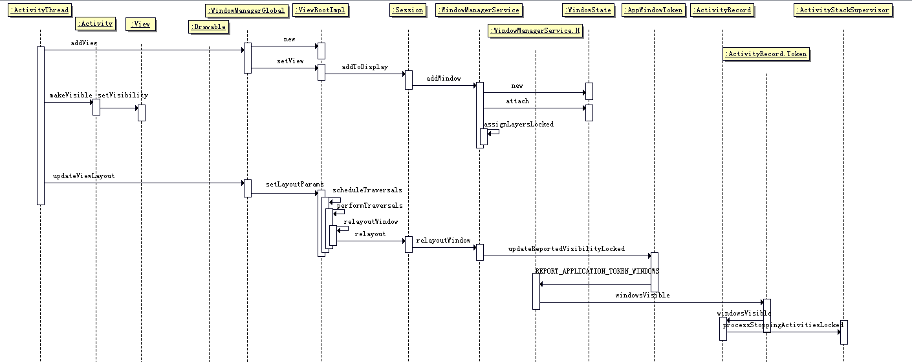

# Activity创建过程与window相关部分 #

当一个Activity的ActivityThread执行到handleResumeActivity函数的时候，说明当前activity的Create,Start准备工作都完成了。接下来是需要进行Resume准备，显示界面的部分。

整体流程图：


## 具体代码分析 ##

所以我们从ActivityThread的handleResumeActivity开始追踪。

大体流程图如下：



首先ActivityThread在执行handleResumeActivity之前还没有与WindowManagerService有过交互。到了这里主要的工作有：
1. 当activity需要正常显示，不需要启动新activity或被finish时，设置LayoutParams,并将其与decorView通过addView加入到wm中去。
2. 成功添加之后，还发现会有一个updateViewLayout的请求会发送给wm。
3. 当以上两步都完成了之后，会调用`r.activity.makeVisible();`，通知activity可以显示了。


### addView流程 ###

```java
ActivityThread.java

	final void handleResumeActivity(IBinder token,
            boolean clearHide, boolean isForward,boolean ignoreCallback, boolean reallyResume) {

		................................................

        // 调用performResumeActivity进行AMS对resume操作的后续操作，得到返回值 ActivityClientRecord
        r = performResumeActivity(token, clearHide, reason);

        if (r != null) {
            final Activity a = r.activity;

			// 首先描述的是当前窗口还没有被添加到WMS中，且该窗口还没有被结束或启动其他应用，那么我们接下来将添加该窗口
			// 后续还会分析窗口已经被添加到WMS中的情况，代码中不重复出现，文字中分析。
            boolean willBeVisible = !a.mStartedActivity;
            // 从AMS中更新willBeVisible值

			---------------------------------------------------------------------------------------------
			//以下代码是很关键的位置
            if (r.window == null && !a.mFinished && willBeVisible) {
                r.window = r.activity.getWindow();
				
				// decor view的创建，且先设置可见性为 invisible
                View decor = r.window.getDecorView();
                decor.setVisibility(View.INVISIBLE);
                ViewManager wm = a.getWindowManager();

				// 获取ActivityClientRecord中的WindowAtrributes作为LayoutParams
                WindowManager.LayoutParams l = r.window.getAttributes();
                a.mDecor = decor;
				// 在此处补全LayoutParams，如type是BASE_APPLICATION等级的type
                l.type = WindowManager.LayoutParams.TYPE_BASE_APPLICATION;
                l.softInputMode |= forwardBit;

                // 关于 r.mPreserveWindow 状态的判断

                if (a.mVisibleFromClient) {
                    if (!a.mWindowAdded) {
                        a.mWindowAdded = true;
						// 如果是一个没有被添加到WMS中的Window则会调用该接口，传入的View是从r.window中获取的decorView，以及获取后补全type的LayoutParams
                        wm.addView(decor, l);
                    } else {
                        // 当窗口已经被添加过了
                        a.onWindowAttributesChanged(l);
                    }
                }

```

以上代码其实是AMS与WMS交互的起点，所以我们逐条分析：

1. 在ActivityThread处理handleResumeActivity的时候，先会进入performResumeActivity，获取当前窗口的一些状态，得到返回值[ActivityClientRecord](../chap2/chap2.md#activityrecordactivityclientrecord)，使用返回值创建DecorView以及LayoutParams。
2. 使用创建的DecorView以及LayoutParams调用wm的addView接口添加窗口。
3. 以上流程是在resume的activity的窗口还未被添加时的流程，如果窗口被添加到WMS中，或是其他状态，在这里是不会走上述代码中的流程的。我们暂时只关注创建新的activity且WMS没添加Window时的流程。

接下来我们需要追踪的是wm到底是怎么addView的。

接口ViewManager被WindowManager继承。WindowManager定义了WindowManager.LayoutParams这个很重要的状态内部类，是一个用于保存窗口特性的一个数据结构。

WindowManager接口实际上又被WindowManagerImpl所继承，impl中持有WindowManagerGlobal的实例，实现的多数方法是直接调用mGlobal来实现的，所以接下来直接看WindowManagerGlobal中是如何实现addView的。

```java

WindowManagerGlobal.java

	public void addView(View view, ViewGroup.LayoutParams params,
            Display display, Window parentWindow) {

        //传入参数判空
		................................................

		//注意:调用addView的时候就会重新创建一个ViewRootImpl，比如说dialog其实是有单独的ViewRootImpl的
        ViewRootImpl root;
        View panelParentView = null;

        synchronized (mLock) {

			//预处理部分，暂时不关注
            ................................................
			//创建新的
            root = new ViewRootImpl(view.getContext(), display);

            view.setLayoutParams(wparams);

			//在global中添加数据记录
            mViews.add(view);
            mRoots.add(root);
            mParams.add(wparams);
        }

        // 最后做这个，因为发出了一个请求
        try {
			//调用新创建的ViewRootImpl
            root.setView(view, wparams, panelParentView);
        } catch (RuntimeException e) {
            //异常处理
        }
    }

```
是在WindowManagerGlobal的addView方法中创建ViewRootImpl，且在setView方法中将decorView和LayoutParams添加到ViewRootImpl中。

接下来主要分析一下ViewRootImpl，这个类在WindowManager相关中所占的作用非常之大。我会将一些比较关键的属性与方法额外列出来，着重分析。

```java

ViewRootImpl.java

public final class ViewRootImpl implements ViewParent,
        View.AttachInfo.Callbacks, HardwareRenderer.HardwareDrawCallbacks {
	//会新建，但是在setView中会copy传入的Params。
	final WindowManager.LayoutParams mWindowAttributes = new WindowManager.LayoutParams();
	
	//W是IWindow的BN端，用于给WindowState中的BP端对象mClient来调用。
	final W mWindow;

	//Choreographer用于发送消息，控制绘制的节奏
	Choreographer mChoreographer;

	// Surface在这里是可以被任意线程调用的，但是必须被在同步锁里面
	// Surface绝对不可以被重新分配或者清除（调用Surface.clear）
    final Surface mSurface = new Surface();

	// 以下变量会被多个线程访问到
    final Rect mWinFrame; // wm 分配的 frame 
    final Rect mPendingOverscanInsets = new Rect();
    final Rect mPendingVisibleInsets = new Rect();
    final Rect mPendingStableInsets = new Rect();
    final Rect mPendingContentInsets = new Rect();

	//Configuration保存的是与界面全局相关的一些值，比如说mcc/mnc、locale、screenLayout以及如navigation之类的配置
	final Configuration mLastConfiguration = new Configuration();
    final Configuration mPendingConfiguration = new Configuration();

	//投递消息到这里被处理
	final ViewRootHandler mHandler = new ViewRootHandler();

	//构造函数初始化各种属性 传入参数Display中保存的信息说明该ViewRootImpl需要被哪个显示设备输出
	public ViewRootImpl(Context context, Display display) {
        mContext = context;
		mWindowSession = WindowManagerGlobal.getWindowSession();

        //一通初始化
        ................................................
		//获取SystemProperties的一些值
        loadSystemProperties();
        mWindowIsRound = context.getResources().getBoolean(
                com.android.internal.R.bool.config_windowIsRound);
		
    }

	//setView是ActivityThread调用的，目的是设置一些参数到ViewRootImpl里，并且远程调用服务端，获取可用的布局属性等。
	public void setView(View view, WindowManager.LayoutParams attrs, View panelParentView) {
        synchronized (this) {
            if (mView == null) {
                mView = view;

                mAttachInfo.mDisplayState = mDisplay.getState();
                mDisplayManager.registerDisplayListener(mDisplayListener, mHandler);

                mViewLayoutDirectionInitial = mView.getRawLayoutDirection();
                mFallbackEventHandler.setView(view);
                mWindowAttributes.copyFrom(attrs);
                if (mWindowAttributes.packageName == null) {
                    mWindowAttributes.packageName = mBasePackageName;
                }
                attrs = mWindowAttributes;
				//持续追踪客户端实际提供的window flag，在setView的时候去更新这个值
                mClientWindowLayoutFlags = attrs.flags;

                setAccessibilityFocus(null, null);

                if (view instanceof RootViewSurfaceTaker) {
                    mSurfaceHolderCallback =
                            ((RootViewSurfaceTaker)view).willYouTakeTheSurface();
                    if (mSurfaceHolderCallback != null) {
                        mSurfaceHolder = new TakenSurfaceHolder();
                        mSurfaceHolder.setFormat(PixelFormat.UNKNOWN);
                    }
                }

				//计算在某个Z轴上，surface需要绘制的区域
                // TODO: Use real shadow insets for a constant max Z.
                final int surfaceInset = (int) Math.ceil(view.getZ() * 2);
                attrs.surfaceInsets.set(surfaceInset, surfaceInset, surfaceInset, surfaceInset);

                CompatibilityInfo compatibilityInfo = mDisplayAdjustments.getCompatibilityInfo();
                mTranslator = compatibilityInfo.getTranslator();
                mDisplayAdjustments.setActivityToken(attrs.token);

                // 中间一些值的处理，暂时不关注
                ................................................

                int res; /* = WindowManagerImpl.ADD_OKAY; */

                // Schedule the first layout -before- adding to the window
                // manager, to make sure we do the relayout before receiving
                // any other events from the system.
				//在使当前window加入窗口管理器，开始第一次layout，确保我们在接收到其他系统的事件之前已经relayout过了
                requestLayout();
                if ((mWindowAttributes.inputFeatures
                        & WindowManager.LayoutParams.INPUT_FEATURE_NO_INPUT_CHANNEL) == 0) {
                    mInputChannel = new InputChannel();
                }
                try {
                    mOrigWindowType = mWindowAttributes.type;
                    mAttachInfo.mRecomputeGlobalAttributes = true;
                    collectViewAttributes();
					
					//其实最关键的还是这一句，当ViewRootImpl需要被绑定某个View（即addView传入的view）上，需要addToDisplay
                    res = mWindowSession.addToDisplay(mWindow, mSeq, mWindowAttributes,
                            getHostVisibility(), mDisplay.getDisplayId(),
                            mAttachInfo.mContentInsets, mAttachInfo.mStableInsets, mInputChannel)；

				// 异常处理，对res返回值的处理等
                ................................................
            }
        }
    }
}

```

看到上述代码，可以追踪到，ViewRootImpl初始化的时候更多的只是从WindowManagerGlobal中取值等赋初始值等。而与绑定view相关，使ViewRootImpl真正工作的是setView，这个函数会做许多与surface相关的操作，毕竟surface的内容都是由ViewRootImpl来添加的。而最终，会去调用从WindowManagerGlobal中获取的mWindowSession对象的addToDisplay方法。

那么mWindowSession是个什么样的对象呢？

首先先放一张大佬总结的，WindowManagerService相关结构的神图:


我们关注的mWindowSession在放大图中：


我们可以很明显可以看到继承IWindowManager的服务端提供了接口openSession。那么为什么又要单独给出一个IWindowSession呢？

接下来我们继续按照线索追踪，看看这个架构的原因。

```java

WindowManagerGlobal.java

	public static IWindowSession getWindowSession() {
        synchronized (WindowManagerGlobal.class) {
            if (sWindowSession == null) {
                try {
                    InputMethodManager imm = InputMethodManager.getInstance();
					//通过ServiceManager获取IWindowManager
                    IWindowManager windowManager = getWindowManagerService();
					//调用IWindowManager的openSession,会调用到WindowManagerService的相应函数
                    sWindowSession = windowManager.openSession(
                            new IWindowSessionCallback.Stub() {
                                @Override
                                public void onAnimatorScaleChanged(float scale) {
                                    ValueAnimator.setDurationScale(scale);
                                }
                            },
                            imm.getClient(), imm.getInputContext());
                } catch (RemoteException e) {
                    Log.e(TAG, "Failed to open window session", e);
                }
            }
            return sWindowSession;
        }
    }

```

```java

WindowManagerService.java

	public IWindowSession openSession(IWindowSessionCallback callback, IInputMethodClient client,
            IInputContext inputContext) {
        if (client == null) throw new IllegalArgumentException("null client");
        if (inputContext == null) throw new IllegalArgumentException("null inputContext");
        Session session = new Session(this, callback, client, inputContext);
		//返回根据传入参数创建的IWindowSession的BN端
        return session;
    }

```

```java

Session.java


	public int addToDisplay(IWindow window, int seq, WindowManager.LayoutParams attrs,
            int viewVisibility, int displayId, Rect outContentInsets, Rect outStableInsets,
            InputChannel outInputChannel) {
		//直接调用服务端的属性mService所对应的方法，mService是初始化时传入的属性 
        return mService.addWindow(this, window, seq, attrs, viewVisibility, displayId,
                outContentInsets, outStableInsets, outInputChannel);
    }
```

在WindowManagerGlobal中，调用的是WindowManagerGlobal的getWindowSession。而这个方法会调用到服务端的Session类的addToDisplay方法。最终还是由mService来处理addWindow。

WMS向外提供openSession，从而返回另一个Binder对象，使外界通过另一条路进行通信。而Session也会与Surface的创建与回收相关。所以会单独的将Session拆开，同时也将很多与WMS相关的操作直接进行调用。

Session与WMS的关系是多对一的关系，Session在WindowState中保存，储存在WMS的数据结构中。

那么接下来主要关注WindowManagerService的addWindow。

```java

WindowManagerService.java

	public int addWindow(Session session, IWindow client, int seq,
            WindowManager.LayoutParams attrs, int viewVisibility, int displayId,
            Rect outContentInsets, Rect outStableInsets, InputChannel outInputChannel) {
        int[] appOp = new int[1];
        int res = mPolicy.checkAddPermission(attrs, appOp);
        if (res != WindowManagerGlobal.ADD_OKAY) {
            return res;
        }

        boolean reportNewConfig = false;
        WindowState attachedWindow = null;
        WindowState win = null;
        long origId;
        final int type = attrs.type;

        synchronized(mWindowMap) {
            

            boolean addToken = false;
            WindowToken token = mTokenMap.get(attrs.token);

			//异常处理
			................................................
				//新建一个与attrs.token相关的token值
                token = new WindowToken(this, attrs.token, -1, false);
                addToken = true;
           
			//很长的一段异常处理
			................................................

			//使用前面的一些属性来新建一个WindowState对象
            win = new WindowState(this, session, client, token,
                    attachedWindow, appOp[0], seq, attrs, viewVisibility, displayContent);
            
			//对于win返回值的异常处理
			................................................

			//WindowManagerPolicy实际上是PhoneWindowManager实现
			//根据当前窗口状态（是否需要状态栏等），来调整mAttrs.flags的属性
            mPolicy.adjustWindowParamsLw(win.mAttrs);
            win.setShowToOwnerOnlyLocked(mPolicy.checkShowToOwnerOnly(attrs));

			//根据 attrs.type 设置一些操作之前需要的值，只要执行完都会return ADD_OKAY
            res = mPolicy.prepareAddWindowLw(win, attrs);
            if (res != WindowManagerGlobal.ADD_OKAY) {
                return res;
            }

			//设置跟InputChannel相关的初始化，与InputDispatcher相关
            if (outInputChannel != null && (attrs.inputFeatures
                    & WindowManager.LayoutParams.INPUT_FEATURE_NO_INPUT_CHANNEL) == 0) {
                String name = win.makeInputChannelName();
                InputChannel[] inputChannels = InputChannel.openInputChannelPair(name);
                win.setInputChannel(inputChannels[0]);
                inputChannels[1].transferTo(outInputChannel);

                mInputManager.registerInputChannel(win.mInputChannel, win.mInputWindowHandle);
            }

            // 从现在开始，不能出现异常之类的

            res = WindowManagerGlobal.ADD_OKAY;

            origId = Binder.clearCallingIdentity();

            if (addToken) {
                mTokenMap.put(attrs.token, token);
            }

			//实际上调用mSession.windowAddedLocked  这一步是对于session的绑定
            win.attach();
			//将WindowState添加到mWindowMap中
            mWindowMap.put(client.asBinder(), win);

            ................................................

            boolean imMayMove = true;
			//这一段判断，主要是处理掉type是InputMethod相关的步骤，将windowState放入不同的数据结构
            if (type == TYPE_INPUT_METHOD) {
                win.mGivenInsetsPending = true;
                mInputMethodWindow = win;
                addInputMethodWindowToListLocked(win);
                imMayMove = false;
            } else if (type == TYPE_INPUT_METHOD_DIALOG) {
                mInputMethodDialogs.add(win);
                addWindowToListInOrderLocked(win, true);
                moveInputMethodDialogsLocked(findDesiredInputMethodWindowIndexLocked(true));
                imMayMove = false;
            } else {
                addWindowToListInOrderLocked(win, true);
				
				getDefaultDisplayContentLocked().pendingLayoutChanges|= WindowManagerPolicy.FINISH_LAYOUT_REDO_WALLPAPER;

				//处理掉type与wallPaper相关的逻辑
                if (type == TYPE_WALLPAPER) {
                    mLastWallpaperTimeoutTime = 0;
                    displayContent.pendingLayoutChanges |= FINISH_LAYOUT_REDO_WALLPAPER;
                } else if ((attrs.flags&FLAG_SHOW_WALLPAPER) != 0) {
                    displayContent.pendingLayoutChanges |= FINISH_LAYOUT_REDO_WALLPAPER;
                } else if (mWallpaperTarget != null
                        && mWallpaperTarget.mLayer >= win.mBaseLayer) {
                    // If there is currently a wallpaper being shown, and
                    // the base layer of the new window is below the current
                    // layer of the target window, then adjust the wallpaper.
                    // This is to avoid a new window being placed between the
                    // wallpaper and its target.
                    displayContent.pendingLayoutChanges |= FINISH_LAYOUT_REDO_WALLPAPER;
                }
            }
			
			//设置winAnimator的值，表示当前动画处于何种状态，当前正在进入Animation
            final WindowStateAnimator winAnimator = win.mWinAnimator;
            winAnimator.mEnterAnimationPending = true;
            winAnimator.mEnteringAnimation = true;

			//根据是不是default的display来设置outContentInsets以及outStableInsets
            if (displayContent.isDefaultDisplay) {
                mPolicy.getInsetHintLw(win.mAttrs, outContentInsets, outStableInsets);
            } else {
                outContentInsets.setEmpty();
                outStableInsets.setEmpty();
            }

            if (mInTouchMode) {
                res |= WindowManagerGlobal.ADD_FLAG_IN_TOUCH_MODE;
            }
            if (win.mAppToken == null || !win.mAppToken.clientHidden) {
                res |= WindowManagerGlobal.ADD_FLAG_APP_VISIBLE;
            }

			//mInputMonitor是输入事件以及注释区域管理器
            mInputMonitor.setUpdateInputWindowsNeededLw();

			//检测foucus是否改变，这里的代码暂时没有继续往后追
            boolean focusChanged = false;
            if (win.canReceiveKeys()) {
                focusChanged = updateFocusedWindowLocked(UPDATE_FOCUS_WILL_ASSIGN_LAYERS,
                        false /*updateInputWindows*/);
                if (focusChanged) {
                    imMayMove = false;
                }
            }

            if (imMayMove) {
                moveInputMethodWindowsIfNeededLocked(false);
            }


			//这里重新计算window的层次
            assignLayersLocked(displayContent.getWindowList());
			//注意，在这里不要进行布局计算，window必须要重新布局之后才能显示，所以我们接下来会完成这件事

			//focus改变了才会执行这里
            if (focusChanged) {
                mInputMonitor.setInputFocusLw(mCurrentFocus, false /*updateInputWindows*/);
            }

			//更新由input dispatcher提供的已缓存的信息
            mInputMonitor.updateInputWindowsLw(false /*force*/);

            ................................................

        Binder.restoreCallingIdentity(origId);

        return res;
    }

```

流程到这里，ActivityThread的handleResumeActivity与WMS相关的第一个步骤就结束了。

这个流程中首先会创建ViewRootImpl，然后在setView中openSession。通过Session向WMS请求addWindow。addWindow中会根据type值，设置一些变量，然后对InputDispatcher，Animation这些Window相关模块的初始化设置。

### updateViewLayout流程 ###

第二步，在符合判断的情况会进入updateViewLayout。和addView的调用流程很相似，追踪到WindowManagerGlobal：

```java

WindowManagerGlobal.java

public void updateViewLayout(View view, ViewGroup.LayoutParams params) {
		//判空处理
        ................................................

		WindowManager.LayoutParams wparams = (WindowManager.LayoutParams)params;
        
		//设置新的params
        view.setLayoutParams(wparams);

        synchronized (mLock) {
            int index = findViewLocked(view, true);
			//更新Layout
            wparams = mMultiWindowGlobal.updateViewLayout(view,wparams,mParams,index);
            ViewRootImpl root = mRoots.get(index);
			//删除了再重新添加一遍
            mParams.remove(index);
            mParams.add(index, wparams);
			//更新一遍LayoutParams，最终调用scheduleTraversals
            root.setLayoutParams(wparams, false);
        }
    }

```

实际上，这里没有太多意外的东西。首先把各数据结构中的params更新成新的，最后在进行一次ViewRootImpl的scheduleTraversals进行重新performMeasure、performLayout、performDraw的过程。

performDraw的最后会通知WMS进行重新布局。重新布局的重点会通过AppWindowToken进行IPC调用AMS,从而通知Activity进入onStop等。

[这一块的东西比较复杂，重新写了一篇文档记录该过程](Window显示完成通知Activity的流程.md)。


### makeVisible流程 ###

ViewRootImpl的handlerResumeActivity在执行完addView以及updateViewLayout方法之后，会执行`r.activity.makeVisible()`，通知Activity开始显示。

接下来直接从Activity相关代码追起：

```java
Activity.java

	void makeVisible() {
        if (!mWindowAdded) {
            ViewManager wm = getWindowManager();
            wm.addView(mDecor, getWindow().getAttributes());
            mWindowAdded = true;
        }
        mDecor.setVisibility(View.VISIBLE);
    }

```

到这里是一个关键点，从这里应用要开始显示，所以需要大量涉及WMS以及Surface相关的调用。因为过程复杂且重要，所以从`mDecor.setVisibility(View.VISIBLE);`之后的调用单独绘制了一幅图。


上述过程看起来很复杂，但是其实可以分作几个模块：

1. setVisible导致的invalidate重绘请求的传递。
2. 重绘之后经历ViewRootImpl的performTraversals流程，其中分作relayoutWindow、performMeasure、performLayout、performDraw几个子流程。
3. relayoutWindow负责请求WMS对当前窗口进行布局，返回给ViewRootImpl的是各frame的大小（除去StatusBar、NavigationBar等等最后给该应用的窗口大小）。这个布局过程会在WMS的文章中重点分析。
4. performMeasure负责测量，performLayout负责布局，这两个部分不是当前分析的重点，而且各应用开发的文章对这个部分有比较详细的分析。暂时不具体分析。
5. performDraw负责绘制过程，这个部分与Surface相关度很高，在drawSoftware流程中会lockCanvas获取Canvas用于绘制，而且会逐级往下分发该canvas用于子View的绘制。这个过程在图中有详细的显示。


