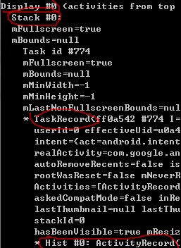

# 类图以及数据结构分析 #

## 主要内容 ##

Activity的创建到销毁，这一套生命周期是由服务端以及客户端协同进行的。用这种方式保证可以各种请求可以有序的被处理，如：按照各种模式启动Activity，根据Activity在AndroidMainifest文件中的属性控制Activity的行为等等。

Android系统最终提供给用户可以操作、交互的部分多数是以Activity为单位。而单单由一个ActivityManagerService管理所有有关Activity是非常复杂的，所以主要与Activity相关的服务会有PackageManagerService、ActivityManagerService、WindowManagerService。

- **PackageManagerService**主要负责的部分是解析验证权限，以及包的安装卸载，应用启动加速等等。主要负责的是与整个应用装载到设备的过程。

- **ActivityManagerService**主要负责的部分是管理Activity的生命周期以及模式，管理进程，调整power相关功能，验证权限等。

- **WindowManagerService**主要是负责与显示输出、事件输入相关的功能。

以上的每个服务都不是完全独立的，会互相合作最终成为Android系统的一个主干。


而我们的目标不是分析整个系统，而是以管窥豹，针对于某些特定的面去了解Android系统。


- [AMS Activity管理相关类](#ams-activity管理相关类)
- [AMS Activity协作相关类](#ams-activity协作相关类)

## AMS Activity管理相关类 ##

### AMS Activity生命周期管理类 ###

管理一个Activity的时候，需要让其按照一定规律运转生命周期。同时也要接受各类请求，对Activity进行一定改变。同时，因为每个Activity还是不同进程的，还需要注意它的安全性。

所以分析的时候将与生命周期相关的类分作 **服务端** 与 **客户端**。服务端在系统进程中，用于给客户端提供服务。客户端负责与操作者交互以及接受客户请求等。

### 服务端： ###
***ActivityManagerService*** : 

* 只会由SystemServer准备系统环境时创建，常驻系统之中，如果挂掉会自动重建。
* Activity管理服务最关键的类，继承IActivityManager，作为Binder的BN端，提供服务。  
* 为客户端提供服务，总管Activity、Service、Broadcast这几个关键组件。  
* 涉及与电源以及性能相关的模块，按照Activity模式控制性能与能耗模式。
* 多个层级，管理[复杂的Activity的聚集关系](#activitydisplayactivitystacktaskrecordactivityrecord)，并按照不同逻辑控制有序的改变多个Activity的关系。
* 负责映射与管理Linux系统中的pid、uid等与Android系统中Activity的关系。

***ActivityManagerNative*** : 

* 直接继承IActivityManager与binder，被ActivityManagerService继承。用于将跨进程请求发送到AMS中。
* 有内部类ActivityManagerProxy作为binder的BP端，由`ActivityManagerNative.getDefault()`返回，用于跨进程请求调用。
* 基本上就是手动实现AIDL的过程。

***ActivityStackSupervisor*** :

* 在ActivityStackService构造函数创建，一直伴随着AMS运行。
* 以ActivityStack为目标，对其进行查找、添加和删除等，同时也可以对Stack中的Activity请求生命周期变化。
* 里面会保存如`mStoppingActivities`和`mFinishingActivities`之类的数据结构记录需要做某些操作的Stack。


### 客户端： ###

***ActivityThread*** :

* 江湖人称主线程，UI线程。与生命周期以及绘制相关的操作会在其中执行。
* 由Zygote进程创建，ActivityThread的main函数为入口函数。一般都是一个进程的入口点。
* Looper在该类中被初始化以及prepare。主线程的消息都在这个MessageQueue中被处理。
* 有内部类ApplicationThread，继承IApplicationThread。用于被服务端访问，进行一些操作。
* 有内部类H，继承handler，将服务端的各类请求作为message来处理，分发到对应的函数中。
* 处理Activity生命周期相关，以及broadcast还有service相关的逻辑。

***Instrumentation*** :

* 工具类，在ActivityThread中绑定Activity的时候被创建，通过attach函数传到Activity中。
* 执行如改变生命周期、获取context等属性值、以及与Monitor相关的操作。

***Activity*** :

* 作为用户直接操作的类，提供丰富的可重写接口，同时可以通过context、config、window等等属性来影响整个系统的行为。
* 同样是与Window相关交互也非常多的一个类，通过ViewRootImpl与View系统进行关联。。


### AMS Activity dump相关类 ###

#### ActivityDisplay、ActivityStack、TaskRecord、ActivityRecord ####

在activity dump日志如下图：



红圈所示即是Stack相关数据结构。

***Display***：即**ActivityDisplay**，表示当前Display设备。一般来说手机只有显示屏作为Display设备，只有一个Display。机顶盒等设备可能会有多个Display。

***Stack***：即**ActivityStack**，Stack是Task的集合。Stack id 为0是home stack，一般只有Launcher与SystemUI两个应用常驻。Stack id 为1是FullScreen stack，正常状态下非home stack中的其他task都在此stack中，而且dump的信息会将当前激活状态的stack打印在更上方的位置。在多窗口模式下，是可以出现stack id>1的情况，[详情参考大佬的博客](http://blog.csdn.net/niohandsome/article/details/53354867)。

***Task***：即**TaskRecord**，是ActivityRecord的集合。TaskRecord弱化了进程的概念，同时弱化了package的概念，可以将非同进程、也非同package的Activity有序的组合在一起。Task会有自己的affinity，默认值是启动该Task应用的包名。同样的可以设置task启动模式。通过这两种方式可以设计出合理的Activity相关关系。[详情参考大佬的博客](http://blog.csdn.net/yyyysjhappy/article/details/20127615)


***Hist***：即**ActivityRecord**，这个类记录了当前Activity的一些状态，[状态值可以查看源码](http://androidxref.com/7.1.1_r6/xref/frameworks/base/services/core/java/com/android/server/am/ActivityRecord.java)。其中比较有意思的几个属性：

>final IApplicationToken.Stub appToken;  


- **appToken**是用ActivityRecord内部类Token赋值的，而Token继承Binder的Stub。其作用是作为一个通信的管道关联起来AMS和（WMS）WindowManagerService，使其可以互相调用。[详情参考大佬的博客](http://blog.csdn.net/guoqifa29/article/details/46819377)。说句题外话，实际上AMS和WMS是在同一个进程system_server中的，但是这里将其设置为跨进程通信的模式，可以预防system_server后期过于庞大，将主要的服务拆分出去。这也侧面体现了google工程师设计功底。

>TaskRecord task;   


- **task**是持有当前ActivityRecord的TaskRecord实例，在ActivityRecode中的函数`finishLaunchTickingLocked()`有
`task.stack.mHandler.removeMessages(ActivityStack.LAUNCH_TICK_MSG);`
可以通过这种方式一级一级的返回到ActivityStack来请求处理事件，同样的也可以直接调用更高一级的函数。

>final ActivityStackSupervisor mStackSupervisor;  


- **mStackSupervisor**是[ActivityStackSupervisor]()的实例，而其初始化是在AMS的构造函数中，可以说这个类是伴着AMS一起存活的。  
在ActivityRecord中有`windowsVisible()`，这个函数是在WindowManagerService.H的重写方法`handlerMessage()`中被调用的，代码如下： 

```
case REPORT_APPLICATION_TOKEN_WINDOWS: {
                    final AppWindowToken wtoken = (AppWindowToken)msg.obj;

                    boolean nowVisible = msg.arg1 != 0;
                    boolean nowGone = msg.arg2 != 0;

                    try {
                        if (DEBUG_VISIBILITY) Slog.v(
                                TAG, "Reporting visible in " + wtoken
                                + " visible=" + nowVisible
                                + " gone=" + nowGone);
                        if (nowVisible) {
                            wtoken.appToken.windowsVisible();
                        } else {
                            wtoken.appToken.windowsGone();
                        }
                    } catch (RemoteException ex) {
                    }
                } break;
```

`windowsVisible()`作用是改变visible属性。WMS实际持有的是Token，token被ActivityRecord持有，所以想从上至下改变AMS状态，就必须持有ActivityStackSupervisor实例。而实例的类型是final，是因为只会有一个ActivityStackSupervisor在内存中，避免被意外改变。而且由于AMS是常驻的服务，所以mStackSupervisor不需要被回收，所以使用final不会导致泄漏问题。


## AMS Activit协作相关类 ##

### ActivityRecord、ActivityClientRecord ###

两者分别位于AMS端和ActivityThread端，两者起的作用其实是比较一致的。

* ActivityRecord：位于AMS端，dumpsys打印出来的值都是从ActivityRecord中获取的。在ActivityStackSupervisor的realStartActivityLocked中会通过IApplicationThread调用ActivityThread的scheduleLaunchActivity方法。在ActivityThread端重建出来一个ActivityClientRecord。
* ActivityClientRecord：位于ActivityThread端，创建与WMS相关的操作时，会用到该类。


