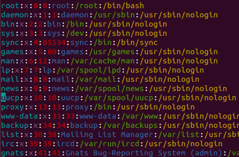
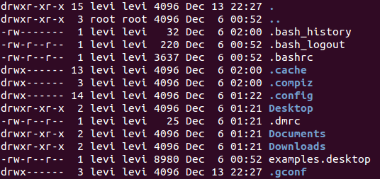
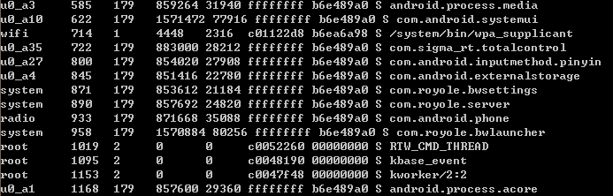
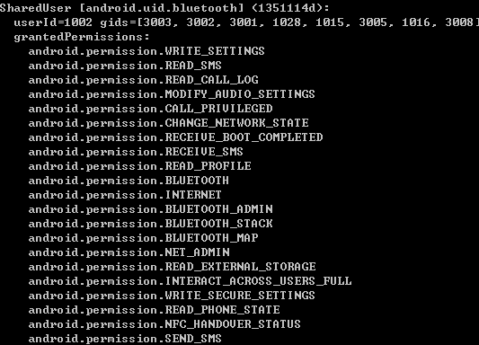

# uid与进程 #

工作中遇到了几次与进程相关的问题。所以在此总结一下有关进程相关的概念与属性。

## Linux中uid的概念 ##

一般来说一个用户就有一个UID，而UID一般可以被root用户查询到。

UID可以属于某个GID（组），多数一般用户的UID即GID。

以上有7个段，分别

1. "用户名"是代表用户账号的字符串。

2. “口令”一些系统中，存放着加密后的用户口令字。有些系统直接设置为X，实际的在/etc/shadow里面。

3. “用户标识号”是一个整数，系统内部用它来标识用户。

4. “组标识号”字段记录的是用户所属的用户组。

5. “注释性描述”字段记录着用户的一些个人情况。

6. “主目录”，也就是用户的起始工作目录。

接下来可以看看ls所对应的结果：

第一行的权限声明了，自己的rwx、用户组的rwx、所有人rwx。

第三行声明了所有者用户，第四行声明了所属用户组。

通过这种文件属性的方式，来控制访问权限。三个级别的读写执行权限，构成了linux的权限系统。

## Android中uid的概念 ##

在android的shell中查询ps:

1. 第一行描述的是用户号uid，需要注意的是root和system是不一样的uid。包括shell的uid也是不一样。
2. 第二行是进程号pid。
3. 第三行是父进程号ppid。

在这里首先需要强调的是，**网上经常说的Android.mk设置platform，然后设置sharedUserId就可以共享进程。这一点是错的！**  
可以看到BWSettings是系统设置，符合上述条件，但它的进程号和system_server并不一致。即pid不一致。  
一致的是uid，即用户id.  
暂时基本没找到网上澄清这个问题的。欢迎大手指正本结论。

接着看dumpsys package中有关permission的一段：

可以发现有名为 android.uid.bluetooth 的 SharedUser。userId是1002，且groupId有多个。如果没有则会导致非同组的文件都不能读取。

那么这个gids和权限有什么异同之处?

首先权限这个东西是android添加上的，更接近于用户的使用习惯，可以比较方便的显示和控制。

而gid更偏向于底层实现，而且权限更加的高。比如一个非系统级的应用要申请系统级的权限，这个时候它不属于系统内部的用户组，所以即使申请了权限也不会给它。

## 共享数据的方式 ##

如果你需要做一个application，将某些服务service，provider或者activity等的数据，共享出来怎么办，三个办法。

1、完全暴露，这就是android:exported=”true”的作用，而一旦设置了intentFilter之后，exported就默认被设置为true了，除非再强制设为false。当然，对那些没有intentFilter的程序体，它的exported属性默认仍然是false，也就不能共享出去。

2、权限提示暴露，这就是为什么经常要设置usePermission的原因，如果人家设置了android:permission=”xxx.xxx.xx”那么，你就必须在你的application的Manufest中usepermission xxx.xxx.xx才能访问人家的东西。

3、私有暴露，假如说一个公司做了两个产品，只想这两个产品之间可互相调用，那么这个时候就必须使用shareUserID将两个软件的Uid强制设置为一样的。这种情况下必须使用具有该公司签名的签名文档才能，如果使用一个系统自带软件的ShareUID，例如Contact，那么无须第三方签名。

这种方式保护了第三方软件公司的利益于数据安全。

当然如果一个activity是又system process跑出来的，那么它就可以横行霸道，任意权限，只是你无法开发一个第三方application具有系统的Pid（系统Pid不固定），但是你完全可以开发一个具有系统Uid的程序，对系统中的所有程序任意访问，只需再Manufest中声明shareUserId为android.system.uid即可，生成的文件也必须经过高权限签名才行，一般不具备这种审核条件的application，google不会提供给你这样的签名文件。当然你是在编译自己的系统的话，想把它作成系统软件程序，只需在Android.mk中声明Certificate:platform则可以了，既采用系统签名。这个系统Uid的获得过程，我们把它叫做获得Root权限的过程。所以很多第三方系统管理软件就是有Root权限的软件，因为他需要对系统有任意访问的权限。那么它的Root签名则需要和编译的系统一致，例如官方的系统得用官方的签名文件，CM的系统就得用CM的签名文件。（这里就不多讲了）

## 读取共享数据的方式 ##

如果要使用某个共享UID的话，一般来说有三步：

1、在Manifest节点中增加android:sharedUserId属性。

2、在Android.mk中增加LOCAL_CERTIFICATE的定义。

如果增加了上面的属性但没有定义与之对应的LOCAL_CERTIFICATE的话，APK是安装不上去的。提示错误是：Package com.test.MyTest has no signatures that match those in shared user android.uid.system; ignoring!也就是说，仅有相同签名和相同sharedUserID标签的两个应用程序签名都会被分配相同的用户ID。例如所有和media/download相关的APK都使用android.media作为sharedUserId的话，那么它们必须有相同的签名media。

3、把APK的源码放到packages/apps/目录下，用mm进行编译。

举例说明一下。

系统中所有使用android.uid.system作为共享UID的APK，都会首先在manifest节点中增加android:sharedUserId="android.uid.system"，然后在Android.mk中增加LOCAL_CERTIFICATE := platform。可以参见Settings等

系统中所有使用android.uid.shared作为共享UID的APK，都会在manifest节点中增加android:sharedUserId="android.uid.shared"，然后在Android.mk中增加LOCAL_CERTIFICATE := shared。可以参见Launcher等

系统中所有使用android.media作为共享UID的APK，都会在manifest节点中增加android:sharedUserId="android.media"，然后在Android.mk中增加LOCAL_CERTIFICATE := media。可以参见Gallery等。

另外，应用创建的任何文件都会被赋予应用的用户标识，并且正常情况下不能被其他包访问。当通过getSharedPreferences（String，int）、openFileOutput（String、int）或者openOrCreate Database（String、int、SQLiteDatabase.CursorFactory）创建一个新文件时，开发者可以同时或分别使用MODE_WORLD_READABLE和MODE_WORLD_RITEABLE标志允许其他包读/写此文件。当设置了这些标志后，这个文件仍然属于自己的应用程序，但是它的全局读/写和读/写权限已经设置，所以其他任何应用程序可以看到它。

