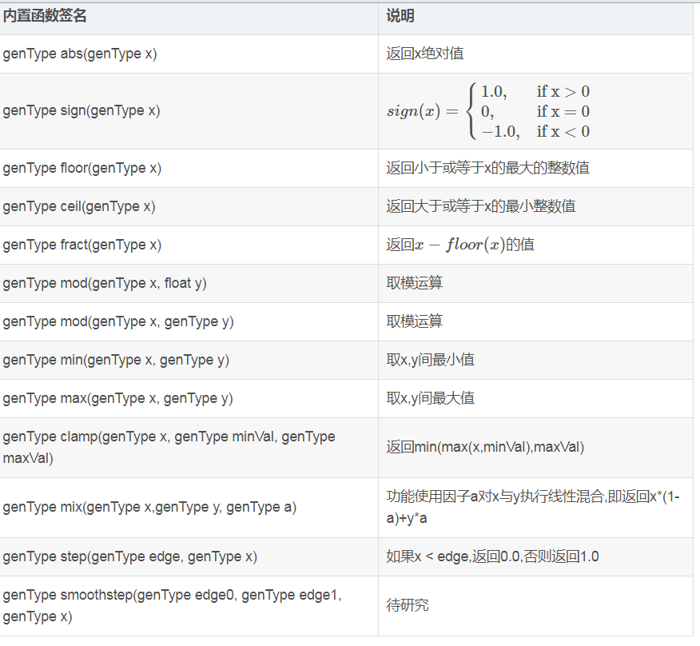
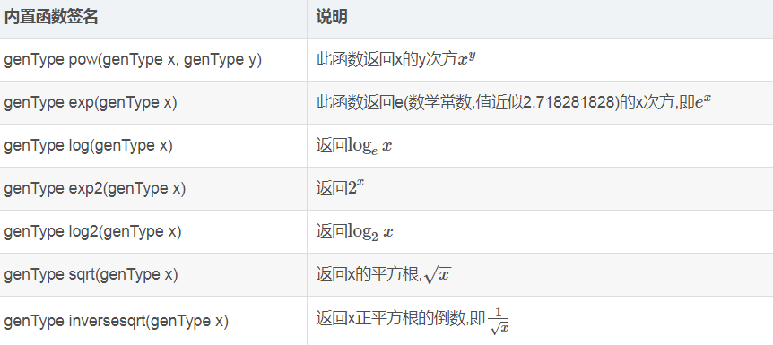
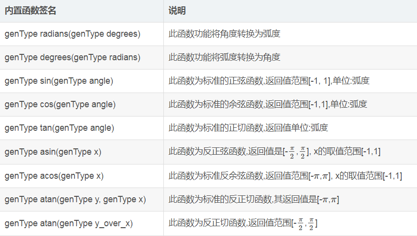
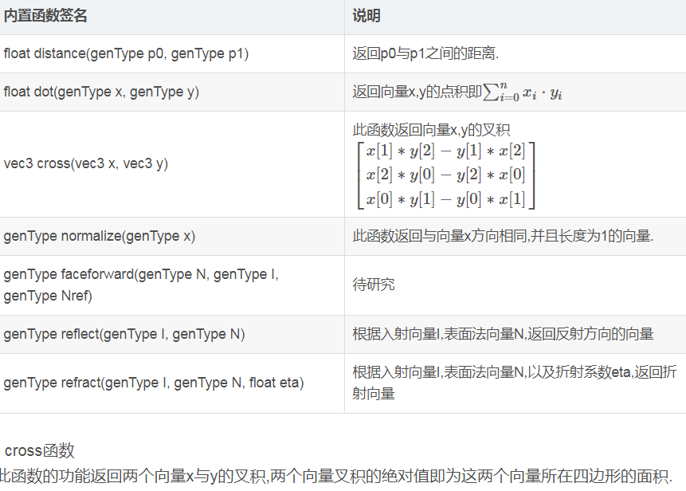
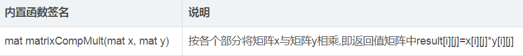
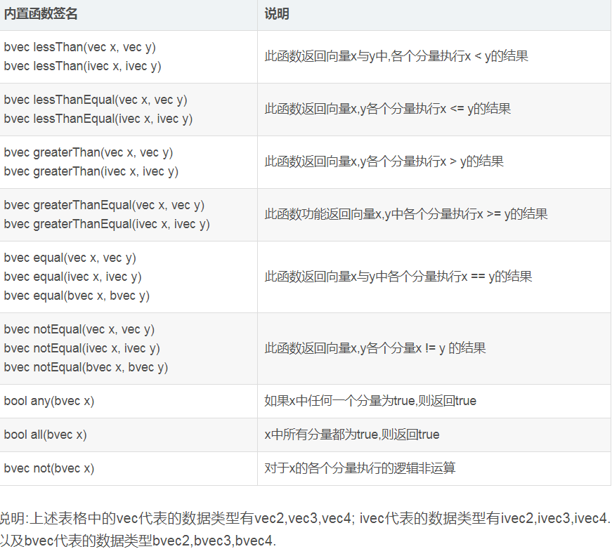
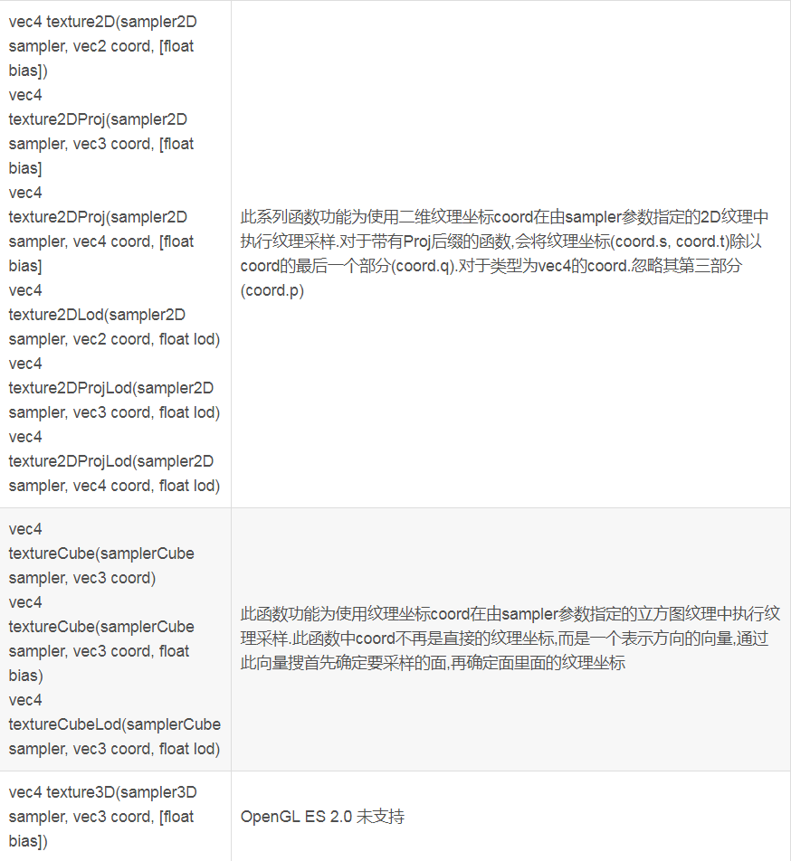
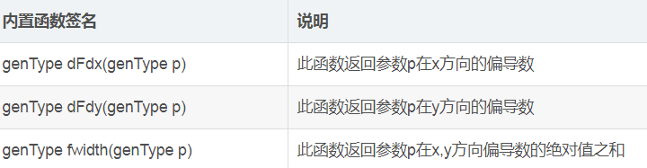

# shader script简介 # 

shader script这块是GLES20中最核心的内容，非固定管线编程的特点也是体现在shader script中的。

而我们主要要介绍shaders从以下几个角度来介绍：

1. 非固定管线编程流程
2. 变量类型
3. 内置变量
4. 内置函数

## 非固定管线编程流程 ##

需要了解详细的内容可以参考[巨犇的博客](http://www.cnblogs.com/liangliangh/p/4116164.html)，这篇文章从GPU介绍到了管线编程的方方面面。节约时间(偷懒)的仁兄可以直接看后文。

图形出现的过程非常复杂，而我们只简单用图像描述一下过程：

[非固定管线编程流程](./非固定管线编程流程.gif)

上图有以下这些流程：

1. 顶点经过图形学操作(Geometry operations)，得到变形之后的顶点。
2. 将变形之后的顶点进行图元装配（Assembly），图元装配时，要指定连接模式，如:Line或Triangle。
3. 对装配好的图元进行光栅化(Raster)，得到光栅片段(Fragments)。
4. 最后对光栅片段进行插值（Interpolation），得到添加了色彩的光栅片段。

而在实际的编写glsl(opengl shader language)中，需要编写两个shader脚本，一个是vertex（顶点），一个是fragment（片元）。这两个脚本使得之前的扳开关变成了变成的流程。

1. vertex shader的作用：
	1. 通过gl函数接口，获取顶点数组、输入变量等等外界输入。
	2. 借助Martix工具，计算相机矩阵，对顶点进行图形学操作。
	3. 自定义的对输入数组进行操作（非固定管线编程的魅力所在）。

2. fragment shader的作用：
	1. 接收vertex shader的变量值，得到栅格化之后的fragment信息。
	2. 取纹理像素点，对fragment进行上色，从而达到显示的效果。
	3. 自定义操作，对栅格化的片元进行各种有意思的图像特效（如水波纹等）。

以上是对非固定管线编程一个非常简短的介绍。  
特别需要吐槽一下的是，在shader script编译时才会报错，但没有办法进行类似于log的输出，唯一能做的就是将输出的片元当做调试工具（如：x>1的区域全部涂红），调试程序的值的时候非常难受。

这是一个关于[shader的应用实例](./实例1-测试shader.md)，主要解释了顶点与片元之间的关系。

## 变量类型 ##

在glsl中，变量会有限定符以及类型，语法与c是基本一致的。以下会详细分析限定符以及变量类型：

### 限定符 ###

限定符有多类，比如描述用途限定符，输入输出限定符、插值限定符、精度限定符。而这些限定符都是非常重要的，以下就逐一介绍：

#### 用途限定符 ####

用途限定符指定当前变量的使用方式以及作用，以下是具体分析：

1. uniform:用于不经常更改的信息，用于顶点与片元着色器，在shader中是只读的，外部代码可以赋值（通过glUniformXX进行赋值）。
2. attribute:用于经常更改的信息，用于与在应用传值到顶点着色器，多数时候是传入顶点数组（glVertexAttribPointer）。
3. varying:用于从顶点着色器传递到片元着色器的插值得到的信息，一般是平滑插值，可以用插值限定符进行修改。
4. const:用于声明只读常量变量，对shader外是不可见的。
5. 缺省：声明的变量shader外部不可见，且vertex与fragment的变量空间不同，可以重复命名不互相影响。

#### 输入输出限定符 ####

输入输出限定符有三种，in/out/inout：

1. in：复制进函数，但不在返回的时候复制，函数内部可写。默认的就是in。
2. out：只在返回的时候复制，可读，但进入函数的时候属于未定义状态。
3. inout：复制进函数并在返回时复制出去。

#### 精度限定符 ####

精度限定符有三种，lowp/mediump/highp。字面意思即可知道精度等级。  
需要注意的是：highp为默认精度，但厂商可能实际上并不支持三种精度。可以使用`precision highp float`的方法设置默认精度。

#### 插值限定符 ####

插值限定符属于比较高级的玩法，有smooth（平滑着色）和flat（平面着色）。  
默认选择就是smooth，来自顶点的着色器输出变量在图元中线性插值。一般来说这样够用了，所以不再继续深究该限定符用法。

### 类型 ###

glsl中的变量类型除了C语言中的float以及int之外，添加了不少与图形相关的变量类型：

#### 标量 ####

1. float：声明单独的一个浮点数。
2. int：声明一个单独的整数，范围是[-65535,65535]或者更大。
3. bool：声明一个单独的布尔数。逻辑运算结果不能用int，只能用bool判断。

#### 矢量 ####

每种标量都可以组合成矢量，硬件对图形计算的加速可能主要是在矢量的计算中。矢量例子：

* vec2: 包含两个浮点数的矢量
* ivec3：包含三个整数的矢量
* bvec4：包含四个布尔数的矢量

取矢量中的值可以参考以下方法：

```
vec2 direction;

direction.x = 1.0;
direction.r = 1.0;
direction.s = 1.0;
direction[0] = 1.0;
```

x,y,z,w  |  r,g,b,a  | s,t,p,q 分别可以将矢量看做方向|颜色|纹理坐标。但实际上程序是不会区分的，以任意一种方式读取都可以。

通过`vec4(0,0,0,0)`可以来赋值矢量。

#### 矩阵 ####

* mat2:2x2的浮点矩阵
* mat3：3x3的浮点矩阵
* mat4：4x4的浮点矩阵

`transform[3]`取出来的是第4列，是个vec4的矢量。同样的，`transform[3][1]`取出来的是第4列第2个的值。

#### 取样器 ####

* sampler1D：一维纹理
* sampler2D：二维纹理
* sampler3D：三维纹理
* samplerCube：立方体贴图纹理
* sampler1DShadow：访问一个带对比的一维深度纹理
* sampler1DShadow：访问一个带对比的一维深度纹理

取样器封装了底层实现纹理查找的硬件实现，根据以下方式读取纹理信息：

```
uniform sampler2D Grass;

vec4 color = texture2D(Grass,coord);

```

着色器本身不能在shader中初始化，而是使用uniform限定符从程序外部指定。指定时需要使用gl接口绑定某个纹理。

#### 结构 ####

```

struct light
{
	vec3 position;
	vec3 color;
}

light ceilingLight;

```

结构是唯一的用户定义的类型，每个结构都有自己的命名空间。与C++中类似。

#### 数组 ####

```

vec3 points[10]；
points[2] = vec4(1,0);

```
与C++用法基本一致。


## 内置变量 ##

内置变量分别来自顶点着色器与片元着色器。

### 顶点着色器 ###

* gl_Position: `highp vec4 gl_Position;` 写入顶点位置。 
* gl_PointSize: `mediump float gl_PointSize; `写入需要光栅化点的尺寸。

变量gl_Position仅可用在顶点语言中，并且用来写入奇次顶点位置。所有符合语法规则的顶点着色器都应该给该变量写入一个值。可以在着色器运行期间的任何时候给它写入新值，也可以随时读取它的值。这个值可以用在顶点处理开始之后的图元装配，剪裁，剔除和其他操作图元的固定功能上。如果检测到gl_Position没有被写入，或者在写入前被读取，编译器会产生一个诊断信息，但是并不是所有的情况都能检测的到。如果顶点着色器已经执行，但是并没有写入gl_Position，那么gl_Position的值是未定义的。

如果这些值没有被写入过，那么它们的值是未定义的。着色器在给它们写入值之后也可以将它们的值读取出来以重新获取写入的值。如果被多次写入过值，最近写入的值有效。

### 片元着色器 ###

* gl_FragCoord:`mediump vec4 gl_FragCoord;`是片元着色器中的只读变量，它保存了片元相对窗口的坐标位置：x, y, z, 1/w。这个值是顶点处理产生片元后固定功能内插图元的结果。组件z是用于表示片元深度的深度值。
* gl_FrontFacing:`bool gl_FrontFacing;`是片元着色器的内建只读变量，如果片元属于一个当前图元，那么这个值就为true。这个变量的一个用法就是来模拟两面光，通过选择由顶点着色器计算的两个颜色中的一个。
* gl_FragColor:`mediump vec4 gl_FragColor;`指明随后固定管线用到的片元颜色值。会比较常见。
* gl_FragData:`mediump vec4 gl_FragData[gl_MaxDrawBuffers];`写入数据时为了指明后续固定功能管线要使用的片元数据n。如果后续固定功能管线要使用这个片元数据，但是着色器又没有给它写入值，那么片元数据将是一个未定义的值。
* gl_PointCoord:`mediump vec2 gl_PointCoord;`是片元着色器的内建只读变量，它的值是当前片元所在点图元的二维坐标。点的范围是0.0到1.0。如果当前的图元不是一个点，那么从gl_PointCoord读出的值是未定义的。

片元着色器的输出值由OpenGL ES管线的后端固定函数进行处理。片元着色器使用gl_FragColor和gl_FragData内建变量向OpenGL ES管线输出值，除非关键字discard被执行。

对于片元着色器来说，向gl_FragColor和gl_FragData写入值不是必要的。许多算法，如阴影体，包含未被写入颜色值的渲染通道。

在片元着色器中这些变量可能会被写入多次。如果这样的话，在后续的固定功能管线中使用的就是最后一次被赋的值。这些变量可以在写入值之后随时将值读取出来。如果在读取之前没有被写入值的话，那么将得到一个未定义的值。


## 内置函数 ##

glsl着色语言的内置函数分以下几类，常见函数、指数函数、角度转化和三角函数、几何函数、矩阵函数、向量关系函数、纹理采样函数、微分函数。

### 常见函数 ###



### 指数函数 ###



### 角度转化和三角函数 ###



### 几何函数 ###



### 矩阵函数 ###



### 向量关系函数 ###




### 纹理采样函数 ###



### 微分函数 ###




