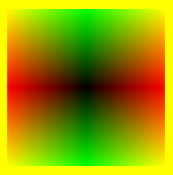
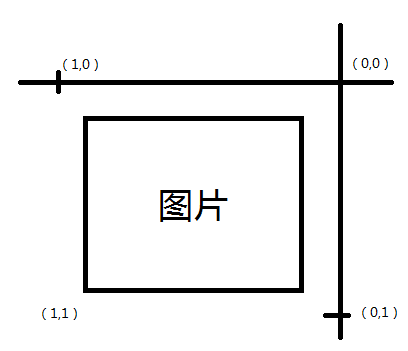

# 实例1-测试shader #

这篇实例的目的主要是为了揭示shader易混淆的一些概念。这篇文章是假设对GLES2.0版本接口有一定了解的情况下阅读的。

## 最终显示效果 ##



图片背景是黄色，四个角颜色也是黄色，中心是黑色，左右是红色，上下是绿色。

## 各实现代码 ##

顶点数组：当前只绘制一个矩形，更多的变化可以自行推演。

```

float scaleRate = 1.0f; 
        float w = 1.0f;

//为了更好的控制点元 使用的是GL_TRIANGLES模式，而不是GL_TRIANGLES_FAN
float[] vertices = new float[]{
                -w, scaleRate, 0f,
                -w, -scaleRate, 0f,
                w, scaleRate, 0f,

                w, scaleRate, 0f,
                -w, -scaleRate, 0f,
                w, -scaleRate, 0f,
        };
```

vertex shader:顶点着色器，负责将需要的值输入进来，然后进行插值。

```
uniform mat4 uMVPMatrix; //总变换矩阵
attribute vec3 aPosition;  //顶点位置
attribute vec2 aTexCoor;    //顶点纹理坐标
varying vec2 vTextureCoord;  //用于传递给片元着色器的变量
void main()
{
   gl_Position = uMVPMatrix * vec4(aPosition,1); //根据总变换矩阵计算此次绘制此顶点位置
   vTextureCoord = vec2(aPosition.x,aPosition.y);//aTexCoor;//将接收的纹理坐标传递给片元着色器
}

```

fragment shader:片元着色器，负责将需要的值输入进来，然后进行插值。

```
precision mediump float;
uniform sampler2D sTexture;//纹理内容数据
varying vec2 vTextureCoord; //接收从顶点着色器过来的参数

void main()
{
   vec2 texCoords = vTextureCoord;

   //给此片元从纹理中采样出颜色值，为了可以调试值的变化，此处使用自行定义的值
   //gl_FragColor = texture2D(sTexture, texCoords);

    //保证rgb值在 [0,1]之间，否则会导致什么都绘制不出来
    float rColor = abs(texCoords.x);
    float gColor = abs(texCoords.y);
    if(rColor>1.0)
        rColor = 1.0;

    if(rColor<0.0)
        rColor = 0.0;

    if(gColor>1.0)
        gColor = 1.0;

    if(gColor<0.0)
        gColor = 0.0;

    gl_FragColor = vec4(rColor,gColor,0,1);
}

```

## 原理分析 ##

可以看到 `varying vec2 vTextureCoord;` 是用于vertex和fragment中传值的变量。vertex传入多个**图元顶点**，而fragment得到的是根据图元顶点**光栅化**得到的片元。

在示例程序中，我们是直接用的 aPosition 的xy轴坐标当做传入参数，在外界调用 `glVertexAttribPointer` 时，指定了vertex shader的调用次数为2*3次。而fragment shader会在每一个在三角形的片元中调用一次。

所以实际上 `vec4(rColor,gColor,0,1);` 这个函数会是渐变的，根据X轴的绝对值增加r分量值，Y轴绝对值增加g分量值。最终会达到图片效果。

## 纹理赋值 ##

如果直接把fragment shader中纹理赋值的注释打开：
```
precision mediump float;
uniform sampler2D sTexture;//纹理内容数据
varying vec2 vTextureCoord; //接收从顶点着色器过来的参数


void main()
{
   vec2 texCoords = vTextureCoord;

   //给此片元从纹理中采样出颜色值
   gl_FragColor = texture2D(sTexture, texCoords);
}
```

结果会得到如下图：


这个图很有意思，我们总结出以下特点。

1. 纹理只能用[0,1]来取值。超出的部分，会取出来值，且是黑色，即(0,0,0)。
2. 当以(0,0)取值取出的是纹理的右上角，(1,0)取出的是纹理的左上角。那么下面总结一个纹理取值的图示：



**特别说明**：如果希望显示特定的纹理区域（平移以及旋转特效），也可在vertex中多传入一个数组，将数组值也通过varying表示符标记，在栅格化的时候同样进行均匀插值，使得取到纹理的不同位置。

vertex shader:
```
attribute vec2 aTexCoor;    //顶点纹理坐标
```
Render：
```
//TODO 5 将纹理坐标传入glsl
GLES20.glVertexAttribPointer(maTexCoorHandle, 2, GLES20.GL_FLOAT, false, 2 * 4, mTexCoorBuffer);
```