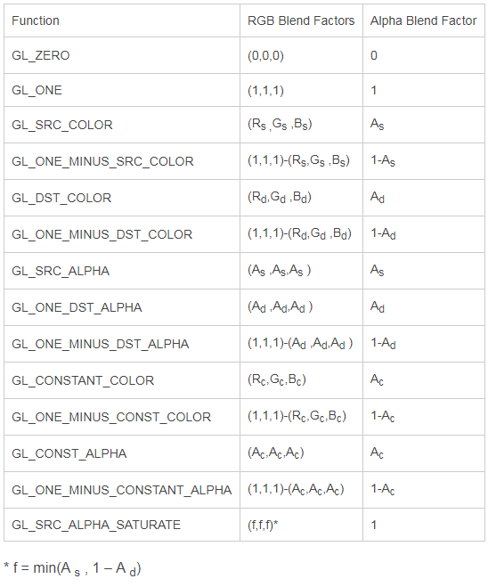

# 混合模式 #

在GLES功能开始初始化的时候，可以使用glEnable/glDisable接口设置一些功能。

最常见的有：`GLES20.GL_DEPTH_TEST` 开启深度测试，可以使前面的物体挡住后面的物体，后面的不显示。再就是我们这篇文章的主角：`GLES20.GL_BLEND`

当开启blend选项之后，我们还需要设置混合参数才能达到我们想要的效果，下文就详细介绍如何调整混合模式。

## 混合模式选项 ##

混合模式设置紧接着glEnable语句，例如：
```
GLES20.glEnable(GLES20.GL_BLEND);
GLES20.glBlendFunc(GLES20.GL_ONE,GLES20.GL_ZERO);
```

glBlendFunc的原型是glBlendFunc(int src_mode,int dst_mode)。假如某片元中已有(1,1,0,1)颜色的像素，再与(0,1,1,1)混合。此时前者是要被混合的对象，即dst，后者是用于混合的源，即src。

通过选择src和dst的混合模式，实现图像混合。而下图是混合模式值的列表：



计算公式是：Ci = (Cs * S) + (Cd * D)

意味着每个像素点值会与混合模式对应的值乘起来，再将混合目标与混合源加起来，如此实现图像混合。

## 混合模式实例 ##

以下是几个有代表性的例子：

### zero-one ###


由于src模式是zero，dst是one，所以新的贴图始终不会贴上去，就是一片黑。

### one-zero ###


由于dst是zero，src是one，所以新贴图贴上去的位置无论alpha值是什么，都会刷掉之前的dst图像。

### one-one ###


由于dst是one，src是one，所以混合后图像是rgb值进行线性叠加，所以浅绿会变成黄色。

### src-dst ###


dst是dst，即dst使用dst的alpha值来混合。src是src，即src使用src的alpha值来混合。当前图像与one-one一样，是因为src和dst的alpha值都是1。所以没有差异，当alpha值不为1时会有差异，该模式会浅一点。

### src-minus_src ###


该模式dst是1-src的alpha值，src是src的alpha值。最终混合出来的效果以src为主，即新图像为主，但也会有老图像的alpha值，符合多数混合要求。
