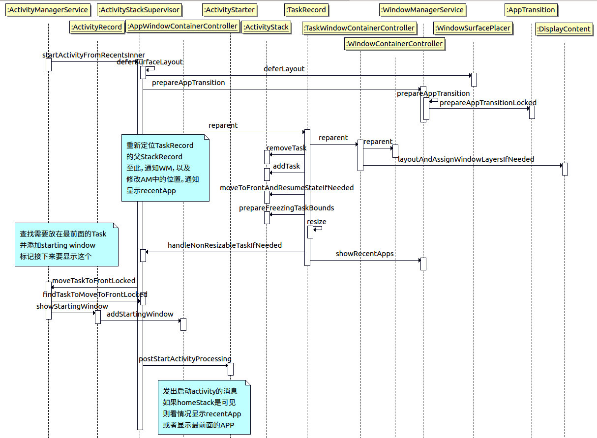

# 拖拽分屏启动流程

分屏在O版本上已经很完善了，接下来会大致的介绍一下启动流程。



此处分析的是点击menu进入RecentApps中选出需要进入分屏的应用（miui）。

而在代码逻辑中，最后还是会走到ActivityManagerService.startActivityRecentsInner()，在加锁的情况下调用到ActivityStackSupervisor里面的同名函数。

```java
ActivityStackSupervisor.java

    final int startActivityFromRecentsInner(int taskId, Bundle bOptions) {
        final TaskRecord task;
        final int callingUid;
        final String callingPackage;
        final Intent intent;
        final int userId;
        final ActivityOptions activityOptions = (bOptions != null)
                ? new ActivityOptions(bOptions) : null;
        final int launchStackId = (activityOptions != null)
                ? activityOptions.getLaunchStackId() : INVALID_STACK_ID;
        if (StackId.isHomeOrRecentsStack(launchStackId)) {
            throw new IllegalArgumentException("startActivityFromRecentsInner: Task "
                    + taskId + " can't be launch in the home/recents stack.");
        }

        // 标记，避免重复布局
        mWindowManager.deferSurfaceLayout();
        try {
            if (launchStackId == DOCKED_STACK_ID) {
                mWindowManager.setDockedStackCreateState(
                        activityOptions.getDockCreateMode(), null /* initialBounds */);

                // Defer updating the stack in which recents is until the app transition is done, to
                // not run into issues where we still need to draw the task in recents but the
                // docked stack is already created.
                // 同样是bound相关的值
                deferUpdateBounds(RECENTS_STACK_ID);
                // 标记mSkipAppTransitionAnimation为false
                mWindowManager.prepareAppTransition(TRANSIT_DOCK_TASK_FROM_RECENTS, false);
            }
            
            // 取出id为taskId的task
            task = anyTaskForIdLocked(taskId, MATCH_TASK_IN_STACKS_OR_RECENT_TASKS_AND_RESTORE,
                    launchStackId);

            // 没有id为taskId的特殊情况
            if (task == null) {
                continueUpdateBounds(RECENTS_STACK_ID);
                mWindowManager.executeAppTransition();
                throw new IllegalArgumentException(
                        "startActivityFromRecentsInner: Task " + taskId + " not found.");
            }

            // Since we don't have an actual source record here, we assume that the currently
            // focused activity was the source.
            final ActivityStack focusedStack = getFocusedStack();
            final ActivityRecord sourceRecord =
                    focusedStack != null ? focusedStack.topActivity() : null;

            if (launchStackId != INVALID_STACK_ID) {
                if (task.getStackId() != launchStackId) {

                    // 很关键的步骤，在这里会重新定位TaskRecord的父StackRecord，这个函数结束后，AM中的逻辑排序基本完成
                    task.reparent(launchStackId, ON_TOP, REPARENT_MOVE_STACK_TO_FRONT, ANIMATE,
                            DEFER_RESUME, "startActivityFromRecents");
                }
            }

            // 当不需要验证Credentials，且rootActivity不为空的时候。实际上多数时候都是这个流程
            if (!mService.mUserController.shouldConfirmCredentials(task.userId)
                    && task.getRootActivity() != null) {
                final ActivityRecord targetActivity = task.getTopActivity();

                mService.mActivityStarter.sendPowerHintForLaunchStartIfNeeded(true /* forceSend */,
                        targetActivity);
                mActivityMetricsLogger.notifyActivityLaunching();
                // 比较核心的操作，查找需要放到最前面的task，并标记需要显示这个task对应的window
                mService.moveTaskToFrontLocked(task.taskId, 0, bOptions, true /* fromRecents */);
                mActivityMetricsLogger.notifyActivityLaunched(ActivityManager.START_TASK_TO_FRONT,
                        targetActivity);

                // 我们需要把task启动到分屏(dock)stack上，把task放到resizing模式中，得以用背景填满全屏。
                // 而且我们调用这个在比较靠后的位置，为了保证task已经在wm端存在了。
                if (launchStackId == DOCKED_STACK_ID) {
                    setResizingDuringAnimation(task);
                }

                // 发出启动activity的消息
                mService.mActivityStarter.postStartActivityProcessing(task.getTopActivity(),
                        ActivityManager.START_TASK_TO_FRONT,
                        sourceRecord != null
                                ? sourceRecord.getTask().getStackId() : INVALID_STACK_ID,
                        sourceRecord, task.getStack());
                return ActivityManager.START_TASK_TO_FRONT;
            }

            // 该情况是需要验证的task或为task中rootActivity为空的情况，暂不分析。
            callingUid = task.mCallingUid;
            callingPackage = task.mCallingPackage;
            intent = task.intent;
            intent.addFlags(Intent.FLAG_ACTIVITY_LAUNCHED_FROM_HISTORY);
            userId = task.userId;
            int result = mService.startActivityInPackage(callingUid, callingPackage, intent, null,
                    null, null, 0, 0, bOptions, userId, task, "startActivityFromRecents");
            if (launchStackId == DOCKED_STACK_ID) {
                setResizingDuringAnimation(task);
            }
            return result;
        } finally {
            mWindowManager.continueSurfaceLayout();
        }
    }

```

以上大致的分析了一下入口函数startActivityFromRecentsInner的内容，接下来可以将主要内容分为三部分：

1. AM的reparent
2. 标记需要显示的task
3. 通知启动activity

## AM的reparent

task.reparent()的作用主要是把AM中的数据结构调整过来（重新定位父节点，或创建该task）。

```java
TaskRecord.java

boolean reparent(int preferredStackId, int position, @ReparentMoveStackMode int moveStackMode,
            boolean animate, boolean deferResume, boolean schedulePictureInPictureModeChange,
            String reason) {
        final ActivityStackSupervisor supervisor = mService.mStackSupervisor;
        final WindowManagerService windowManager = mService.mWindowManager;
        final ActivityStack sourceStack = getStack();
        final ActivityStack toStack = supervisor.getReparentTargetStack(this, preferredStackId,
                position == MAX_VALUE);
        if (toStack == sourceStack) {
            return false;
        }

        // 从　sourceStack　到　toStack　的动作
        final int sourceStackId = getStackId();
        final int stackId = toStack.getStackId();
        final ActivityRecord topActivity = getTopActivity();

        final boolean mightReplaceWindow = StackId.replaceWindowsOnTaskMove(sourceStackId, stackId)
                && topActivity != null;
        if (mightReplaceWindow) {
            //　标记relaunch　topActivity，因为大小已经改变了，且
            windowManager.setWillReplaceWindow(topActivity.appToken, animate);
        }

        windowManager.deferSurfaceLayout();
        boolean kept = true;
        try {
            final ActivityRecord r = topRunningActivityLocked();
            final boolean wasFocused = r != null && supervisor.isFocusedStack(sourceStack)
                    && (topRunningActivityLocked() == r);
            final boolean wasResumed = r != null && sourceStack.mResumedActivity == r;
            final boolean wasPaused = r != null && sourceStack.mPausingActivity == r;

            // In some cases the focused stack isn't the front stack. E.g. pinned stack.
            // Whenever we are moving the top activity from the front stack we want to make sure to
            // move the stack to the front.
            final boolean wasFront = r != null && supervisor.isFrontStackOnDisplay(sourceStack)
                    && (sourceStack.topRunningActivityLocked() == r);

            // Adjust the position for the new parent stack as needed.
            position = toStack.getAdjustedPositionForTask(this, position, null /* starting */);

            // Must reparent first in window manager to avoid a situation where AM can delete the
            // we are coming from in WM before we reparent because it became empty.
            mWindowContainerController.reparent(toStack.getWindowContainerController(), position,
                    moveStackMode == REPARENT_MOVE_STACK_TO_FRONT);

            final boolean moveStackToFront = moveStackMode == REPARENT_MOVE_STACK_TO_FRONT
                    || (moveStackMode == REPARENT_KEEP_STACK_AT_FRONT && (wasFocused || wasFront));
            // Move the task
            sourceStack.removeTask(this, reason, moveStackToFront
                    ? REMOVE_TASK_MODE_MOVING_TO_TOP : REMOVE_TASK_MODE_MOVING);
            toStack.addTask(this, position, false /* schedulePictureInPictureModeChange */, reason);

            if (schedulePictureInPictureModeChange) {
                // Notify of picture-in-picture mode changes
                supervisor.scheduleUpdatePictureInPictureModeIfNeeded(this, sourceStack);
            }

            // TODO: Ensure that this is actually necessary here
            // Notify the voice session if required
            if (voiceSession != null) {
                try {
                    voiceSession.taskStarted(intent, taskId);
                } catch (RemoteException e) {
                }
            }

            // If the task had focus before (or we're requested to move focus), move focus to the
            // new stack by moving the stack to the front.
            if (r != null) {
                toStack.moveToFrontAndResumeStateIfNeeded(r, moveStackToFront, wasResumed,
                        wasPaused, reason);
            }
            if (!animate) {
                toStack.mNoAnimActivities.add(topActivity);
            }

            // We might trigger a configuration change. Save the current task bounds for freezing.
            // TODO: Should this call be moved inside the resize method in WM?
            toStack.prepareFreezingTaskBounds();

            // Make sure the task has the appropriate bounds/size for the stack it is in.
            if (stackId == FULLSCREEN_WORKSPACE_STACK_ID
                    && !Objects.equals(mBounds, toStack.mBounds)) {
                kept = resize(toStack.mBounds, RESIZE_MODE_SYSTEM, !mightReplaceWindow,
                        deferResume);
            } else if (stackId == FREEFORM_WORKSPACE_STACK_ID) {
                Rect bounds = getLaunchBounds();
                if (bounds == null) {
                    toStack.layoutTaskInStack(this, null);
                    bounds = mBounds;
                }
                kept = resize(bounds, RESIZE_MODE_FORCED, !mightReplaceWindow, deferResume);
            } else if (stackId == DOCKED_STACK_ID || stackId == PINNED_STACK_ID) {
                if (stackId == DOCKED_STACK_ID && moveStackMode == REPARENT_KEEP_STACK_AT_FRONT) {
                    // Move recents to front so it is not behind home stack when going into docked
                    // mode
                    mService.mStackSupervisor.moveRecentsStackToFront(reason);
                }
                kept = resize(toStack.mBounds, RESIZE_MODE_SYSTEM, !mightReplaceWindow,
                        deferResume);
            }
        } finally {
            windowManager.continueSurfaceLayout();
        }

        if (mightReplaceWindow) {
            // If we didn't actual do a relaunch (indicated by kept==true meaning we kept the old
            // window), we need to clear the replace window settings. Otherwise, we schedule a
            // timeout to remove the old window if the replacing window is not coming in time.
            windowManager.scheduleClearWillReplaceWindows(topActivity.appToken, !kept);
        }

        if (!deferResume) {
            // The task might have already been running and its visibility needs to be synchronized
            // with the visibility of the stack / windows.
            supervisor.ensureActivitiesVisibleLocked(null, 0, !mightReplaceWindow);
            supervisor.resumeFocusedStackTopActivityLocked();
        }

        // TODO: Handle incorrect request to move before the actual move, not after.
        supervisor.handleNonResizableTaskIfNeeded(this, preferredStackId, DEFAULT_DISPLAY, stackId);

        boolean successful = (preferredStackId == stackId);
        // MIUI MOD: START
        // if (successful && stackId == DOCKED_STACK_ID) {
        boolean needShowRecents = true;
        final ActivityStack fullscreenStack = supervisor.getStack(FULLSCREEN_WORKSPACE_STACK_ID);
        if (fullscreenStack != null) {
            final ActivityRecord r = fullscreenStack.topRunningActivityLocked();
            if (r != null && r.visible && r.getTask().supportsSplitScreen()) {
                needShowRecents = false;
            }
        }
        if (successful && stackId == DOCKED_STACK_ID && toStack.getChildCount() == 1
                && needShowRecents) {
        // END
            // If task moved to docked stack - show recents if needed.
            mService.mWindowManager.showRecentApps(false /* fromHome */);
        }
        return successful;
    }

```

## 标记需要显示的task

## 通知启动activity
