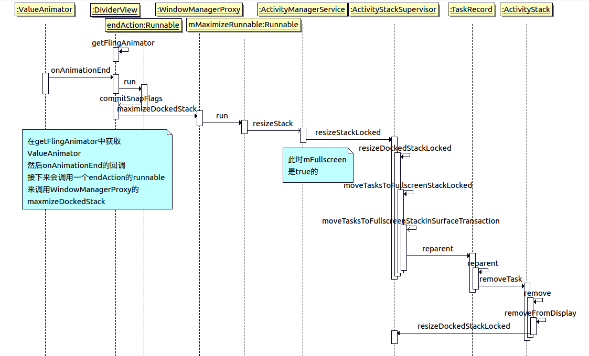

# 长按分屏关闭流程


长按关闭时，会调用到DividerView的stopDragging，从而启动一个ValueAnimator动画。

等到Choreographer动画回调触发，调用函数doAnimationFrame，ValueAnimator开始动画过程。以上过程不做具体分析，需要了解而已按照流程图进行查找。

我们主要关注到ActivityManagerService的resizeStack被调用到了。resizeDockedStackLocked做了一些简单的判断，就调用到了ActivityStackSupervisor的resizeDockedStackLocked。分析的起点就从这里开始。

```java
ActivityStackSupervisor.java

    /** 
    * 以下列出各变量值的用处/含义 以及来源
    * dockedBounds 在DividerView的resizeStack中设置，过程比较复杂，以后另起一篇分析。dockedBound一般是指根据dockSide计算出来的分屏区域大小。
    * tempDockedTaskBounds 与上面一个Bounds很接近，差异是用mSnapTargetBeforeMinimized信息来计算的，即上次的信息。
    * tempDockedTaskInsetBounds 有多种情况，可以直接是tempDockedTaskBounds，也可以是null，也可以是由taskPositionDocked计算出来的
    * tempOtherTaskBounds 是对dockSide取反的的区域，应该与tempDockedTaskBounds是互补的。
    * tempOtherTaskInsetBounds 一般就是tempOtherTaskBounds区域，然后进行了一些针对dockSide的align操作得到。
    * preserveWindows 在wms.resizeDockedStack中设置，值为PRESERVE_WINDOWS即为true
    * deferResume 在ActivityStackSupervisor同名函数中设置，为false
    */
    void resizeDockedStackLocked(Rect dockedBounds, Rect tempDockedTaskBounds,
            Rect tempDockedTaskInsetBounds, Rect tempOtherTaskBounds, Rect tempOtherTaskInsetBounds,
            boolean preserveWindows, boolean deferResume) {

        if (!mAllowDockedStackResize) {
            // 已经进入过该函数过了，避免循环调用，后面会标记该值
            return;
        }

        final ActivityStack stack = getStack(DOCKED_STACK_ID);
        if (stack == null) {
            // 取dock stack为空的异常处理
            return;
        }

        mWindowManager.deferSurfaceLayout();
        try {
            // 标记之后避免再次进入该函数，
            mAllowDockedStackResize = false;
            ActivityRecord r = stack.topRunningActivityLocked();

            // 先对dock stack进行resize
            stack.resize(dockedBounds, tempDockedTaskBounds, tempDockedTaskInsetBounds);

            // 实际退出分屏的时候，到这里 mFullScreen是false  dockBounds是（0,0-1080,1920）  
            // isAttached（检查Stack的list是否为空，若空则代表是独立的）是true
            if (stack.mFullscreen || (dockedBounds == null && !stack.isAttached())) {

                // 在这种情况下（全屏/dockedBounds为null是一回事），使其他stack都为fullscreen，且移动所有dock stack到fullscreen stack
                moveTasksToFullscreenStackLocked(DOCKED_STACK_ID, ON_TOP);

                // dock stack此时应该已经空了，所以activity应该置空
                r = null;
            } else {
                // docked stack占用了一块专用区域，所以其他stacks需要调整，避免与docked stack重叠。
                // 获得从wms获取一个已经被调整且所有stack都一致的bounds
                final Rect otherTaskRect = new Rect();
                for (int i = FIRST_STATIC_STACK_ID; i <= LAST_STATIC_STACK_ID; i++) {
                    final ActivityStack current = getStack(i);

                    // 第i个stack不为空，且是可以被dock stack来resize的stack，即 不等于 3,4 且小于6
                    if (current != null && StackId.isResizeableByDockedStack(i)) {
                        // 第一个参数是传入的，后面两个out参数是传出的，实际是从TaskStack中调用getStackDockedModeBoundsLocked，后面分析
                        current.getStackDockedModeBounds(
                                tempOtherTaskBounds /* currentTempTaskBounds */,
                                tempRect /* outStackBounds */,
                                otherTaskRect /* outTempTaskBounds */, true /* ignoreVisibility */);

                        // 使用前一个函数传出的参数调用
                        resizeStackLocked(i, !tempRect.isEmpty() ? tempRect : null,
                                !otherTaskRect.isEmpty() ? otherTaskRect : tempOtherTaskBounds,
                                tempOtherTaskInsetBounds, preserveWindows,
                                true /* allowResizeInDockedMode */, deferResume);
                    }
                }
            }
            if (!deferResume) {
                // deferResume即延迟resume，传入的一般是false，所以会立即去确认一般visibility
                stack.ensureVisibleActivitiesConfigurationLocked(r, preserveWindows);
            }
        } finally {
            // 循环结束，重置变量，continueSurfaceLayout中会调用performSurfacePlacement
            mAllowDockedStackResize = true;
            mWindowManager.continueSurfaceLayout();
            Trace.traceEnd(TRACE_TAG_ACTIVITY_MANAGER);
        }
    }
```

到这里，可以总结ActivityStackSupervisor调用resizeDockedStackLocked会做以下的事情：

1. 先对Dock Stack进行一次resize工作，计算出configuration以及mBounds等属性。resize是一个常见的函数，这里不着重分析。
2. 对每个可以对Dock Stack进行resize的Stack进行一次getStackDockedModeBounds。由tempOtherTaskBounds计算出该Stack的outStackBounds，outTempTaskBounds
3. 将上一步获得的两个参数传入resizeStackLocked。resizeStackLocked也是一个常见函数，resize当前stack，计算位置。
4. 进行ensureVisibleActivitiesConfigurationLocked操作。在resizeStackLocked中也会调用这个函数，用于遍历Task，确认有未更新的部分，就会重新进入resumeFocusedStackTopActivityLocked。
5. continueSurfaceLayout进行重新布局，更新新的布局位置。

我们着重追踪一下第二步的getStackDockedModeBounds，大体调用顺序如下时序图：


## getStackDockedModeBounds

```java
TaskStack.java

    /**
     * 确定非Dock的stack在docked模式下的stack和task的bounds
     *
     * @param currentTempTaskBounds 非dock stack的当前task bounds区域
     * @param outStackBounds 计算得出的非dock stack的stack bounds区域
     * @param outTempTaskBounds 计算得出的非dock stack的task bounds区域
     * @param ignoreVisibility 在获取stack bounds是否忽略可见性，传入的是true
     */
    void getStackDockedModeBoundsLocked(Rect currentTempTaskBounds, Rect outStackBounds,
            Rect outTempTaskBounds, boolean ignoreVisibility) {

        // 分支处理等等，不详细分析。需要注意的是，outTempTaskBounds在stackId不是home时，是(0,0-0,0)
        ............

        

        getStackDockedModeBounds(mTmpRect, outStackBounds, mStackId, mTmpRect2,
                mDisplayContent.mDividerControllerLocked.getContentWidth(), dockedOnTopOrLeft);
    }

    /**
     * 输出显示设备上有docked stack的stack bounds
     * @param displayRect dock stack所在显示设备的bounds
     * @param outBounds 输出调用该函数的stack的bounds
     * @param stackId 调用该函数的stack的id
     * @param dockedBounds dock stack的bounds
     * @param dockDividerWidth dockDivider即分屏中间的横杠，它的宽度.
     * @param dockOnTopOrLeft dockSide是top或left.
     */
    private void getStackDockedModeBounds(
            Rect displayRect, Rect outBounds, int stackId, Rect dockedBounds, int dockDividerWidth,
            boolean dockOnTopOrLeft) {
            ............
    }

```

具体内容不逐行分析，可以发现最终从getStackDockedModeBoundsLocked中获取了Stack和Task的bounds。Stack bounds是当前这个stack将要被设置的bounds大小，Task bounds一般是(0,0-0,0)，除非是home。

返回值已经确定了，接下来要看第三步的resizeStackLocked是如何操作的

## resizeStackLocked


```java
ActivityStackSupervisor.java

    // stackId为目标id，bounds是id对应的stack bound区域，tempTaskBounds多数情况下是上次的task区域信息，剩下来的参数基本是由resizeDockedStackLocked传入的，拉到最上面看具体分析
    void resizeStackLocked(int stackId, Rect bounds, Rect tempTaskBounds, Rect tempTaskInsetBounds,
            boolean preserveWindows, boolean allowResizeInDockedMode, boolean deferResume) {
        // 当前调用方式不会调用到这里
        if (stackId == DOCKED_STACK_ID) {
            resizeDockedStackLocked(bounds, tempTaskBounds, tempTaskInsetBounds, null, null,
                    preserveWindows, deferResume);
            return;
        }
        
        // 异常处理
        .............
        
        mWindowManager.deferSurfaceLayout();
        try {
            // resize非dock的几个stack
            stack.resize(bounds, tempTaskBounds, tempTaskInsetBounds);
            
            // 这后面的操作其实在ActivityStackSupervisor.resizeDockedStackLocked中是一样的，都需要对resize过的stack进行一次ensure以及continueSurfaceLayout操作。
            if (!deferResume) {
                stack.ensureVisibleActivitiesConfigurationLocked(
                        stack.topRunningActivityLocked(), preserveWindows);
            }
        } finally {
            mWindowManager.continueSurfaceLayout();
            Trace.traceEnd(TRACE_TAG_ACTIVITY_MANAGER);
        }
    }

```

分析到这里，我们可以概括一下长按分屏关闭流程做了什么：

1. 由DividerView发起resizeDockStack（发起原因之一是如时序图所分析的）
2. 调用到ActivityStackSupervisor的resizeDockedStackLocked，对Docked Stack进行resize的计算工作，进入退出分屏都会调用到这里。
3. 首先对dockStack进行resize，但先不进行ensure(ensureVisibleActivitiesConfigurationLocked)以及continueSurfaceLayout的操作。
4. 对非dockStack的进行resizeStackLocked,会逐一进行resize、ensure以及continueSurfaceLayout。
5. 最后进行dockStack的ensure，以及再进行一次continueSurfaceLayout。


# 长按分屏关闭流程--动画结束流程



前面的流程是动画结束之后ValueAnimator回调onAnimationEnd的流程，会一路调用到AMS的resizeStack。这期间的过程不是我们分析的重点。
到了resizeStack之后，animate是false，会直接调用ActivityStackSupervisor的resizeStackLocked。

```java
ActivityStackSupervisor.java

    void resizeStackLocked(int stackId, Rect bounds, Rect tempTaskBounds, Rect tempTaskInsetBounds,
            boolean preserveWindows, boolean allowResizeInDockedMode, boolean deferResume) {
        // 因为是针对dock stack调用到这里的
        if (stackId == DOCKED_STACK_ID) {
            resizeDockedStackLocked(bounds, tempTaskBounds, tempTaskInsetBounds, null, null,
                    preserveWindows, deferResume);
            return;
        }
        ............
    }

```

接下来又回到熟悉的老朋友resizeDockedStackLocked。

```java
ActivityStackSupervisor.java

    void resizeDockedStackLocked(Rect dockedBounds, Rect tempDockedTaskBounds,
            Rect tempDockedTaskInsetBounds, Rect tempOtherTaskBounds, Rect tempOtherTaskInsetBounds,
            boolean preserveWindows, boolean deferResume) {
            ............
            // 此时动画结束，mFullscreen正常情况下应该更新成了true
            if (stack.mFullscreen || (dockedBounds == null && !stack.isAttached())) {
                // 接下来会调用这里
                moveTasksToFullscreenStackLocked(DOCKED_STACK_ID, ON_TOP);

                r = null;
            } else {
            ............
    }

```
到这里就列出了两种流程的调用差异。

接下来简单分析这种流程干了什么。


```java
ActivityStackSupervisor.java


    void moveTasksToFullscreenStackLocked(int fromStackId, boolean onTop) {
        // 简单的用Surface的open和close包着一个执行moveTasksToFullscreenStackInSurfaceTransaction的runnable
        mWindowManager.inSurfaceTransaction(
                () -> moveTasksToFullscreenStackInSurfaceTransaction(fromStackId, onTop));
    }

    // 看名字可以估计是在surface transaction中移动Task到Fullscreen中
    private void moveTasksToFullscreenStackInSurfaceTransaction(int fromStackId,
            boolean onTop) {

        final ActivityStack stack = getStack(fromStackId);
        if (stack == null) {
            return;
        }

        mWindowManager.deferSurfaceLayout();
        try {
            // 遍历stack，对每个调用resizeStackLocked
            ............

            ActivityStack fullscreenStack = getStack(FULLSCREEN_WORKSPACE_STACK_ID);
            final boolean isFullscreenStackVisible = fullscreenStack != null &&
                    fullscreenStack.shouldBeVisible(null) == STACK_VISIBLE;
            // If we are moving from the pinned stack, then the animation takes care of updating
            // the picture-in-picture mode.
            final boolean schedulePictureInPictureModeChange = (fromStackId == PINNED_STACK_ID);
            final ArrayList<TaskRecord> tasks = stack.getAllTasks();
            final int size = tasks.size();
            // 传入ON_TOP，即为true
            if (onTop) {
                for (int i = 0; i < size; i++) {
                    final TaskRecord task = tasks.get(i);
                    final boolean isTopTask = i == (size - 1);
                    if (fromStackId == PINNED_STACK_ID) {
                        task.setTaskToReturnTo(isFullscreenStackVisible && onTop ?
                                APPLICATION_ACTIVITY_TYPE : HOME_ACTIVITY_TYPE);
                    }

                    // 主要关注这里，注释的意思是延迟resume显示过程直到所有的task都已经被移到fullscreen stack中了
                    task.reparent(FULLSCREEN_WORKSPACE_STACK_ID, ON_TOP,
                            REPARENT_MOVE_STACK_TO_FRONT, isTopTask /* animate */, DEFER_RESUME,
                            schedulePictureInPictureModeChange,
                            "moveTasksToFullscreenStack - onTop");
                }
            } else {
                for (int i = 0; i < size; i++) {
                    final TaskRecord task = tasks.get(i);
                    // Position the tasks in the fullscreen stack in order at the bottom of the
                    // stack. Also defer resume until all the tasks have been moved to the
                    // fullscreen stack.
                    task.reparent(FULLSCREEN_WORKSPACE_STACK_ID, i /* position */,
                            REPARENT_LEAVE_STACK_IN_PLACE, !ANIMATE, DEFER_RESUME,
                            schedulePictureInPictureModeChange,
                            "moveTasksToFullscreenStack - NOT_onTop");
                }
            }

            ensureActivitiesVisibleLocked(null, 0, PRESERVE_WINDOWS);
            resumeFocusedStackTopActivityLocked();
        } finally {
            mAllowDockedStackResize = true;
            mWindowManager.continueSurfaceLayout();
        }
    }

```

TaskRecord的reparent又是一个比较庞大的函数，而且每当需要进入退出分屏的时候都会调用到这里。后面会有wiki具体分析分屏中常用的函数，在此先不赘述。

根据流程，关注到ActivityStack.remove。

```java
ActivityStack.java

    // 完全删除stack，同样删除WindowManager端
    void remove() {
        removeFromDisplay();
        mStackSupervisor.mStacks.remove(mStackId);
        mWindowContainerController.removeContainer();
        mWindowContainerController = null;
        onParentChanged();
    }

    // 更新当前stack的内部状态用于完全移除出当前的父节点（Display），由此可以被完全销毁或重新定位一个父节点
    private void removeFromDisplay() {
        final ActivityStackSupervisor.ActivityDisplay display = getDisplay();
        if (display != null) {
            display.detachStack(this);
        }
        mDisplayId = INVALID_DISPLAY;
        mStacks = null;
        if (mTaskPositioner != null) {
            mTaskPositioner.reset();
        }
        if (mStackId == DOCKED_STACK_ID) {
            // If we removed a docked stack we want to resize it so it resizes all other stacks
            // in the system to fullscreen.
            mStackSupervisor.resizeDockedStackLocked(
                    null, null, null, null, null, PRESERVE_WINDOWS);
        }
    }

```


