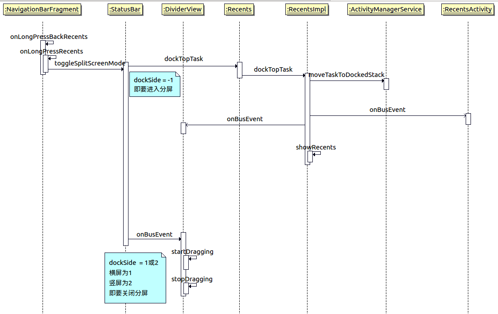

# 长按分屏启动流程

长按menu键是原生的分屏逻辑，我们主要关注分屏过程中是如何启动分屏的这一段逻辑。



以上是启动流程。


接下来追踪主线代码：

```java
StatusBar.java

    protected boolean toggleSplitScreenMode(int metricsDockAction, int metricsUndockAction) {
        if (mRecents == null) {
            return false;
        }
        // dockSide经常出现，进入分屏之前dockSide必然是-1，而关闭分屏的时候是1(横屏)，2（竖屏）
        int dockSide = WindowManagerProxy.getInstance().getDockSide();
        if (dockSide == WindowManager.DOCKED_INVALID) {
            //开启分屏时的逻辑
            return mRecents.dockTopTask(NavigationBarGestureHelper.DRAG_MODE_NONE,
                    ActivityManager.DOCKED_STACK_CREATE_MODE_TOP_OR_LEFT, null, metricsDockAction);
        } else {
            //关闭分屏时的逻辑
            Divider divider = getComponent(Divider.class);
            if (divider != null && divider.isMinimized() && !divider.isHomeStackResizable()) {
                // Undocking from the minimized state is not supported
                return false;
            } else {
                EventBus.getDefault().send(new UndockingTaskEvent());
                if (metricsUndockAction != -1) {
                    mMetricsLogger.action(metricsUndockAction);
                }
            }
        }
        return true;
    }
```

```java
Recents.java

    @Override
    public boolean dockTopTask(int dragMode, int stackCreateMode, Rect initialBounds,
            int metricsDockAction) {
        // 确认设备可以与recents交互
        if (!isUserSetup()) {
            return false;
        }

        Point realSize = new Point();
        if (initialBounds == null) {
            mContext.getSystemService(DisplayManager.class).getDisplay(Display.DEFAULT_DISPLAY)
                    .getRealSize(realSize);
            initialBounds = new Rect(0, 0, realSize.x, realSize.y);
        }

        int currentUser = sSystemServicesProxy.getCurrentUser();
        SystemServicesProxy ssp = Recents.getSystemServices();
        ActivityManager.RunningTaskInfo runningTask = ssp.getRunningTask();
        boolean screenPinningActive = ssp.isScreenPinningActive();
        boolean isRunningTaskInHomeOrRecentsStack = runningTask != null &&
                ActivityManager.StackId.isHomeOrRecentsStack(runningTask.stackId);
        // 1.确认当前task不为空 2.当前task不是home stack 3.screen不处于pinning状态(不常用的状态)
        if (runningTask != null && !isRunningTaskInHomeOrRecentsStack && !screenPinningActive) {
            logDockAttempt(mContext, runningTask.topActivity, r长按分屏启动流程.pngunningTask.resizeMode);
            // 验证当前task是否支持分屏
            if (runningTask.supportsSplitScreenMultiWindow) {
                // 传入参数，有效情况一般不为-1
                if (metricsDockAction != -1) {
                    MetricsLogger.action(mContext, metricsDockAction,
                            runningTask.topActivity.flattenToShortString());
                }
                // 系统应用一般为true
                if (sSystemServicesProxy.isSystemUser(currentUser)) {
                    mImpl.dockTopTask(runningTask.id, dragMode, stackCreateMode, initialBounds);
                } else {
                    if (mSystemToUserCallbacks != null) {
                        IRecentsNonSystemUserCallbacks callbacks =
                                mSystemToUserCallbacks.getNonSystemUserRecentsForUser(currentUser);
                        if (callbacks != null) {
                            try {
                                callbacks.dockTopTask(runningTask.id, dragMode, stackCreateMode,
                                        initialBounds);
                            } catch (RemoteException e) {
                                Log.e(TAG, "Callback failed", e);
                            }
                        } else {
                            Log.e(TAG, "No SystemUI callbacks found for user: " + currentUser);
                        }
                    }
                }
                mDraggingInRecentsCurrentUser = currentUser;
                return true;
            } else {
                // 不支持分屏的task
                EventBus.getDefault().send(new ShowUserToastEvent(
                        R.string.dock_non_resizeble_failed_to_dock_text, Toast.LENGTH_SHORT));
                return false;
            }
        } else {
            return false;
        }
    }


```

```java
RecentsImpl.java

    public void dockTopTask(int topTaskId, int dragMode,
            int stackCreateMode, Rect initialBounds) {
        SystemServicesProxy ssp = Recents.getSystemServices();

        // 确保我们通知了DividerView在我们实际启动应用之前，通过这，我们可以成功切换程resize模式
        // 此处首先调用moveTaskToDockedStack，调整task到dockStack这个分屏应用所在的stack上
        if (ssp.moveTaskToDockedStack(topTaskId, stackCreateMode, initialBounds)) {
            // 通知事件到 EventBus，此时register到的按顺序是RecentActivity以及DividerView
            EventBus.getDefault().send(new DockedTopTaskEvent(dragMode, initialBounds));
            // 显示近期任务
            showRecents(
                    false /* triggeredFromAltTab */,
                    dragMode == NavigationBarGestureHelper.DRAG_MODE_RECENTS,
                    false /* animate */,
                    true /* launchedWhileDockingTask*/,
                    false /* fromHome */,
                    DividerView.INVALID_RECENTS_GROW_TARGET);
        }
    }

```

到这里总结下长按menu键之后触发的操作：
1. 事件传递到NavigationBarFragment的onLongPressBackRecents中，处理事件后由StatusBar的toggleSplitScreenMode来处理问题。
2. 启动分屏时，toggleSplitScreenMode中的流程会走dockSide为-1的事件，然后会进入Recents的dockTopTask，将最上面的一个task放到分屏中。
3. dockTopTask中想要正常进行分屏，首先判断当前task不为空、当前task不是home stack、screen不处于pinning状态、将要[分屏的应用是否可以分屏](./可分屏的判断逻辑.md)。
4. 如果确认是需要进行分屏，则会在RecentsImpl的dockTopTask中首先通知AMS移动task到分屏stack上，再通知eventbus，最后下半屏显示近期任务。

（注：[将要分屏的应用是否可以分屏的详细介绍请点击链接](./可分屏的判断逻辑.md)，如果只希望了解结论直接拉到最下面。）

那么接下来主要分析的流程是
1. AMS对moveTaskToDockedStack所做的操作。
2. EventBus对RecentActivity和DividerView的影响。

## AMS对moveTaskToDockedStack所做的操作

```java
ActivityManagerService.java

    @Override
    public boolean moveTaskToDockedStack(int taskId, int createMode, boolean toTop, boolean animate,
            Rect initialBounds) {
        enforceCallingPermission(MANAGE_ACTIVITY_STACKS, "moveTaskToDockedStack()");
        synchronized (this) {
            long ident = Binder.clearCallingIdentity();
            try {
                // 查找该id的taskRecord
                final TaskRecord task = mStackSupervisor.anyTaskForIdLocked(taskId);
                if (task == null) {
                    Slog.w(TAG, "moveTaskToDockedStack: No task for id=" + taskId);
                    return false;
                }

                // 通知WMS设置 mDockedStackCreateMode/Bound这两个值
                mWindowManager.setDockedStackCreateState(createMode, initialBounds);

                // 延迟resume这个操作，直到我们已经将home stack移动到前台stack后面了
                // task的reparent操作不论是拖拽式还是长按式启动分屏都会调用到
                final boolean moved = task.reparent(DOCKED_STACK_ID, toTop,
                        REPARENT_KEEP_STACK_AT_FRONT, animate, !DEFER_RESUME,
                        "moveTaskToDockedStack");
                if (moved) {
                    // 到这就已经成功的reparent了，这里的工作是确保需要显示的activity确实显示出来了
                    mStackSupervisor.ensureActivitiesVisibleLocked(null, 0, !PRESERVE_WINDOWS);
                }
                return moved;
            } finally {
                Binder.restoreCallingIdentity(ident);
            }
        }
    }
```
至此，又分两个流程
1. ActivityStack的reparent
2. ActivityStackSupervisor的ensureActivitiesVisibleLocked

### ActivityStack的reparent

task.reparent()的作用主要是把AM中的数据结构调整过来（重新定位父节点，或创建该task）。

```java
TaskRecord.java

    boolean reparent(int preferredStackId, int position, @ReparentMoveStackMode int moveStackMode,
            boolean animate, boolean deferResume, boolean schedulePictureInPictureModeChange,
            String reason) {
        final ActivityStackSupervisor supervisor = mService.mStackSupervisor;
        final WindowManagerService windowManager = mService.mWindowManager;
        final ActivityStack sourceStack = getStack();
        final ActivityStack toStack = supervisor.getReparentTargetStack(this, preferredStackId,
                position == MAX_VALUE);  //分屏时，这个是stackId=3的stack
        if (toStack == sourceStack) {
            return false;
        }

        // 从　sourceStack　到　toStack　的动作
        final int sourceStackId = getStackId();
        final int stackId = toStack.getStackId();
        final ActivityRecord topActivity = getTopActivity();

        final boolean mightReplaceWindow = StackId.replaceWindowsOnTaskMove(sourceStackId, stackId)
                && topActivity != null;// debug为false
        if (mightReplaceWindow) {
            //　标记relaunch　topActivity，从AppWindowToken通知当前窗口可能需要去掉以及重建
            windowManager.setWillReplaceWindow(topActivity.appToken, animate);
        }

        // 标记值，避免布局次数过多
        windowManager.deferSurfaceLayout();
        boolean kept = true;
        try {
            final ActivityRecord r = topRunningActivityLocked();  // 获取当前stack的最顶端activity的ActivityRecord
            final boolean wasFocused = r != null && supervisor.isFocusedStack(sourceStack)
                    && (topRunningActivityLocked() == r);  // 一般情况，三方应用只在前台Stack上
            final boolean wasResumed = r != null && sourceStack.mResumedActivity == r;
            final boolean wasPaused = r != null && sourceStack.mPausingActivity == r;

            // 特殊情况，如pinned stack不符合该情况。点击到navigation，所以front是stackId=0的，wasFront=false
            final boolean wasFront = r != null && supervisor.isFrontStackOnDisplay(sourceStack)
                    && (sourceStack.topRunningActivityLocked() == r);

            // 保证position是合理值，通过判断task最大position来保证
            position = toStack.getAdjustedPositionForTask(this, position, null /* starting */);

            // 我们首先需要reparent WM的数据结构避免AM删空了
            mWindowContainerController.reparent(toStack.getWindowContainerController(), position,
                    moveStackMode == REPARENT_MOVE_STACK_TO_FRONT);

            final boolean moveStackToFront = moveStackMode == REPARENT_MOVE_STACK_TO_FRONT
                    || (moveStackMode == REPARENT_KEEP_STACK_AT_FRONT && (wasFocused || wasFront));

            // 在两个stack的数据结构中，增删需要reparent的task
            sourceStack.removeTask(this, reason, moveStackToFront
                    ? REMOVE_TASK_MODE_MOVING_TO_TOP : REMOVE_TASK_MODE_MOVING);
            toStack.addTask(this, position, false /* schedulePictureInPictureModeChange */, reason);

            // 函数传入，与pip（画中画）模式有关系，暂不分析
            if (schedulePictureInPictureModeChange) {
                // Notify of picture-in-picture mode changes
                supervisor.scheduleUpdatePictureInPictureModeIfNeeded(this, sourceStack);
            }

            // 无用，跳过
            if (voiceSession != null) {
                try {
                    voiceSession.taskStarted(intent, taskId);
                } catch (RemoteException e) {
                }
            }

            // task移动之前处于focus状态，通过移到前台来确保新的stack处于focus状态
            if (r != null) {
                toStack.moveToFrontAndResumeStateIfNeeded(r, moveStackToFront, wasResumed,
                        wasPaused, reason);
            }
            // animate传入false
            if (!animate) {
                toStack.mNoAnimActivities.add(topActivity);
            }

            // 将会有配置变化，保留当前的task bound
            // TODO: 是否需要将此处移到wm的resize中
            toStack.prepareFreezingTaskBounds();

            // 确保task在所在的stack里有正确的bound/size
            if (stackId == FULLSCREEN_WORKSPACE_STACK_ID
                    && !Objects.equals(mBounds, toStack.mBounds)) {
                kept = resize(toStack.mBounds, RESIZE_MODE_SYSTEM, !mightReplaceWindow,
                        deferResume);
            } else if (stackId == FREEFORM_WORKSPACE_STACK_ID) {
                Rect bounds = getLaunchBounds();
                if (bounds == null) {
                    toStack.layoutTaskInStack(this, null);
                    bounds = mBounds;
                }
                kept = resize(bounds, RESIZE_MODE_FORCED, !mightReplaceWindow, deferResume);
            } else if (stackId == DOCKED_STACK_ID || stackId == PINNED_STACK_ID) {
                if (stackId == DOCKED_STACK_ID && moveStackMode == REPARENT_KEEP_STACK_AT_FRONT) {
                    // 第一步是将recents移动到前台，避免home stack的内容直接出现在分屏模式
                    mService.mStackSupervisor.moveRecentsStackToFront(reason);
                }
                // resize计算边界 
                kept = resize(toStack.mBounds, RESIZE_MODE_SYSTEM, !mightReplaceWindow,
                        deferResume);
            }
        } finally {
            // 调用到WindowPlacerLocked的continueLayout
            windowManager.continueSurfaceLayout();
        }

        if (mightReplaceWindow) {
            // 根据resize计算出来的kept值代表是否保留原有的window，如果不需要kept的话，就执行这里  断点发现没执行
            windowManager.scheduleClearWillReplaceWindows(topActivity.appToken, !kept);
        }

        // deferResume代表是否需要延迟resume 实际断点deferResume是false
        if (!deferResume) {
            // task 可能此处已经在运行了，需要根据stack或window的可见性同步进行调整
            supervisor.ensureActivitiesVisibleLocked(null, 0, !mightReplaceWindow);
            supervisor.resumeFocusedStackTopActivityLocked();
        }

        // TODO: 在实际移动之前处理掉不正常的移动请求
        supervisor.handleNonResizableTaskIfNeeded(this, preferredStackId, DEFAULT_DISPLAY, stackId);

        boolean successful = (preferredStackId == stackId);
        if (successful && stackId == DOCKED_STACK_ID) {
            // 需要显示recents时进行显示
            mService.mWindowManager.showRecentApps(false /* fromHome */);
        }
        return successful;
    }

```

总结一下reparent干了什么：
1. **通知mWindowContainerController先进行reparent操作**。
2. **在Stack数据结构中分别增删TaskRecord**。
3. 移动目标Stack到前台。
4. **将recents移到前台，遮挡home stack的内容。并计算相应stack的边界**。
5. **continueSurfaceLayout重新计算布局信息**。
6. 跟随task状态，调整可见性。


