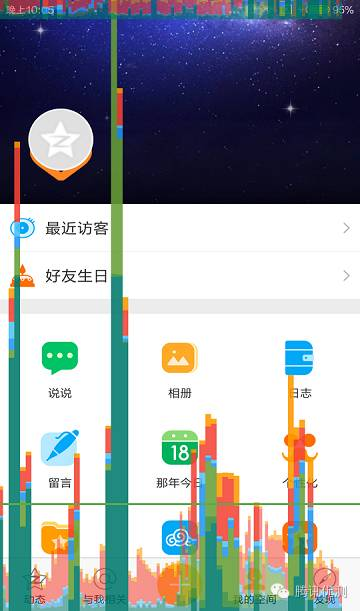
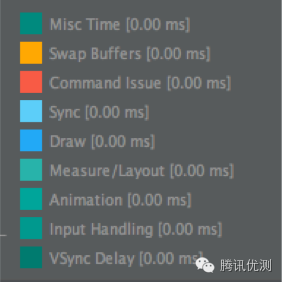

# GPU性能测试

最近项目需要绘制图像，前版本方案是使用onDraw接口进行绘图，因为从图像质量以及功能考虑从GLES优化显示效果。

需要测试GPU性能可以用以下方法：

1. GPU View Updates
2. Show GPU Overdraw
3. Profile GPU Rendering
4. GPU Monitor
5. Trepn Profiler

虽然以上方法暂时还是没有解决问题，但是这里还是把方法进行记录。

## GPU View Updates

开启方式：设置-开发者选项-显示GPU视图更新

功能：查看View的更新以及redraw区域的大小

## Show GPU Overdraw

开启方式：设置-开发者选项-调试GPU过度绘制-显示过度绘制区域

功能：查看过度绘制（某些像素被绘制多次）区域，颜色越深绘制次数越多。

## Profile GPU Rendering

开启方式：设置-开发者选项-GPU呈现模式分析

图示:

* 绿色横线代表正常绘制耗时
* 蓝色竖线代表绘制时间，即创建和更新display lists的时间
* 红色竖线代表执行时间，即系统进行2D渲染Display List的时间
* 橙色竖线代表处理时间，即CPU等待GPU完成渲染处理的时间

在6.X版本之后变成9个部分，将渲染过程继续细分：

* Swap Buffers：对应原先Process（橙色），表示处理任务的时间，也可以说是CPU等待GPU完成任务的时间，线条越高，表示GPU做的事情越多；

* Command Issue：对应原先Execute（红色），表示执行任务的时间，这部分主要是Android进行2D渲染显示列表的时间，为了将内容绘制到屏幕上，Android需要使用Open GL ES的API接口来绘制显示列表，红色线条越高表示需要绘制的视图更多；

* Sync & Upload：表示的是准备当前界面上有待绘制的图片所耗费的时间，为了减少该段区域的执行时间，我们可以减少屏幕上的图片数量或者是缩小图片的大小；

* Draw：对应原先Update（蓝色），表示测量和绘制视图列表所需要的时间，蓝色线条越高表示每一帧需要更新很多视图，或者View的onDraw方法中做了耗时操作；

* Measure/Layout：表示布局的onMeasure与onLayout所花费的时间，一旦时间过长，就需要仔细检查自己的布局是不是存在严重的性能问题；

* Animation：表示计算执行动画所需要花费的时间，包含的动画有ObjectAnimator，ViewPropertyAnimator，Transition等等。一旦这里的执行时间过长，就需要检查是不是使用了非官方的动画工具或者是检查动画执行的过程中是不是触发了读写操作等等；

* Input Handling：表示系统处理输入事件所耗费的时间，粗略等于对事件处理方法所执行的时间。一旦执行时间过长，意味着在处理用户的输入事件的地方执行了复杂的操作；

* Misc Time/Vsync Delay：表示在主线程执行了太多的任务，导致UI渲染跟不上vSync的信号而出现掉帧的情况

GPU Monitor 与这个功能一样的，只是显示在AndroidStudio中。

## Trepn Profiler

Trepn Profiler能够实时监测手机几项主要性能指标，主要包括CPU、内存、GPU、网络流量以及电量。其中GPU监测仅支持搭载高通处理器的设备，而其他功能可以在搭载任意处理器的手机上使用。

开启方式：Profile System -> Performance Graph

如果没有看到GPU，可以在Settings -> DATA POINT 中勾选GPU选项（非高通芯片可能会没有GPU选项）。再进入Performance Graph就可以检测状态。

然而在项目中，GPU性能都是保持在0的一条直线，所以实际上这个也不一定可以解决GPU使用性能检测的问题。

***

接下来可能需要考虑从系统日志方面来测试性能。

