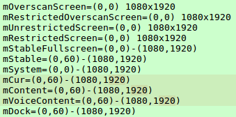

# PhoneWindowManager计算流程

PhoneWindowManager负责计算整体布局，其中的内容可以用dumpsys windows policy来打印。

源码分析可以参考博客：[大佬的博客](https://blog.csdn.net/luoshengyang/article/details/8479101)

先上一张dump截图：

* OverscanScreen:包含黑边的整个屏幕大小
* RestrictedOverscanScreen:与Overscan区域一致，暂未仔细追踪该代码。可能是随黑边变动区域，若无则等价Overscan。
* UnRestrictedScreen:逻辑显示区域，即去掉了overscan的大小的区域。
* RestrictedScreen:随导航栏变动区域，若无导航栏，则与unRestrict区域一致。
* StableFullScreen:与UnRestricted一致，该区域是不会变动的。

* Stable:在UnRestricted区域中再去掉状态栏，不受可见性影响，始终是去掉之后的大小。
* System:与overscan相同
* Cur:与content基本一致，计算方法不一致。去掉导航栏、状态栏以及输入法生下来的区域。
* Content:与cur基本一致。
* VoiceContent:音量面板可布局区域，基本也与cur和content一致。
* Dock:只去掉状态栏和导航栏，不去掉输入法。

## beginLayoutLw

1. 负责初始化各变量：

OverscanScreen=RestrictedScreen=System 全部都取系统display的像素，即整个屏幕

UnRestrictedScreen=RestrictedScreen,且Dock/Content/VoiceContent/Stable/Stablefull/cur 全部初始化成UnRestricted的属性。

pf(ParentFrame)=df(DisplayFrame)=of(OverscanFrame)=vf(VisibleFrame)=Dock  dcf(DecorFrame)=0

2. 标签含义：

pf:父窗口
df:屏幕
of:内容边衬
vf:可见边衬
dcf:装饰区

3. 然后根据LP进行标签设置。

## layoutWindowLw

1. 在一开始会判断是否是状态栏(状态栏可输入除外)和导航栏，若是则可以直接返回，不必再次布局。
2. 新增标签（最开始都是空的）

cf(ContentFrame):内容区域
sf(StableFrame):固定区域
osf:空

3. 首

