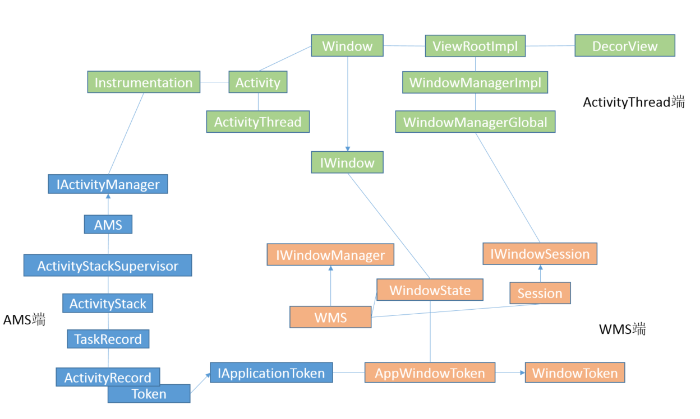
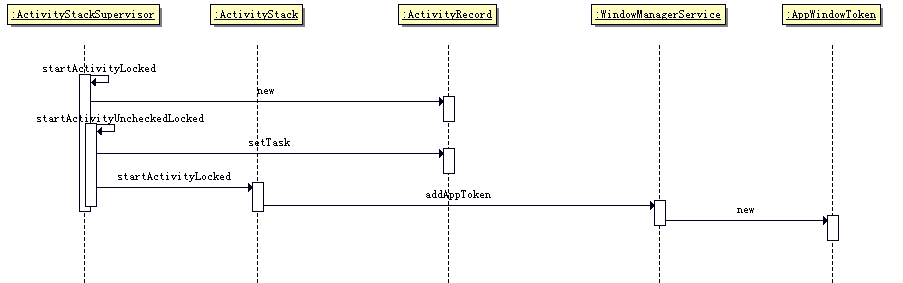

# Token机制的流程以及作用

Token机制是系统中进行跨进程通信的一种常用方式。本文主要描述Token相关流程，目的是记录该类型的架构和WMS与AMS通信的模型。

1. 结构概述
2. Activity创建过程中对Token的注册过程

## 结构概述



以上是一个非常不严谨的结构图，但是希望重点描述的是AMS端，WMS端，ActivityThread端的大致结构。

有以下特性：

1. AMS端和WMS端会协作起来，为应用提供功能。
2. 应用是在AMS中被管理生命周期的，负责按照启动模式启动，与Stack，Task，Record这几个数据结构有关系。
3. Activity在AMS端被保留成ActivityRecord，Window在WMS端保留成WindowState。
4. ActivityRecord中的Token也是和WindowState中持有的AppWindowToken一一对应的，可以进行跨进程通信。
5. 实际上一个Activity可以持有多个Window，但是只有Activity所在的窗口是AppWindowToken，而对话框等是WindowToken。
6. 在8.0代码中，修改了AppWindowToken相关的结构，大概是以AppWindowToken为核心，来定义Token，后续再对这个问题进行分析。


##  Activity创建过程中对Token的注册过程

AppWindowToken 初始化大体流程图如下：



当一个Activity被启动时，会通过[AMS的流程](../../../ActivityManagerService/doc/AMS管理Activity启动流程/AMS管理Acitivity启动流程.md)，调用到ActivityStackSupervisor的函数：

```java

	final int startActivityLocked(IApplicationThread caller,
            Intent intent, String resolvedType, ActivityInfo aInfo,
            IVoiceInteractionSession voiceSession, IVoiceInteractor voiceInteractor,
            IBinder resultTo, String resultWho, int requestCode,
            int callingPid, int callingUid, String callingPackage,
            int realCallingPid, int realCallingUid, int startFlags, Bundle options,
            boolean componentSpecified, ActivityRecord[] outActivity, ActivityContainer container,
            TaskRecord inTask) {
        int err = ActivityManager.START_SUCCESS;

		//多数都是err返回值和一些状态值的判断过程
        ..................................

        ActivityRecord r = new ActivityRecord(mService, callerApp, callingUid, callingPackage,
                intent, resolvedType, aInfo, mService.mConfiguration, resultRecord, resultWho,
                requestCode, componentSpecified, this, container, options);

        //一些特殊情况的处理过程
        ..................................

		//处理pending状态的activity
        doPendingActivityLaunchesLocked(false);

		//执行启动应用流程，将生成的ActivityRecord实例传入
        err = startActivityUncheckedLocked(r, sourceRecord, voiceSession, voiceInteractor,
                startFlags, true, options, inTask);

        if (err < 0) {
            notifyActivityDrawnForKeyguard();
        }
        return err;
    }

```

在这一步，根据需要启动的 Activity 信息生成 ActivityRecord ，然后继续调用 startActivityUncheckedLocked 。

```java
	final int startActivityUncheckedLocked(ActivityRecord r, ActivityRecord sourceRecord,
            IVoiceInteractionSession voiceSession, IVoiceInteractor voiceInteractor, int startFlags,
            boolean doResume, Bundle options, TaskRecord inTask) {
        final Intent intent = r.intent;
        final int callingUid = r.launchedFromUid;

        final boolean launchSingleTop = r.launchMode == ActivityInfo.LAUNCH_SINGLE_TOP;
        final boolean launchSingleInstance = r.launchMode == ActivityInfo.LAUNCH_SINGLE_INSTANCE;
        final boolean launchSingleTask = r.launchMode == ActivityInfo.LAUNCH_SINGLE_TASK;

        int launchFlags = intent.getFlags();

		//根据启动模式，来进行一系列操作，这里非常复杂，暂时不对这个地方进行分析
        ..................................
        	//
            r.setTask(prev != null ? prev.task : targetStack.createTaskRecord(getNextTaskId(),
                            r.info, intent, null, null, true), null);
		..................................

		//找到真正需要启动的stack，并在该stack上启动ActivityRecord对应的activity
        targetStack.startActivityLocked(r, newTask, doResume, keepCurTransition, options);

        if (!launchTaskBehind) {
            // Don't set focus on an activity that's going to the back.
            mService.setFocusedActivityLocked(r, "startedActivity");
        }
        return ActivityManager.START_SUCCESS;
    }
```

到这一步，想吐槽一下，谷歌的命名还是很有规律的啊，startActivityLock负责状态判断，控制异常情况的返回。startActivityUncheckedLocked进行具体的业务逻辑，根据启动模式以及flag等信息，处理好需要启动的stack，并在其上启动activity。

像是 WindowManagerService 中的 performLayoutAndPlaceSurfacesLocked 负控制循环的次数， performLayoutAndPlaceSurfacesLockedInner 负责具体业务逻辑的实现。外层名字短，负责处理流程。内层名字长，负责处理业务逻辑。

接下来我们跟踪 ActivityStack 的 startActivityLocked 函数。

```java
	final void startActivityLocked(ActivityRecord r, boolean newTask,
            boolean doResume, boolean keepCurTransition, Bundle options) {
        
			//其他的过程我们现在不关心，只分析和token创建有关的部分
			..................................
			//向WindowManagerService调用addAppToken，函数原型：
			//	void addAppToken(int addPos, IApplicationToken token, int groupId, int stackId,
            //			int requestedOrientation, boolean fullscreen, boolean showWhenLocked, int userId,
            //			int configChanges, boolean voiceInteraction, boolean launchTaskBehind);
			//可以观察到，基本所有信息都是从ActivityRecord中得到的，主要是考虑跨进程的调用，ActivityRecord并没有进行序列化过。
            mWindowManager.addAppToken(task.mActivities.indexOf(r), r.appToken,
                    r.task.taskId, mStackId, r.info.screenOrientation, r.fullscreen,
                    (r.info.flags & ActivityInfo.FLAG_SHOW_ON_LOCK_SCREEN) != 0, r.userId,
                    r.info.configChanges, task.voiceSession != null, r.mLaunchTaskBehind);

    }

```

到这里，还没有出现任意一个Token，但是实际上 ActivityRecord 的初始化中，会new一个继承 IApplicationToken 的 Token 内部类。 

也就是说，实际上此时新创建ActivityRecord的Token早已就绪，而在该函数中，将需要把Token传递给WMS。

那么接下来我们去跟踪WMS对addAppToken，看看是怎么处理Token的。

```java
@Override
    public void addAppToken(int addPos, IApplicationToken token, int taskId, int stackId,
            int requestedOrientation, boolean fullscreen, boolean showWhenLocked, int userId,
            int configChanges, boolean voiceInteraction, boolean launchTaskBehind) {

			//延时操作相关
			..................................
		
		//锁住的是保存Window信息的一个map结构 保证map结构的读写安全
        synchronized(mWindowMap) {
			//先查找AppWindowToken是不是已经存在了
            AppWindowToken atoken = findAppWindowToken(token.asBinder());
            if (atoken != null) {
                Slog.w(TAG, "Attempted to add existing app token: " + token);
                return;
            }
			//不存在是正常的，会根据 WMS/IApplicationToken/voiceInteraction 创建这个实例，后续会进行其他参数的赋值工作。总的来说，是将AMS中的Token再进行一次构造，成为WMS中的AppWindowToken
            atoken = new AppWindowToken(this, token, voiceInteraction);
            atoken.inputDispatchingTimeoutNanos = inputDispatchingTimeoutNanos;
            atoken.groupId = taskId;
            atoken.appFullscreen = fullscreen;
            atoken.showWhenLocked = showWhenLocked;
            atoken.requestedOrientation = requestedOrientation;
            atoken.layoutConfigChanges = (configChanges &
                    (ActivityInfo.CONFIG_SCREEN_SIZE | ActivityInfo.CONFIG_ORIENTATION)) != 0;
            atoken.mLaunchTaskBehind = launchTaskBehind;

			//根据AMS中的task结构，在WMS中也新增一个对应的数据结构
            Task task = mTaskIdToTask.get(taskId);
            if (task == null) {
                createTask(taskId, stackId, userId, atoken);
            } else {
                task.addAppToken(addPos, atoken);
            }
			
			//向map中添加 ActivityRecord.Token 的 asBinder 返回值，以及新建的 AppWindowToken
            mTokenMap.put(token.asBinder(), atoken);

            //初始化 AppWindowToken 为 hidden
            atoken.hidden = true;
            atoken.hiddenRequested = true;

        }
    }

```

此处首先在有锁的情况下，根据token.asBinder来寻找有没有相应的 AppWindowToken，正常情况没有，那么会创建新的 AppWindowToken，并按照task建立对应数据结构，把新建的 AppWindowToken 以 Token.asBinder 作为key保存在map中。

到这里其实就已经非常明朗了:

1. 在请求打开新的Activity时，构建ActivityRecord的时候，新建了内部类的Token实例。
2. 内部类Token继承IApplicationToken，提供方法windowDraw/Visible/Gone等。
3. 在具体的ActivityStack中，调用WMS的addAppToken，将ActivityRecord的相关属性传递过去。
4. 在WMS中，根据传递过来的内部类Token创建出AppWindowToken，并保存在map中。

到这里，其实Token的来源已经都描述清楚了，关于Token的使用，可以[参考之前的博客](../../../Activity创建过程与window相关部分/Activity创建过程与window相关部分.md)。

博客内容简而言之，使用token的一个例子是：

1. 当ActivityThread调用addView之后，最终会经历一次完整的relayoutWindow相关流程。
2. relayoutWindow结尾时，会向WMS的内部handler传递一个 REPROT_APPLICATION_TOKEN_WINDOWS 的消息。
3. 在该消息处理函数中，会调用 AppWindowToken 中的属性 appToken，从而访问到IApplicationToken。
4. 最终由此跨进程调用到AMS的ActivityRecord的内部类Token中，进而实现界面显示完成之后，通知到AMS继续进行后续的操作。


