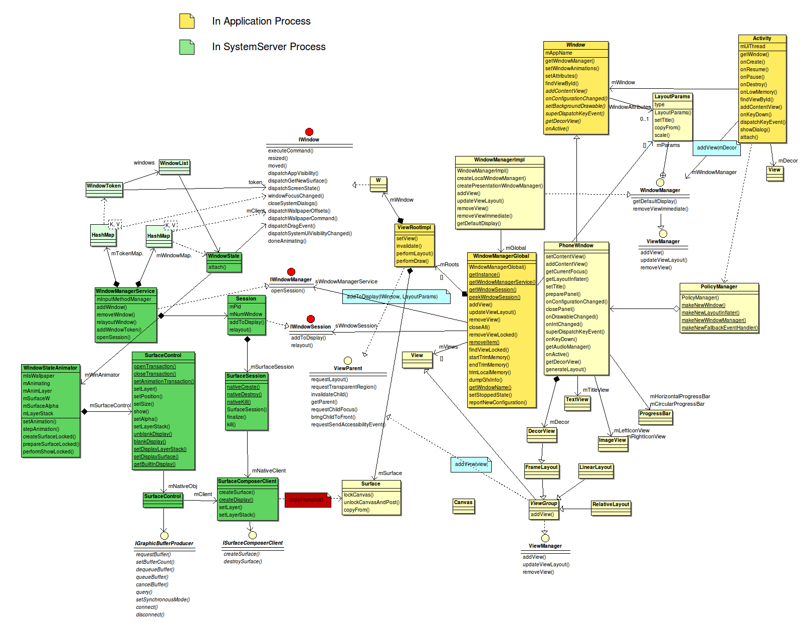

# 类图与数据结构分析

先放一张摘自[漫天尘沙](http://www.cnblogs.com/samchen2009/p/3364327.html)的不包含子系统（布局、动画、输入）的整体架构图：（致敬漫天尘沙大佬，很可惜显示相关系列文章在博客园并不全）

按照进程，可以分作[system_server端](#system_server端)，以及[用户进程(ActivityThread)](#activitythread端)端。图中黄色的卡片就是用户进程(ActivityThread)端，绿色卡片是system_server端。

## ActivityThread端

区分的理由主要是，ActivityThread端应用开发者有权限使用，且运行于应用的进程中，只负责某个应用的图像的显示。该端主要负责应用自己窗口的测量，布局，绘制等。同样也要负责事件分发相关，但不是当前主要要分析的东西。以下将把ActivityThread端的类分为以下几组介绍：

### View ViewGroup ViewParent ViewManager

这两者是应用层接触得最多的类，也是图形界面组成的最基本元素。

* View:各种图形组件都是继承View来定制自己的内容。继承Drawable和KeyEvent的callback，分别实现绘制部分以及接收事件。在内部会保存很多类似于Visible状态，是否可点击等等属性值，以及相关的静态属性值。
* ViewGroup：继承View，实现ViewParent和ViewManager。ViewGroup的作用就是作为View的容器，储存在数组mChildren中，对子级的View进行管理。
* ViewParent:接口，定义子级View可以对父级View可以进行的操作。
* ViewManager:接口，暴露了添加子窗口以及更新窗口等功能。

很有意思的是，ViewManager会由ViewGroup和WindowManager两者继承。ViewGroup是View的容器，主要管理目标是子级的View。WindowManager是由WindowManagerImpl实现的，而WindowManagerImpl的实际功能有很多都是由mGlobal属性实现，即WindowManagerGlobal来实现逻辑代码（这一套架构与Context的继承关系有异曲同工之妙）。WindowManagerGlobal实现addView业务逻辑的时候，会将新建的ViewRootImpl加入管控范围，而ViewRootImpl是ViewGroup的子类。ViewGroup实现addView业务逻辑的时候，是将子View加入管控范围。所以实际上WindowManagerGlobal才是管理View的顶级容器。

### Activity Window PhoneWindow DecorView

Activity是四大组件中唯一可见的组件，也是我们接触得最多的组件。

* Activity：继承ContextThremeWrapper，实现Window.Callback以及Window.OnWindowDismissCallback等回调。提供模板供用户自定义Activity继承，提供各种回调以及调用接口实现应用功能。在调用Activity的attach函数时绑定界面，此时会利用PolicyManager创建一个新的Window。
* Window：抽象类，描述顶级的窗口的样式，实现它的类暂时只有PhoneWindow，提供标准的UI策略，如：背景，标题栏，默认按键处理等。
* PhoneWindow：实现样式相关的逻辑，如Activity的setContentView就是通过getWindow来实现的。再比如标题栏，特征值(setFeature)的设置等等。这个类与View的差异很大，Window主要负责的是整体窗口样式相关的部分，而View关注的是某个组件具体的细节。
* DecorView：PhoneWindow内部类，继承FrameLayout，在ActivityThread的`handlerResumeActivity()`中被`wm.addView(decor,l)`调用，最终调用到ViewRootImpl的`setView()`。进而赋值给属性mView，用于后续关于View的操作。

### PolicyManager Policy 

前面描述了Activity在attach绑定界面时，使用的PolicyManager来创建Window。

* PolicyManager：final class，实现IPolicy的静态接口，用于创建四个类型的实例。虽然不知道这样用与直接创建有什么差异，但是这个做法非常有特点，final类不能再被拓展，构造函数被写成private类型，只提供静态函数。
* Policy：PolicyManager的具体实现，当该策略类被使用，用类加载器加载类，提升效率。

这是Client端的policy类，主要用于生成类实例。而[system_server端也有policy类](#windowmanagerpolicy-phonewindowmanager)，且策略管理的功能差异比较大。

### WindowManager WindowManagerImpl WindowManagerGlobal ViewRootImpl

这几个类是WMS在client端的调用类，实现与WMS服务相关的功能。

* WindowManager：实现ViewManager，主要还定义了LayoutParams内部类，用于描述窗口的大多数状态信息。
* WindowManagerImpl：实现WindowManager，除了与token的操作，都直接调用WindowManagerGlobal实现功能。
* WindowManagerGlobal：
	1. 单例，保存三个Arraylist:mViews,mRoots,mParams。
	2. 实现get得到WMS以及Session的方法，对应实现WindowManagerImpl的接口。
	3. 需要特别注意的是，addView时，会把新加入的View以及ViewRootImpl还有LayoutParams加入数据结构中。最后调用ViewRootImpl的setView才会真正通过Session访问WMS的服务。
* ViewRootImpl：
	1. Client端非常关键的一个类，是负责管理View和WindowManager间通信的类，同时也是WindowManagerGlobal实现最依赖的类。
	2. 实现ViewParent，自身不是View，但实现了对子级View即DecorView的操作，如：`getChildVisibleRect()`等。
	3. 关于Activity的onResume之后relayout过程可以[参考链接](../../../ActivityManagerService/doc/Activity创建过程与window相关部分/Activity创建过程与window相关部分.md)。
	4. 而添加提示框、悬浮窗时，走的是addView流程，可以[参考链接](./添加悬浮窗流程.md)。
	5. ViewRootImpl中有很多内部类，比如addToDisplay需要的参数IWindow的实现类W，用于让system_server端回调，通知ViewRootImpl窗口的移动、变化等。

以上是ActivityThread所在的进程端的一些类的概述，更主要的逻辑是由system_server负责的。

### 归纳ActivityThread端

归纳一下ActivityThread所在端的关系：

1. 一个进程对应一个ActivityThread，对应一个WindowManagerGlobal。
2. 一个WindowManagerGlobal会持有多个ViewRootImpl，ViewRootImpl在addView的时候被新建。
3. 一个ActivityThread中可以有多个Activity，也可以有多个Activity处于visible状态。
4. 一个Activity对应一个[ActivityClientRecord](../../../ActivityManagerService/doc/chap2/chap2.md#ams-activit协作相关类)，在attach的时候创建一个新的Window。
5. WindowManager也是从Window中调用WindowManagerImpl的createLocalWindowManager构造的。而WindowManagerImpl会获取WindowManagerGlobal的单例来访问功能。
6. AlertDialog调用create的时候，会调用Dialog构造方法创建新的Window，然后再show方法中调用addView方法，将新的DecorView加到新的ViewRootImpl上。
7. 一个WindowManagerImpl拥有一个LayoutParams，对应一个IBinder，在WMS中会被转化成WindowToken（或AppWindowToken，是WindowToken的子类，且当lp.type是应用时被创建）,AppWindowToken中的appToken可以用于和ActivityRecord通信，这个在后文详细描述。

以上都是分析，最终归纳出一副关系图：

箭头两端是1，则是一对一关系。一端是1，一端是n，意味着1端可以持有多个n端。

## system_server端

system_server端运行在同名进程中，负责与系统其它模块，如AMS，Input，Surface等等交互，所以系统端非常复杂，而我们现在主要关注其中最核心的一些类的关系，也是分组分析如下：

### WindowToken AppWindowToken IApplicationToken ActivityRecord.Token

Token的意思是令牌，本质是IBinder，基本作用是验证身份，在这里还可以进行Binder通信。

* WindowToken：在WMS的addWindow中被创建，
* AppWindowToken：

### WindowManagerPolicy PhoneWindowManager
