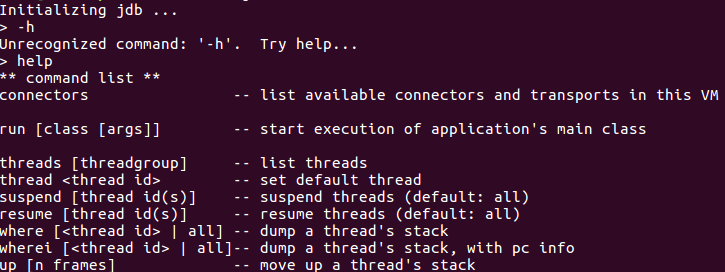
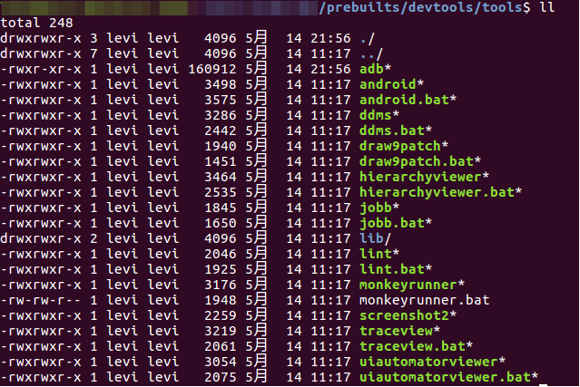
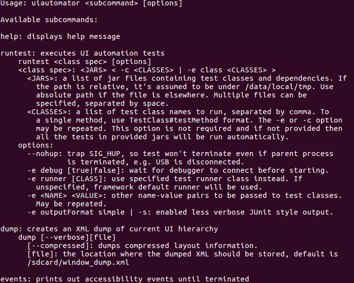
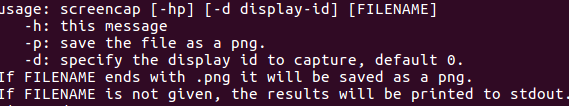
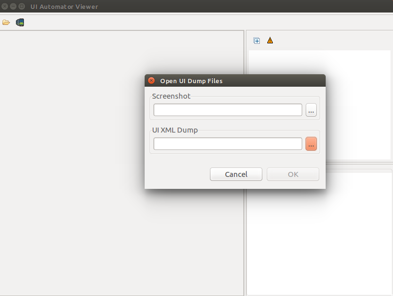

# 源码下DEBUG

最近由windows环境切换到ubuntu环境下，导致一些工具无法顺利的使用。于是就研究一下在ubuntu下的调试工具使用方式。

调试方式分以下两类：
1. 断点调试工具
	* jdb
	* gdb

2. android调试工具
	* ddms
	* hierarchyviewer
	* traceview
	* uiautomatorviewer

## 断点调试工具

在/usr/bin的可执行程序中就有gdb,jdb等。可以直接调用。

### jdb

jdb就是常见的java断点调试工具。首先需要说明的是，暂时无法达到像AndroidStudio中一样，把断点加入到运行程序中。暂时只看简单的使用。调试实际的android进程，即'attach debug Info'按钮相同功能，[可以点击链接](./jdb调试进程.md)。

1. 什么样的文件可以使用jdb调试？

在 'javac -g A.java' 得到的 class文件，没有加上'-g'选项则不能使用jdb调试。与addr2line只能分析有符号的库文件的原理类似。

2. jdb调试有哪些功能？

在键入'jdb'之后，会出现类似于adb的命令行，键入 'help'之后出现帮助信息如下

（注：截图不全）

比较关键的几个功能有：

* stop at TestClass:37        在TestClass的37行设置断点
* stop in TestClass.Hello     在TestClass的Hello方法设置断点
* clear			      列出断点
* clear TestClass:37          清除TestClass的37行的断点
* clear TestClass.Hello       清楚TestClass的Hello方法的断点

断点可以设置多个，设置好了断点之后，键入 'run' 开始使程序正式运行。

运行到第一个断点，程序会停下来。此时可以控制debug流程：

* step                         下一行，若是方法，则进入方法内部
* step up                      返回该方法
* next                         下一行
* cont                         下一个断点

在断点执行到的每个地方，都可以进行查询：

* list			               显示当前代码以及断点位置
* locals                       显示本地方法以及参数
* print i                      打印expression的信息，类似于toString。
* dump i                       打印所有类相关的信息。
* set i=5                      设置一个新的值到当前的实例中
* classes                      显示当前可知的类
* class TestClass              显示TestClass的细节
* methods TestClass            显示TestClass的方法
* fields TestClass             显示TestClass的实例

通过以上方式，可以比较完整的调试一个简单的java程序。而 attch breakpoint 的功能暂时还未了解。

### gdb

gdb的目的是调试gcc编译的程序，使用的方式与jdb类似，而因为暂时项目上没有用到gdb，所以暂时不写，按照惯例，挂上链接：

[Liigo的博客](https://blog.csdn.net/liigo/article/details/582231/)

## android调试工具

在源码的prebuilt文件夹下有一份可以用的可执行文件。

但是如果希望使用比较方便的版本可以用 'apt-get install'来获取。

其中ddms只能负责线程监控以及堆监视相关的内容，不负责ui布局分析等。使用起来无太大差异。

hierarchyviewer分析布局层次。使用起来也没有什么问题。

uiautomatorviewer对应图片来分析布局文件，在使用的时候碰到了一些头疼的问题。

### uiautomatorviewer

由于uiautomatorviewer使用的时候会报一个reflection相关的错误，导致图形化界面在某些机型上不可用。

总结了一种可以代码执行的方法：

1. 使用 'adb shell uiautomatorviewer -dump /sdcard/window_dump.uix'
2. 使用 'adb shell screenshot -p /sdcard/window_png.png'
3. 使用 'adb pull from to '指令获取sdcard中的两个文件
4. 点击左上角，选取以上两个文件，则可以正常使用功能。

以下是几个工具的截图：

uiautomatorviewer:

screenshot:

UI Automator Viewer:

