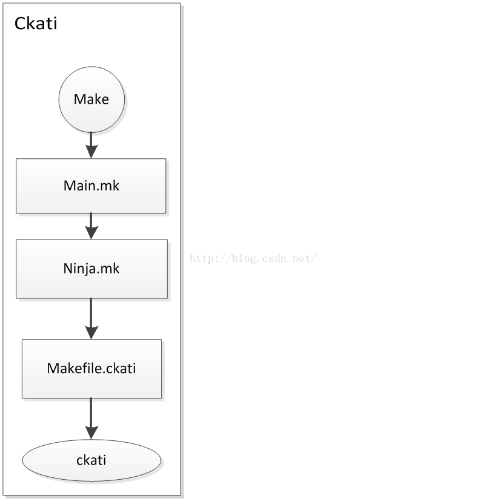

# Ninja编译原理 #

Ninja编译是7.0系统上引入的，主要参考文章：[Android7.0 Ninja编译原理](http://blog.csdn.net/chaoy1116/article/details/53063082)

## 概念简介 ##

### Ninja ###

Ninja是一个致力于速度的小型编译系统（类似于Make）；

如果把其他编译系统比做高级语言的话，Ninja就是汇编语言

主要有两个特点：

1、可以通过其他高级的编译系统生成其输入文件；

2、它的设计就是为了更快的编译；

使用Kati把makefile转换成Ninja files，然后用Ninja编译

在不久的将来，当不再用Makefile（Android.mk）时，Kati将被去掉

ninja核心是由C/C++编写的，同时有一部分辅助功能由python和shell实现。由于其开源性，所以可以利用ninja的开源代码进行各种个性化的编译定制。

Github地址： https://github.com/ninja-build/ninja


### Blueprint, Soong ###

Blueprint和Soong是用于一起把Blueprint 文件转换为Ninja文件。 将来需要写Blueprint文件（Android.bp），转换为Android.soong.mk（也可以直接写），然后转换为Ninja文件（build.ninja）然后用Ninja编译。

如果Android.mk和Android.bp同时存在，Android.mk会被忽略。

如果Android.bp的同级目录下有Android.soong.mk也会被include

## Android7.0编译入口 ##

在android系统中，目前还未完全切换到Ninja编译，编译的入口仍然是make命令, 如下commands以nexus为例：

最终编译使用的命令仍然是make,
既然是make，那就在编译中首先include到的就是build/core/main.mk了，在main.mk中，我们可以清楚的看到对Ninja的调用：

```

relaunch_with_ninja :=

ifneq ($(USE_NINJA),false)

ifndef BUILDING_WITH_NINJA

relaunch_with_ninja := true

```

由于USE_NINJA默认没有定义，所以一定会进入到这个选项中，并且将relaunch_with_ninja置为true。这样的话，就会进入到下面的重要操作语句，去include ninja的makefile.  并且在out目录下生成ninja_build的文件，显示当前是使用了ninja的编译系统。

```
ifeq ($(relaunch_with_ninja),true)

# Mark this is a ninjabuild.

$(shell mkdir -p $(OUT_DIR)&& touch $(OUT_DIR)/ninja_build)

includebuild/core/ninja.mk

else # !relaunch_with_ninja

ifndef BUILDING_WITH_NINJA

# Remove ninja build mark ifit exists.

$(shell rm -f $(OUT_DIR)/ninja_build)

endif
```
 

在include build/core/ninja.mk的语句执行后，我们就可以看到真正定义ninja的地方了。由于前面简介讲了ninjia是基于开源项目编译出来的轻便的编译工具，所以这边google肯定也对ninjia进行了修改，编译，并且最终生成了一个可执行的应用程序。在simba6项目中，我们可以在prebuilts/ninja/linux-x86下面找到这个可执行的应用程序ninja。我们可以简单的运行这个ninja的命令，比如ninja –h, 就可以了解到这个command的基本用法, 也可以看到本版本的ninja使用的base version为1.6.0。

 
```
./ninja -h

usage: ninja [options][targets...]

if targets are unspecified,builds the 'default' target (see manual).

options:

  --version print ninja version ("1.6.0")

  -C DIR  change to DIR before doing anything else

  -f FILE specify input build file [default=build.ninja]

  -j N    run N jobs in parallel [default=6, derived from CPUs available]

  -k N    keep going until N jobs fail [default=1]

  -l N    do not start new jobs if the load average is greater than N

  -n      dry run (don't run commands but act like they succeeded)

  -v      show all command lines while building

  -d MODE enable debugging (use -d list to list modes)

  -t TOOL run a subtool (use -t list to list subtools)

    terminates toplevel options; further flagsare passed to the tool

  -w FLAG adjust warnings (use -w list to list warnings)
```

流程图可以简单归结如下：



## 从Android.mk到Android.bp ##

参考文章：[从Android.mk到Android.bp](http://blog.csdn.net/iEearth/article/details/54707416)

最近更新了Android Nougat源码，无意间发现Android的编译系统已经发生了巨大改变，到处是“Android.bp”文件，下面就来看一下这个bp文件到底是何方神圣。

首先从Soong说起，Soong是Android中对基于GNU make的编译系统的替代物，编译文件“Android.mk”被替换为“Android.bp”。bp文件的目的就是一切从简，格式类似于JSON，像mk文件的条件控制语句等这些复杂的东西都由Go来处理，bp文件是由Go语言来解析的，为“blueprint”框架，随后转为Ninja文件，这大概就是Google的Go兴起后转而使用Go来重构自己。

具体Android.bp语法可以参考文章。